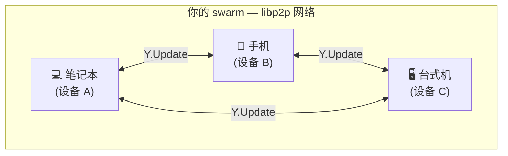
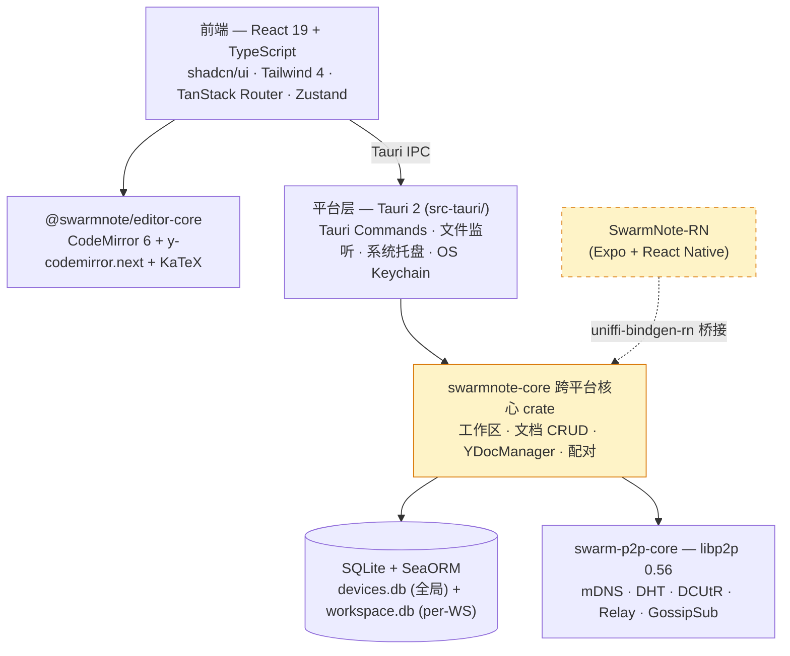

<div align="center">


# SwarmNote

**让笔记在你的设备群里自由流动**

*Your notes, swarming across your own devices.*

[](https://github.com/swarm-apps/SwarmNote/releases)
[](LICENSE)
[](https://tauri.app)
[](https://libp2p.io)
[](https://codemirror.net)

[下载安装](#下载安装) · [它有什么不一样](#它有什么不一样) · [技术架构](#技术架构) · [路线图](#路线图)

</div>

---

## SwarmNote 是什么？

一款**本地优先、设备间 P2P 同步**的笔记工具。

*Swarm* 是英语里"蜂群"的意思——把"属于你自己的多台设备"想象成一个蜂群：每台设备是一只蜜蜂，工作区是蜂巢，笔记像花蜜一样在蜂群间自由流动。

不需要账号、不需要云端服务器、不需要订阅——你的笔记躺在本地的 Markdown 文件夹里，通过 [libp2p](https://libp2p.io) 在你自己的设备之间直接同步。

### 它有什么不一样

<table>
<tr>
<td width="25%" align="center">
<h3>📂</h3>
<b>就是普通文件夹</b><br>
<sub>笔记 = 本地 .md 文件<br>用任何编辑器都能改</sub>
</td>
<td width="25%" align="center">
<h3>🐝</h3>
<b>设备 swarm</b><br>
<sub>你的多台设备 = 一个蜂群<br>P2P 直连，无中间人</sub>
</td>
<td width="25%" align="center">
<h3>🧬</h3>
<b>CRDT 自动合并</b><br>
<sub>Yjs 实现<br>离线编辑零冲突</sub>
</td>
<td width="25%" align="center">
<h3>↻</h3>
<b>外部编辑回流</b><br>
<sub>VS Code 改完 .md<br>SwarmNote 自动同步</sub>
</td>
</tr>
</table>

### 与同类工具对比

| | Obsidian | Notion | Logseq | **SwarmNote** |
|---|---|---|---|---|
| **数据存储** | 本地 Markdown | 云端数据库 | 本地 Markdown | **本地 Markdown** |
| **多设备同步** | 付费 Sync | 内置（云） | Git / 第三方云 | **内置 P2P 同步** |
| **服务器依赖** | 同步要 | 强依赖 | 同步要 | **无** |
| **离线协作合并** | 不支持 | 不支持 | 文件级冲突 | **CRDT 自动合并** |
| **外部工具协同** | 兼容 | 不兼容 | 兼容 | **兼容（含自动 reflow）** |
| **开源** | 否 | 否 | 是 | **是 (MIT)** |

## 你的笔记 = 一个普通文件夹

工作区就是任意本地文件夹，结构如下：

```
my-notes/
├── .swarmnote/
│   └── workspace.db        # SQLite — 文档元数据 + Yjs CRDT 状态
├── meeting-notes.md        # 你的笔记
└── ideas/
    └── product-plan.md
```

这意味着：

- 在 VS Code、nvim、Obsidian 里直接打开 `.md` 文件编辑——SwarmNote 通过 [`notify`](https://docs.rs/notify) 监听变更，用 [`similar`](https://docs.rs/similar) 算文本 diff 自动 reflow 进 Yjs 文档，**既不会冲突也不会丢失编辑历史**
- 用 Git 备份整个工作区
- 把工作区目录放进 Dropbox / OneDrive 也照常工作
- 想停用 SwarmNote？删掉应用就行——你的笔记还在文件夹里

## swarm 是怎么同步的？



每台设备本地维护一份完整的 Yjs CRDT 文档；编辑产生的增量 update 通过 GossipSub 广播给 swarm 内的其他设备；接收方调用 `Y.Doc.applyUpdate` 合并，**任意顺序、任意时刻、任意离线时长都能自动收敛到一致状态**。

发现机制：

- **局域网** — mDNS 自动发现同 Wi-Fi 设备
- **跨网络** — Kademlia DHT 通告 + DCUtR NAT 打洞，打洞失败时自动 Relay 中继兜底

## 下载安装

前往 [Releases](https://github.com/swarm-apps/SwarmNote/releases/latest) 下载最新版本（应用内置自动更新）：

| 平台 | 格式 | 架构 |
|------|------|------|
| **Windows** | `.msi` · `.exe` | x64 |
| **macOS** | `.dmg` | Apple Silicon · Intel |
| **Linux** | `.deb` · `.rpm` · `.AppImage` | x64 |
| **Android / iOS** | 见 [SwarmNote-RN](https://github.com/swarm-apps/SwarmNote-RN) | 开发中 |

## 快速开始

```
1. 启动应用 → 创建或打开一个工作区（任意本地文件夹）
2. 写笔记（CodeMirror 6 编辑器 · Markdown 自动持久化为 .md）
3. 添加设备 → 通过 6 位配对码把另一台设备拉进 swarm
4. 笔记在所有设备间自动同步
```

### 设备如何加入 swarm？

- **配对码** — 一方生成 6 位数字配对码，另一方输入；跨网络可用
- **局域网自动发现** — 通过 mDNS 自动发现同网络设备（开发中）

## 功能特性

| 功能 | 状态 |
|------|------|
| 工作区管理（多窗口 · 最近列表 · 自动恢复） | ✅ |
| CodeMirror 6 编辑器（Markdown · 代码高亮 · KaTeX 数学公式） | ✅ |
| Yjs 协作支持（`y-codemirror.next` 绑定） | ✅ |
| 文件树（增删改查 · 文件监听 · 外部编辑回流） | ✅ |
| 暗 / 亮主题 + 平台原生标题栏（macOS Overlay / Windows / Linux 自定义） | ✅ |
| 多语言（中文 · 英文） | ✅ |
| 系统托盘（灰度 = 未启动 · 彩色 = 运行中） | ✅ |
| 自动更新（GitHub Releases · `tauri-plugin-updater`） | ✅ |
| 设备身份管理（OS Keychain 持久化） | ✅ |
| P2P 节点（DHT 发现 · NAT 检测 · DCUtR 打洞 · Relay 兜底） | ✅ |
| 6 位数字配对码设备配对 | ✅ |
| 跨设备实时同步（GossipSub + Yjs） | 🚧 进行中 |
| 移动端 [SwarmNote-RN](https://github.com/swarm-apps/SwarmNote-RN)（Expo + uniffi-bindgen-rn） | 🚧 进行中 |
| 实时协作编辑（多人同时编辑同一文档） | 📋 计划中 |
| 工作区共享（邀请码 · 权限管理） | 📋 计划中 |
| 全文搜索 | 📋 计划中 |
| 端到端加密 | 📋 计划中 |
| MCP 集成（AI 助手读写笔记） | 📋 计划中 |
| 一键发布博客（GitHub Pages） | 📋 计划中 |

## 技术架构



`swarmnote-core` 是平台无关的核心 crate，被桌面端 (`src-tauri`) 直接调用，也被 [SwarmNote-RN](https://github.com/swarm-apps/SwarmNote-RN) 通过 [`uniffi-bindgen-react-native`](https://github.com/jhugman/uniffi-bindgen-react-native) 桥接到 React Native——**桌面和移动端共享同一份业务逻辑和 CRDT 状态机**。

<details>
<summary><b>技术栈详情</b></summary>

| 层级 | 技术 |
|------|------|
| 前端 | React 19 · TypeScript 5.8 · Vite 7 |
| 编辑器 | CodeMirror 6 + `@codemirror/lang-markdown` + `y-codemirror.next` + KaTeX（封装在独立仓 [`@swarmnote/editor-core`](https://github.com/swarm-apps/swarmnote-editor) 包，本地通过 pnpm link 接入） |
| UI 组件 | shadcn/ui · Radix · Tailwind CSS 4 · Lucide |
| 状态管理 | Zustand 5（9 个 Store · 部分通过 `tauri-plugin-store` 持久化） |
| 路由 | TanStack Router（文件系统路由） |
| 国际化 | Lingui 5（zh · en） |
| 后端 | Rust 2021 · Tauri 2 |
| 跨平台核心 | `swarmnote-core` crate（桌面 + 移动端共享） |
| ORM | SeaORM 2.0-rc · SQLite |
| CRDT | yrs 0.25（Yjs Rust 实现）+ similar（外部编辑文本 diff） |
| P2P | libp2p 0.56 via [`swarm-p2p-core`](https://github.com/swarm-apps/swarm-p2p) |
| Tauri 插件 | updater · store · dialog · opener · notification · process · mcp-bridge |
| 工具链 | Biome · rustfmt · Clippy · Lefthook · commitlint · git-cliff |

</details>

<details>
<summary><b>项目结构</b></summary>

```
swarmnote/
├── src/                       # 前端源码
├── src-tauri/                 # 平台层（Tauri 命令处理 / OS 集成）
├── crates/
│   ├── core/                  # swarmnote-core —— 平台无关核心 (桌面 + 移动共享)
│   ├── entity/                # SeaORM entity 定义
│   └── migration/             # 数据库迁移
├── libs/core/                 # swarm-p2p-core (Git submodule —— P2P 网络层)
└── docs/                      # Astro + Starlight 文档站

# 编辑器核心是独立仓，通过 pnpm link --global 接入：
../swarmnote-editor/           # @swarmnote/editor-core (https://github.com/swarm-apps/swarmnote-editor)
```

</details>

## 从源码构建

### 环境要求

- [Node.js](https://nodejs.org/) 22+ 和 [pnpm](https://pnpm.io/) 10+
- [Rust](https://rust-lang.org/) stable
- Linux 额外依赖：`libwebkit2gtk-4.1-dev libappindicator3-dev librsvg2-dev patchelf libdbus-1-dev`

### 构建步骤

```bash
# 1. 克隆 SwarmNote 主仓（含 swarm-p2p-core 子模块）
git clone --recurse-submodules https://github.com/swarm-apps/SwarmNote.git
cd SwarmNote

# 2. 在同级目录 clone & 构建 swarmnote-editor（编辑器内核）
git clone https://github.com/swarm-apps/swarmnote-editor.git ../swarmnote-editor
(cd ../swarmnote-editor && pnpm install && pnpm -r build)

# 3. 安装主仓依赖（`pnpm.overrides` 已经把 @swarmnote/editor-core 指向 sibling 仓的 dist）
pnpm install

# 桌面端开发（前端 + Rust 后端）
pnpm tauri dev

# 桌面端构建
pnpm tauri build

# 前端 lint / Rust lint
pnpm lint
cd src-tauri && cargo clippy -- -D warnings
```

### 编辑器联调（开发 swarmnote-editor 同时运行主仓）

```bash
# 在 swarmnote-editor 仓启动 watch（每次改源码自动重建 dist）
(cd ../swarmnote-editor && pnpm dev)

# 主仓另开终端跑 dev（Vite HMR 会因 dist 变化自动 reload）
pnpm tauri dev
```

主仓 `package.json` 的 `pnpm.overrides` 把 `@swarmnote/editor-core` 锚定到 `../swarmnote-editor/packages/editor-core`——所以 sibling 必须 clone 到主仓同级目录。未来 `@swarmnote/editor-core` 发到 npm 后会移除这条 override，改用版本号。

## Swarm 生态

SwarmNote 是 Swarm 系列开源项目之一，所有项目共享 [`swarm-p2p-core`](https://github.com/swarm-apps/swarm-p2p) 网络层：

| 项目 | 说明 | 状态 |
|------|------|------|
| [SwarmDrop](https://github.com/swarm-apps/SwarmDrop) | P2P 文件传输（"跨网络版 LocalSend"） | v0.4.4 |
| **SwarmNote** | P2P 笔记同步（桌面端） | v0.2.3 |
| [SwarmNote-RN](https://github.com/swarm-apps/SwarmNote-RN) | SwarmNote 移动端（Expo + React Native） | 开发中 |
| [swarm-p2p-core](https://github.com/swarm-apps/swarm-p2p) | P2P 网络 SDK（libp2p 封装） | 已完成 |

## 路线图

- [x] **v0.1** — 工具链与基础设施（Tauri 2 · React 19 · Cargo workspace）
- [x] **v0.2** — 单机笔记编辑 + P2P 网络 + 设备配对（**当前**）
- [ ] **v0.3** — 跨设备实时同步（GossipSub + Yjs CRDT）
- [ ] **v0.4** — 移动端首个可用版本（[SwarmNote-RN](https://github.com/swarm-apps/SwarmNote-RN)）
- [ ] **v0.5** — 工作区共享 + 端到端加密
- [ ] **v1.0** — 实时协作 + 全文搜索 + MCP 集成

## 参与贡献

欢迎提交 Issue 和 Pull Request！

1. Fork 本仓库
2. 创建特性分支 `git checkout -b feature/amazing`
3. 提交遵循 [Conventional Commits](https://www.conventionalcommits.org/) 格式
4. 创建 Pull Request

## 许可证

[MIT](LICENSE) &copy; 2025 SwarmNote Contributors

---

<div align="center">
<sub>Built with <a href="https://tauri.app">Tauri</a> · <a href="https://libp2p.io">libp2p</a> · <a href="https://codemirror.net">CodeMirror 6</a> · <a href="https://yjs.dev">Yjs</a></sub>
</div>
