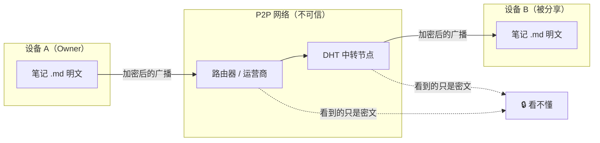
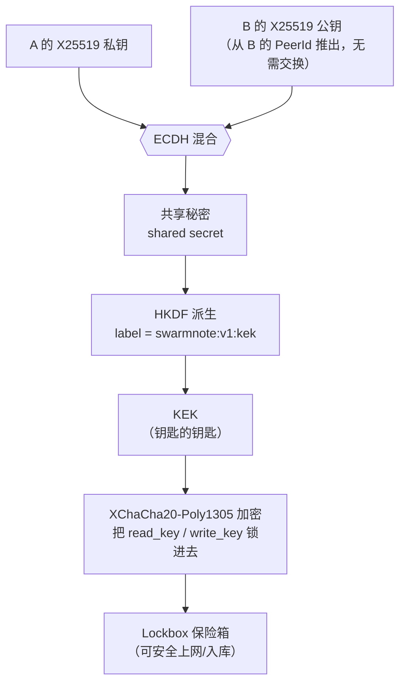
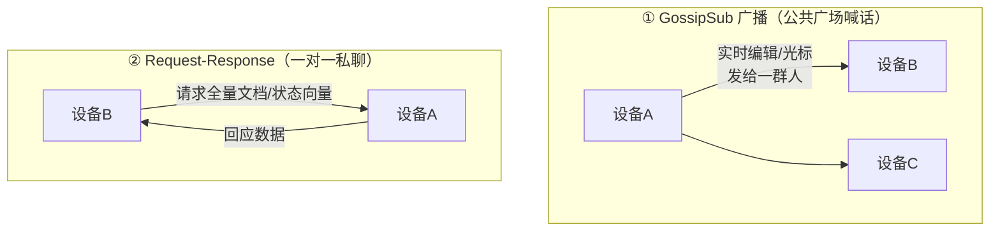
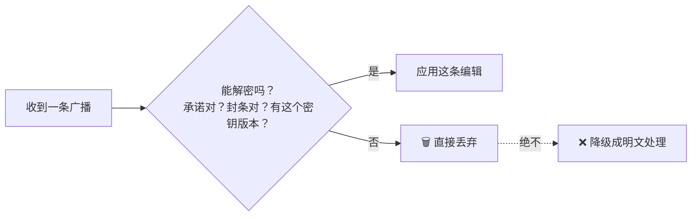
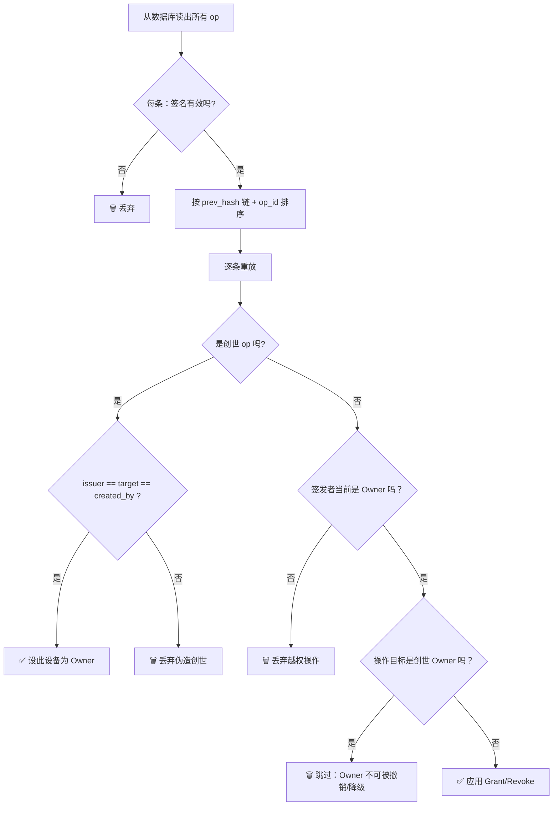
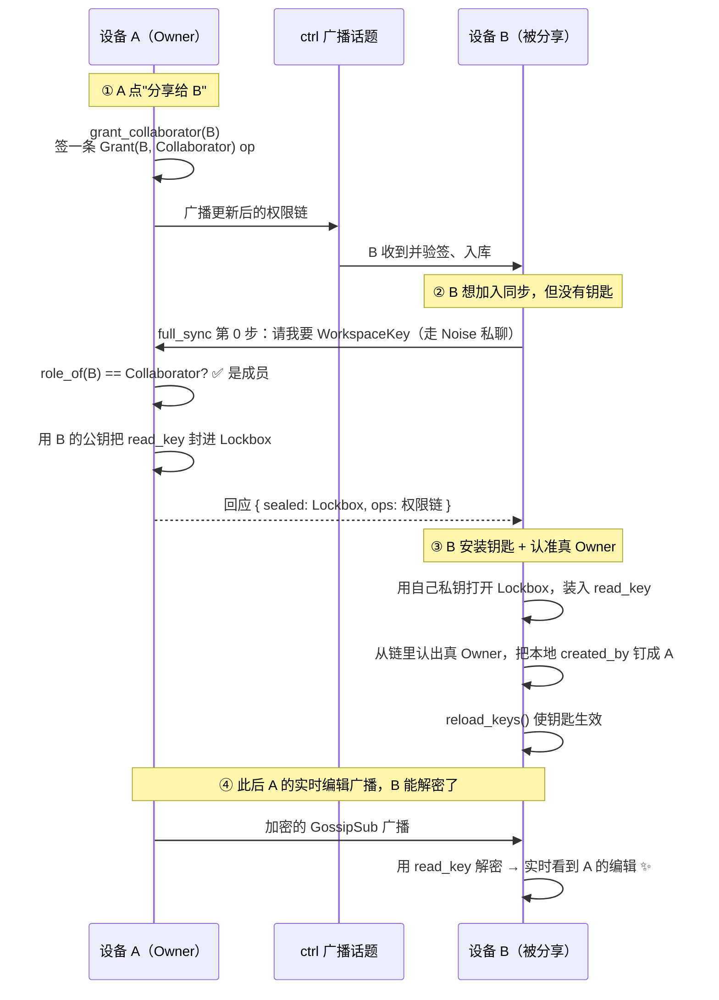
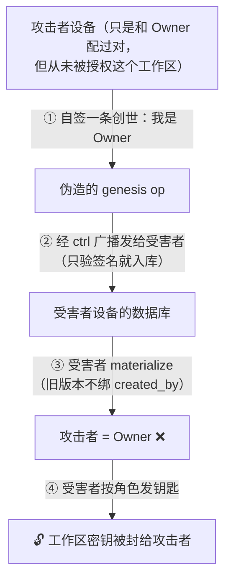
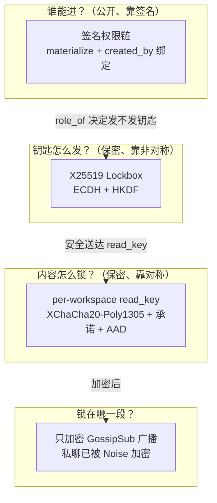

# 给笔记上锁：SwarmNote v0.5.0 端到端加密协作从零讲起

> v0.5.0 让你能把一个工作区**分享**给另一台设备一起实时编辑，而中间经过的网络——你家路由器、运营商、DHT 上帮忙中转的陌生节点——**谁都看不到你写了什么**。但"去中心化 + 没有服务器 + 端到端加密"听起来很玄：没有服务器，谁来发钥匙？谁来决定谁能进？
>
> 这篇文章假设你**完全不懂加密**。我们从最基础的几个概念讲起，然后一块一块地把 SwarmNote 的加密协作搭起来：先是"对称钥匙"，再是"怎么把钥匙安全地递过去"，再是"只锁该锁的东西"，最后是"没有服务器时怎么决定谁说了算"。全程配图和大白话类比。读完你会明白：原来端到端加密不是魔法，而是几个朴素想法的精巧拼装。

## 目录

1. [先说人话：v0.5.0 到底做了什么](#1-先说人话v050-到底做了什么)
2. [加密扫盲：六个必须先懂的概念](#2-加密扫盲六个必须先懂的概念)
   - 2.1 [对称加密：一把钥匙又锁又开](#21-对称加密一把钥匙又锁又开)
   - 2.2 [非对称加密：公钥锁、私钥开](#22-非对称加密公钥锁私钥开)
   - 2.3 [AEAD：加密 + 防篡改的"封条"](#23-aead加密--防篡改的封条)
   - 2.4 [nonce：一次性的随机编号](#24-nonce一次性的随机编号)
   - 2.5 [KDF：从一把钥匙长出很多把](#25-kdf从一把钥匙长出很多把)
   - 2.6 [数字签名：私钥签、公钥验](#26-数字签名私钥签公钥验)
3. [第一块拼图：每个工作区一把对称钥匙](#3-第一块拼图每个工作区一把对称钥匙)
4. [第二块拼图：Lockbox——怎么把钥匙安全递过去](#4-第二块拼图lockbox怎么把钥匙安全递过去)
5. [第三块拼图：只锁"广场喊话"，不锁"私聊"](#5-第三块拼图只锁广场喊话不锁私聊)
6. [第四块拼图：签名权限链——没有服务器，谁说了算？](#6-第四块拼图签名权限链没有服务器谁说了算)
7. [拼起来：一次完整的"分享工作区"之旅](#7-拼起来一次完整的分享工作区之旅)
8. [一个差点上线的严重漏洞：伪造创世](#8-一个差点上线的严重漏洞伪造创世)
9. [我们诚实地"不防"什么](#9-我们诚实地不防什么)
10. [小结与关键文件](#10-小结与关键文件)

---

## 1. 先说人话：v0.5.0 到底做了什么

SwarmNote 是一个**本地优先（local-first）、点对点（P2P）**的笔记应用：你的笔记是磁盘上一堆普通的 `.md` 文件，设备之间通过 libp2p 直接同步，**没有中央服务器**。

v0.5.0 之前，"同步"只在你**自己配过对**的设备之间发生，而且广播出去的内容是**明文**的——任何能进入这张 P2P 网络的节点，理论上都能听到你的编辑。

v0.5.0 加了三件事：

| 能力 | 一句话解释 |
| --- | --- |
| **端到端加密（E2E）** | 同步时广播的内容全程加密，只有被授权的设备能解开 |
| **工作区分享** | 你（Owner）可以把一个工作区授权给另一台已配对设备，让它能加入协作 |
| **权限** | 用"签名操作链"记录谁是 Owner、谁是 Collaborator，没有服务器也能让所有设备对"谁能进"达成一致 |

这三件事是**互相咬合**的：没有加密，分享就是裸奔；没有权限，加密的钥匙不知道该发给谁。所以这一版本质上是**一整套**机制。下面我们从零把它拆开。



> 关键直觉：本地是**信任域**（你自己的电脑），所以磁盘上存明文 `.md`；网络是**不信任域**，所以一离开本机就加密。这叫 **transit-only 加密**——只加密"在路上"的数据。

---

## 2. 加密扫盲：六个必须先懂的概念

要看懂后面的拼图，先花几分钟建立六个概念。每个都配一个生活类比。

### 2.1 对称加密：一把钥匙又锁又开

**对称加密**就是：加密和解密用**同一把钥匙**。

> 类比：一个带锁的铁盒，同一把钥匙既能锁上也能打开。谁有这把钥匙，谁就能读写。

优点是**快**。缺点是：这把钥匙怎么安全地给到对方？（这正是 2.2 要解决的问题。）

SwarmNote 用的对称加密算法叫 **XChaCha20-Poly1305**。名字吓人，拆开看：

- **XChaCha20**：一个"流密码"。它把一把 32 字节的钥匙，拉伸成一条**无限长的伪随机比特流**，然后跟你的明文逐位异或（XOR）。就像一台能吐出无穷无尽随机噪声的机器，用噪声把你的内容盖住。
- **Poly1305**：一个"消息认证码"，相当于给密文盖一个**防伪封条**（见 2.3）。

### 2.2 非对称加密：公钥锁、私钥开

**非对称加密**用**一对**钥匙：**公钥**和**私钥**。

> 类比：公钥是一把**只能锁、不能开**的挂锁，你可以随便复制无数把发给全世界；私钥是唯一能打开这些锁的钥匙，只有你自己留着。
>
> 别人想给你发秘密：拿你的公钥锁上，锁上之后**连他自己都打不开了**，只有你的私钥能开。

SwarmNote 里有两种非对称密钥：

- **Ed25519**：用来**签名**（证明"这是我说的"），见 2.6。每台设备的身份（PeerId）就是它的 Ed25519 公钥。
- **X25519**：用来**密钥交换**（两台设备协商出一个共享秘密），是 Lockbox 的核心，见第 4 节。

一个漂亮的小技巧：SwarmNote **不需要**为每台设备再单独生成、交换一套 X25519 公钥。因为 Ed25519 和 X25519 都基于同一条数学曲线，可以用一个标准公式把 Ed25519 密钥**直接"变形"**成 X25519 密钥：

- 私钥侧：`SigningKey::to_scalar_bytes()`
- 公钥侧：`VerifyingKey::to_montgomery()`

> 类比：知道一个人的身份证号（PeerId 里内嵌的 Ed25519 公钥），就能用公式推算出他的"加密专用地址"（X25519 公钥），不用他再单独告诉你。这省掉了一整轮公钥交换。

### 2.3 AEAD：加密 + 防篡改的"封条"

光加密还不够。假设有人虽然看不懂密文，但**偷偷改了几个字节**，你解密出来会是一堆乱码甚至被误导。

**AEAD**（带关联数据的认证加密）= **加密** + **认证**。它在密文上盖一个**封条（authentication tag）**。解密时先验封条：封条对，才解；封条不对（说明被改过、或钥匙不对），**直接拒绝**。

> 类比：寄一个上了锁的包裹，再贴一张一撕就碎的防伪封条。收件人先看封条完整不完整，破了就当场退回，根本不开箱。

AEAD 还能顺带认证一段**不加密但要防篡改**的元数据，叫 **AAD（关联数据）**：

> 类比：写在信封**外面**的收件人地址。地址是公开能看的，但如果有人涂改了地址，封条照样会碎。SwarmNote 用 AAD 把每条密文**钉死**在"哪个工作区、哪个文档、哪个密钥版本、哪种消息类型"上——这样攻击者就没法把一条消息从文档 A 挪去冒充文档 B（详见第 5 节）。

还有一个更隐蔽的封条叫 **key commitment（密钥承诺）**。普通 AEAD 有个反直觉的弱点：一段密文可能能被**多把不同的钥匙**"解出不同的、但都不报错"的明文。攻击者可以利用这一点来逐步试探钥匙（这类攻击叫 **partitioning oracle**）。SwarmNote 的做法是：在帧里额外放一个**由钥匙派生出来的 32 字节承诺值**，解密前先用**常量时间比较**（防止通过比较耗时泄露信息）验一下"我这把钥匙算出来的承诺，跟帧里写的对不对"。不对就直接拒，连解密都不试。

> 类比：除了防伪封条，再加一个"只有正确的钥匙才能调出来的暗号"。门卫先对暗号，对不上连门都不让你碰。

### 2.4 nonce：一次性的随机编号

流密码有个铁律：**同一把钥匙 + 同一个 nonce，绝对不能加密两条不同的消息**（否则两条密文一异或，加密就被废了）。

**nonce** 就是给每次加密配的一个**一次性编号**，保证"钥匙 + nonce"的组合永不重复。

SwarmNote 用的 XChaCha20 的 nonce 有 **24 字节（192 比特）**，而且每次加密都用操作系统的安全随机数**纯随机生成**（不靠计数器）。

> 类比：每封信都从一副"宇宙级巨大的牌堆"里随机抽一张当编号。牌堆大到 2¹⁹² 张，抽到两张一样的概率，比你中彩票头奖的同时被闪电劈中还低得多。所以"随机生成、永不重复"在工程上是安全的。

### 2.5 KDF：从一把钥匙长出很多把

我们经常需要"很多把用途不同的钥匙"，但又不想真的管理一大堆独立密钥。**KDF（密钥派生函数）**能从**一把主密钥**，确定性地"长出"任意多把**互相独立**的子密钥。

SwarmNote 用 **HKDF-SHA256**。派生时除了主密钥，还喂进去一个**用途标签（label）**：

| 用途标签 | 派生出的子密钥用来…… |
| --- | --- |
| `swarmnote:v1:gossip` | 加密文档更新广播 |
| `swarmnote:v1:asset` | 加密资产（图片等）分块 |
| `swarmnote:v1:commit` | 算上面 2.3 说的"密钥承诺" |
| `swarmnote:v1:kek` | 给 Lockbox 用的"钥匙的钥匙" |

> 类比：一个调味料台。同一袋主料（主密钥），加不同颜色标签的调料（用途），调出味道完全不同、却每次都能复现的几种酱料。即使其中一种酱料配方泄露了，也推不出别的——这叫**域分离（domain separation）**。

派生时还会把 `workspace_id` 和 `key_version` 一起拌进去，所以**不同工作区、不同密钥版本**派生出来的子密钥也彻底不同。

### 2.6 数字签名：私钥签、公钥验

**数字签名**用的是 2.2 那对非对称密钥，但反过来用：

- **私钥签名**：只有持私钥的人能生成签名。
- **公钥验证**：任何人拿公钥都能验"这签名确实是那个私钥签的，且内容一字没改"。

> 类比：手写签名 + 火漆印。别人能一眼认出是你签的（验证），但伪造不了（没有你的私钥）。而且只要文件改一个字，签名就对不上。

SwarmNote 用 **Ed25519** 签名。第 6 节的"权限链"整个就是建立在签名之上的——它让"谁授权了谁"这件事，在没有服务器的情况下也无法被伪造。

---

## 3. 第一块拼图：每个工作区一把对称钥匙

现在开始搭。第一个问题：一个工作区里有 owner、有好几台协作设备，它们之间广播的内容怎么加密？

最朴素也最高效的答案：**整个工作区共用一把对称钥匙**。谁被授权进来，就把这把钥匙发给谁；广播全用它加密。

SwarmNote 给每个工作区生成的其实是**两把**对称密钥：

```rust
// crates/core/src/workspace/keys.rs
struct WorkspaceKeySet {
    read_key:  [u8; 32],          // 读：解密广播必需，所有成员都有
    write_key: Option<[u8; 32]>,  // 写：v1 里是占位，将来限制"谁能写"用
}
```

- **read_key**：解密广播用，每个成员都有。
- **write_key**：v1 里**还没有真正的密码学作用**（广播加密只用 read_key），它是为将来的"只读成员（Reader）"和"逐条更新签名"预留的占位。只读成员将来拿不到 write_key。

为什么要保留**历史版本**？因为 SwarmNote 用 CRDT 同步，新设备加入时要**从头重放**整个编辑历史，那它就得能解开**所有历史版本**加密过的更新。所以密钥用一个按版本号排序的字典存着，旧版本永不丢弃：

```rust
struct WorkspaceKeys {
    versions: BTreeMap<u32, WorkspaceKeySet>,  // 1 → KeySet, 2 → KeySet, ...
}
```

> 类比：一本带版本号的密码本，新页面用新密码，但旧页面的旧密码永远留着，否则就读不了老内容。这也意味着 SwarmNote **没有前向保密**——这是 CRDT 的固有取舍，我们在第 9 节会诚实地讲清楚。

---

## 4. 第二块拼图：Lockbox——怎么把钥匙安全递过去

第一块拼图留了个大问题：对称钥匙**怎么从 owner 安全地发给设备 B**？直接在网络上明文发？那等于钥匙挂门上了。

这正是 2.2 的非对称加密登场的地方。方案叫 **Lockbox（保险箱）**：

> **用接收方 B 的 X25519 公钥，把对称钥匙"锁进"一个保险箱。锁上之后只有 B 的私钥能开**——连 owner 自己都开不了。然后这个保险箱可以大大方方地走网络、甚至存进数据库，因为没有 B 的私钥谁都打不开。

具体怎么"锁"？这里用到一个叫 **ECDH（椭圆曲线 Diffie-Hellman）**的经典魔法：



魔法在于：**A 用「自己的私钥 + B 的公钥」算出的共享秘密，和 B 用「自己的私钥 + A 的公钥」算出来的，是同一个数。** 而旁观者只看到两个公钥，**算不出**这个共享秘密。于是双方凭空"协商"出了一把只有它俩知道的钥匙，全程没在网上传过任何秘密。

> 类比：调色。A 把自己的私密颜色和 B 的公开颜色混在一起，B 把自己的私密颜色和 A 的公开颜色混在一起——两边混出的是**同一种颜色**。但旁观者只看到两种公开色，反推不出私密色，也调不出那个最终色。

这里还藏着第 2.2 节那个省事的小技巧：B 的 X25519 公钥**不用 B 主动发**，A 直接从 B 的 PeerId（里面内嵌着 B 的 Ed25519 公钥）现场推算出来。配对过的设备天然就知道彼此的 PeerId，所以**密钥分发不需要额外的握手**。

**Lockbox 帧的字节布局**（一个自包含的小信封）：

| 字段 | 长度 | 作用 |
| --- | --- | --- |
| version | 1 字节 | 帧格式版本（=1），便于将来升级 |
| nonce | 24 字节 | 一次性随机编号（见 2.4） |
| commitment | 32 字节 | 密钥承诺"暗号"（见 2.3） |
| ciphertext | 变长 | 被锁住的 read_key / write_key |

锁/开的完整流程：

```mermaid
sequenceDiagram
  participant A as 设备 A（发送方）
  participant Box as Lockbox（网络/数据库）
  participant B as 设备 B（接收方）
  Note over A: seal_lockbox
  A->>A: 1. ECDH(A私钥, B公钥) → 共享秘密
  A->>A: 2. HKDF(共享, kek) → KEK；HKDF(共享, commit) → 承诺
  A->>A: 3. XChaCha20-Poly1305 用 KEK 加密钥匙
  A->>Box: 4. [version|nonce|承诺|密文]
  Box->>B: （随同步/入库送达）
  Note over B: open_lockbox
  B->>B: 1. ECDH(B私钥, A公钥) → 同一个共享秘密
  B->>B: 2. 先比对承诺：不对就拒绝
  B->>B: 3. HKDF → 同一个 KEK → 解密，取出钥匙
```

注意第 2 步：解开时要用**发送方 A 的公钥**做 ECDH，这同时**认证了发送方**——只有真正和 A 配过的共享秘密才解得开。

每台被授权的设备、每个密钥版本，都会有一行自己的 Lockbox，存在数据库表里：

```text
workspace_key_lockboxes  主键 = (workspace_id, key_version, recipient_peer_id)
  ├─ sealed_read_key    : 锁住的 read_key
  ├─ sealed_write_key   : 锁住的 write_key（只读成员为空）
  ├─ sealed_by_peer_id  : 谁锁的（解封时推它的公钥）
  └─ commitment / created_at
```

even owner 给**自己**也锁一份（"self-Lockbox"）——这样重启 app 后，owner 也能用自己的私钥把钥匙读回来。

> 一句话记住 Lockbox：**每台设备一个、只有它私钥能开的保险箱**。要给谁分享，就用谁的公钥多锁一个保险箱，原始钥匙从不在网上裸奔。

---

## 5. 第三块拼图：只锁"广场喊话"，不锁"私聊"

有了对称钥匙和分发钥匙的办法，是不是把所有网络流量都加密就完事了？**不是**。这里有一个重要且容易被忽略的设计取舍。

SwarmNote 的设备之间有**两种**通信通道：



- **① GossipSub 广播**：把一条消息发给订阅了某个话题的**一群**节点（用来发实时编辑增量、光标位置）。问题是它**默认是明文**的，中转节点都能听到——这是真正"裸奔"的地方。
- **② Request-Response（请求-回应）**：一对一地要数据（比如新设备加入时拉取全量文档）。它**已经被 libp2p 的 Noise 协议做了端到端加密**——相当于两台设备之间打了一条加密的密话电话。

所以 SwarmNote 的取舍是：

> **只给①广播套上工作区密钥加密；②私聊不再叠加**——因为给已经加密的通道再加一层是浪费，还增加复杂度和出错面。

加密后的广播长这样（"信封 + 内容"）：

| 部分 | 字段 | 长度 | 说明 |
| --- | --- | --- | --- |
| **明文信封** | doc_uuid | 16 字节 | **不加密**，给接收方"这条是哪个文档的"做路由 |
| **AEAD 帧** | version | 1 字节 | 帧版本 |
| | key_version | 4 字节 | 用第几版密钥加的（接收方据此选对的 read_key） |
| | nonce | 24 字节 | 一次性随机编号 |
| | commitment | 32 字节 | 密钥承诺暗号 |
| | ciphertext | 变长 | 真正加密的编辑内容 |

而那段"写在信封外面、不加密但防篡改"的 AAD（见 2.3），绑定了四样东西：

```text
AAD = workspace_id(16B) ‖ doc_uuid(16B) ‖ key_version(4B) ‖ msg_type(1B)
```

`msg_type` 还把广播**分成两条独立频道**：`1` = 文档更新，`2` = awareness（光标/在线状态，走单独的 `swarmnote/ws-aw/{uuid}` 话题）。这样攻击者既不能把"给文档 A 的消息"冒充成"给文档 B 的"，也不能把一条文档更新挪去冒充 awareness。

最后一个关键细节：**解密失败 = 直接丢弃**。



绝不"解不开就当明文用"。这堵住了**降级攻击**——攻击者没法通过发坏消息把系统骗回不安全的明文模式。

> 一句话记住这块：**广场喊话要加密，私聊已经加密。本地 `.md` 不加密（本地是你自己的信任域）。**

---

## 6. 第四块拼图：签名权限链——没有服务器，谁说了算？

现在最难、也最有意思的问题来了。前三块拼图都默认"已经知道谁是成员"。可没有服务器，**谁是 Owner？谁被授权了？** 这件事怎么在一堆平等的设备之间达成一致，还不能被伪造？

最朴素的（错误的）想法是："数据库里有一行 `(设备B, Collaborator)`，就算授权了。"问题是：这行谁都能往自己库里写，没有任何东西能证明它是**真正的 Owner** 批准的。

SwarmNote 的答案是 **签名操作链（authorization DAG）**——把权限变更做成一条**每一步都带数字签名、并指向上一步**的链：

```rust
// crates/core/src/workspace/permissions.rs
struct PermissionOp {
    op_id:          String,         // = blake3(下面这些字段的规范编码)
    op_kind:        OpKind,         // Grant 授权 / Revoke 撤销
    target_peer_id: String,         // 操作谁
    new_role:       Option<Role>,   // Owner / Collaborator
    issuer_peer_id: String,         // 谁签发的
    key_version:    i32,
    prev_hash:      Option<String>, // 指向上一条 op（None = 创世）
    signature:      Vec<u8>,        // 签发者的 Ed25519 签名
}
```

每条 op：

- `op_id` 是对内容算的 **blake3** 指纹（改一个字节，指纹就变）。
- `signature` 是签发者用 **Ed25519 私钥**对内容的签名（见 2.6，别人验得了、伪造不了）。
- `prev_hash` 指向上一条 op，串成一条链。

> 类比：一份**层层签字的授权公文**。每一页都盖了签发人的火漆印（签名），每一页都注明"接着上一页"（prev_hash）。任何人都能验每一页的火漆印真不真，但谁也伪造不了别人的印。这远比"数据库里有这么一行"可信。

### 创世：信任从哪里开始？

链的第一条叫 **genesis（创世）**：`prev_hash = None`，Owner **给自己授予 Owner**（`issuer == target`）。它是整条信任链的根。

但这里有个致命问题（第 8 节会展开）：**任何设备都能给自己签一条"我是 Owner"的创世**，且密码学上完全合法。凭什么信你这条而不信攻击者那条？

SwarmNote 的答案：**把创世绑定到工作区的权威创建者**。工作区表里有一个 `created_by` 字段，记录了创建它的设备 PeerId。重放权限链时，**只认 `issuer == target == created_by` 的那条创世**，其他自签创世一律丢弃。

### 重放：把链"跑"成一张"谁是什么角色"的表

光有一堆 op 还不够，得把它们**按顺序重放**成最终的 `设备 → 角色` 映射。这个过程叫 `materialize`，它一边重放一边执行几条**不变量**，不合格的 op 当场剪掉：



四条不变量，逐条记住：

1. **签名必须有效**——验不过的 op 直接扔。
2. **创世必须绑定 `created_by`**——只有权威创建者的自授创世算数（这是第 8 节那个 critical 漏洞的修复）。
3. **非创世 op 的签发者，当下必须是 Owner**——非 Owner 想授权别人？无效。
4. **Owner 永不可被撤销/降级**——保证至少一个 Owner 永远存活，杜绝"协作者反过来把房主踢了"。

因为重放是**确定性**的（同样的 op 集合，无论到达顺序如何，跑出来的角色表都一样），所有设备各自重放，自然就**收敛到同一份**权限表。

### 怎么传播？

Owner 一旦 grant/revoke，就把更新后的整条链通过一个专门的控制话题 `swarmnote/ctrl` 广播出去。其他设备收到后，先**验每条 op 的签名**，再存进自己的库，下次 `materialize` 就看到了最新权限。

> 注意：权限链本身是**明文广播**的——因为它靠**签名**保真，不靠保密。任何人都能验证它，但谁也伪造不了。真正的秘密（read_key/write_key）才用第 4 节的 Lockbox 加密分发。**公开的是"谁有权限"，保密的是"钥匙本身"。**

---

## 7. 拼起来：一次完整的"分享工作区"之旅

四块拼图都备齐了，来看一次真实的分享是怎么走完全程的。场景：**A 把工作区分享给已配对的设备 B。**



几个值得停下来看的点：

- **第②步的权限闸门**：A 在 `build_workspace_key_response` 里先查 `role_of(B)`。如果 B 不是成员，A **直接拒绝发钥匙**（返回空）。不仅是钥匙——**所有**请求-回应（拉文档列表、拉状态向量、拉全量内容）都先过 `is_authorized` 这道闸；连"列出有哪些工作区"都按角色过滤。未授权设备**既看不到、也拉不动**。

- **第③步的"认准真 Owner"**：B 刚建本地工作区行时，`created_by` 填的是**它自己**（它还不知道 Owner 是谁）。等它从 A 经 Noise 私聊收到权限链后，从链里唯一的创世 op 认出真 Owner 是 A，于是把本地 `created_by` **钉**成 A。这样 B 之后重放权限链时，就能正确地认 A 的创世（见第 6 节不变量 2）。

- **内容 vs 实时**：注意第②步拉**全量文档内容**走的是 Noise 私聊（已加密），**不需要**工作区密钥。所以即使钥匙没拿到，B 也能先把历史内容同步下来；钥匙只用来解密**之后的实时广播**。这让加入流程很稳健——拿钥匙是"尽力而为"，拿不到也不至于一片空白。

---

## 8. 一个差点上线的严重漏洞：伪造创世

这一版差点带着一个 **critical 级安全漏洞**发布出去。它在合并前的对抗式代码审查里被揪出来、修掉，之后才发的 v0.5.0。讲出来，因为它特别能说明"为什么第 6 节那条不变量 2 是命脉"。

**漏洞**：最初的 `materialize` 接受**任意**一条自签的创世 op 当信任根——只要它形如"自己给自己授 Owner"，就认。可问题是（回顾 2.6）：**任何设备都能给自己签一条合法的"我是 Owner"创世**，签名和哈希都自洽，`verify()` 照样通过。

于是攻击链是这样的：



后果非常严重：一个**仅仅配过对、从未被授权**的设备，能把自己"提升"成 Owner，进而骗到工作区的对称密钥——**整个端到端加密的机密性被击穿**。

**修复**就是第 6 节讲的：把创世**绑定到 `workspaces.created_by`**。`materialize` 只认 `issuer == target == created_by` 的创世，其他自签创世（包括攻击者那条，因为它的 `issuer` 不等于真正的 `created_by`）一律丢弃。攻击者那条 op 即使入了库，重放时也直接被剪掉，永远成不了 Owner，自然也骗不到钥匙。

顺带还加固了**"Owner 不可被撤销"**（不变量 4），堵住"被提权的人反手把房主踢了"的次生风险。

> 教训：**`verify()` 通过 ≠ 这条操作合法。** 签名只证明"这是某人签的"，不证明"这个人有权做这件事"。授权判断必须额外绑定一个**带外的信任锚**（这里是 `created_by`）。这正是"认证（authentication）"和"授权（authorization）"的区别。

修复随附了专门的回归测试（伪造创世必须被拒、Owner 不可被撤销等），核心库 105 个测试全绿后才合并发版。

---

## 9. 我们诚实地"不防"什么

安全设计里，**讲清楚不防什么**和讲清楚防什么同样重要——不然就是给了用户错误的安全感。SwarmNote v0.5.0 明确**不防**：

| 不防的 | 为什么 |
| --- | --- |
| **丢设备 / 本地磁盘取证** | 本地 `.md` 是明文（folder-is-truth 的代价），交给操作系统全盘加密 |
| **前向保密（FS）** | CRDT 必须重放全历史 → 必须保留所有历史密钥，应用层 FS 名存实亡 |
| **"踢人即焚"** | 撤销是**惰性**的：被移除的设备对它**离开前**能读到的内容**永久可读**（它本地已有那把钥匙）。真正切断 = 将来轮换密钥让新内容对它失效 |
| **恶意的已授权设备** | v1 "有钥匙即可写"，逐条更新签名带了但还没强制校验 |

还有一个**诚实记录的边界**，来自第 7 节第③步的"认 Owner"机制：

- **joiner 的 Owner-pin 是 TOFU（首次使用即信任）**：B 第一次同步时，信任"它主动选择去同步的、经 Noise 认证的那台设备"给的链里的创世。如果 B 偏要从一台恶意设备同步，那台设备能让 B 把**自己从它那拉来的那份工作区副本**的 Owner 认成攻击者。但后果**仅限 B 自己本地这份副本**被污染（装进去一把解不开真内容的假钥匙，是种自伤式的故障）——**攻击者拿不到真工作区的密钥**（真 Owner 用正确的链拒绝非成员），**也无法在诚实设备上提权**（真 Owner 和其他成员的 `created_by` 仍然拒绝伪造创世）。这本质上是"你从谁那同步，就得到谁的工作区"这一 P2P 固有性质。将来（v1.1+）可以用邀请 token 作为更强的信任锚来收紧。

这些都白纸黑字写在 `dev-notes/design/11-threat-model.md` 里。

---

## 10. 小结与关键文件

把四块拼图连起来回顾一遍：



- **对称加密**（XChaCha20-Poly1305）锁内容，**一个工作区一把钥匙**，快。
- **非对称加密**（X25519 Lockbox）解决"怎么把对称钥匙安全发给每台设备"。
- **只锁该锁的**：广播加密，私聊靠 Noise，本地存明文。
- **签名权限链**在没有服务器的情况下，让所有设备对"谁是 Owner、谁被授权"达成不可伪造的一致——而它的信任根，必须**绑定到权威创建者**，否则就是第 8 节那个能骗走钥匙的大洞。

端到端加密不是魔法，是这几个朴素想法（同一把钥匙、公钥锁私钥开、封条、签名链）的精巧拼装。希望这篇让你从"完全不懂"到"大致看得懂图"。

**想深入看代码？关键文件：**

| 模块 | 路径 |
| --- | --- |
| 密码学地基（AEAD/KDF/X25519/Lockbox/Argon2） | `crates/core/src/crypto.rs` + `crypto/{aead,kdf,keyx,lockbox,password}.rs` |
| 工作区密钥模型 + Lockbox 分发 | `crates/core/src/workspace/keys.rs` |
| 签名权限链 | `crates/core/src/workspace/permissions.rs` |
| 分享/成员管理（owner 侧） | `crates/core/src/workspace/sharing.rs` |
| 加密同步 + 密钥投递协议 | `crates/core/src/workspace/sync/{mod,coordinator,full_sync,workspace_sync}.rs` |
| 设计文档 / 威胁模型 | `dev-notes/design/{04-permissions,05-sharing,08-e2e-encryption,11-threat-model}.md` |

> 相关阅读：[P2P 同步深潜](./p2p-sync-deep-dive.md)（同步链路本身）、[App Core 架构](./app-core-architecture.md)（跨平台 Rust 核心）。
