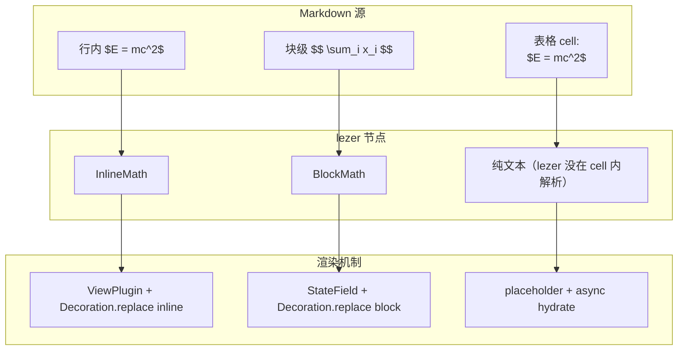

# 行内 LaTeX：在 Live Preview 编辑器里把 `$E = mc^2$` 渲染成 `E = mc²`

> 数学公式在 markdown 里是字符（`$E = mc^2$`），在视觉上应该是排版后的数学（`E = mc²`）。Obsidian 的 Live Preview 让两者按光标位置切换：光标在公式外看到渲染版，进入公式看到字符版。SwarmNote 在 CodeMirror 6 上做同样的事，并把同一套机制扩展到表格 cell 内、块级 `$$...$$` 公式。本文梳理三种场景：行内（lezer 节点 ViewPlugin）、块级（StateField + block widget）、表格 cell 内（placeholder + 异步 hydrate）。

## 目录

1. [一句话总结](#1-一句话总结)
2. [三种场景](#2-三种场景)
3. [基础设施：lazy-load KaTeX](#3-基础设施lazy-load-katex)
4. [行内：InlineMath 节点 + Widget](#4-行内inlinemath-节点--widget)
   - 4.1 [reveal/conceal 策略](#41-revealconceal-策略)
   - 4.2 [click-to-source 交互](#42-click-to-source-交互)
5. [块级：BlockMath StateField + 双模式 decoration](#5-块级blockmath-statefield--双模式-decoration)
6. [表格 cell：placeholder + 异步 hydrate](#6-表格-cellplaceholder--异步-hydrate)
   - 6.1 [renderInlineMarkdown 同步生成 placeholder](#61-renderinlinemarkdown-同步生成-placeholder)
   - 6.2 [createCell 异步 hydrate](#62-createcell-异步-hydrate)
7. [踩过的坑](#7-踩过的坑)
8. [总结](#8-总结)

---

## 1. 一句话总结

> **lezer 把 `$...$` / `$$...$$` 解析成 `InlineMath` / `BlockMath` 节点；行内用 ViewPlugin + Widget 替换、块级必须用 StateField + block widget；表格 cell 内的 markdown 渲染是同步的，所以 math 走"先输出 placeholder 占位、KaTeX 加载完后异步 hydrate" 的二段式。三处都共用一个 module-level lazy-loaded `katexModule` 缓存。**

---

## 2. 三种场景



每条路径都有自己的约束：

- **行内**：必须保留光标进入时切回源码的能力（reveal）；CM6 inline widget 用 ViewPlugin 即可。
- **块级**：block widget 必须由 StateField 提供（CM6 限制 ViewPlugin 不能产 block decoration）。
- **表格 cell**：cell 的 HTML 是 widget 内自己 `cell.innerHTML = renderInlineMarkdown(value)` 生成的——一段同步纯函数，不能直接调异步的 KaTeX。需要把 math 输出成可识别的 placeholder span，widget 在 DOM 插入完后再异步 hydrate。

---

## 3. 基础设施：lazy-load KaTeX

KaTeX 体积大（~270 KB minified + 字体），不能跟 editor bundle 一起打包。三处共用一个模块级缓存：

```ts
// renderBlockMath.ts / renderBlockTables.ts / replaceMathFormulas.ts
let katexModule: typeof import('katex') | null = null;

async function loadKaTeX() {
  if (!katexModule) {
    katexModule = await import('katex');
  }
  return katexModule.default ?? katexModule;
}
```

第一次调用触发动态 import（Vite 自动 code-split），后续直接从 `katexModule` 拿。三个文件各自维护一份缓存——没共享是因为它们是独立 extension，跨文件共享 module state 反而增加耦合，让一份多份缓存换来 import 干净是值得的。

CSS 走全局 import 一次（KaTeX MathML annotation 必须靠 CSS `position: absolute; clip` 隐藏，否则会显示成额外的字符）：

```ts
// renderBlockMath.ts
import 'katex/dist/katex.css';
```

只 import 一次（在 `renderBlockMath.ts` 顶层）就够了——浏览器 CSS 全局生效，行内 math / 表格 math 都受益。

---

## 4. 行内：InlineMath 节点 + Widget

lezer markdown 解析 `$x^2$` 为：

```
InlineMath
├─ MathDelimiter "$"
├─ ... math content ...
└─ MathDelimiter "$"
```

InlineMath 节点在 `inlineRendering` extension 框架下声明：

```ts
export const replaceMathFormulas: InlineRenderingSpec = {
  nodeNames: ['InlineMath'],
  extension: {
    createDecoration(node, state) {
      const tex = extractInlineMath(node, state);  // strip surrounding `$`
      if (!tex || !tex.trim()) return null;
      return new MathWidget(tex, node.from, node.to);
    },
    getRevealStrategy(): RevealStrategy {
      return 'active';  // 光标进入节点 → 显示源码
    },
  },
};
```

`MathWidget.toDOM` 返回一个 `<span>`，先放原始 tex 作为 placeholder，再异步 KaTeX 渲染：

```ts
class MathWidget extends WidgetType {
  toDOM(view: EditorView) {
    const container = document.createElement('span');
    container.className = 'cm-math-inline';
    container.textContent = this.tex;  // ← 加载前先显示原始字符

    void loadKaTeX().then((katex) => {
      if (!container.isConnected) return;  // ← widget 已 destroy，跳过
      try {
        katex.render(this.tex, container, { displayMode: false, throwOnError: false });
      } catch {
        container.textContent = this.tex;
        container.classList.add('cm-math-error');
      }
    });

    // click-to-source 见 §4.2
    container.addEventListener('mousedown', (event) => {
      event.preventDefault();
      event.stopPropagation();
      const contentFrom = this.nodeFrom + 1;
      const contentTo = Math.max(contentFrom, this.nodeTo - 1);
      view.dispatch({
        selection: { anchor: contentFrom, head: contentTo },
        scrollIntoView: true,
      });
      view.focus();
    });

    return container;
  }
}
```

要点：

- **`isConnected` 守卫**：用户编辑过快时 widget 频繁 destroy + 重建，KaTeX `.then` 回调可能在 destroy 后才触发。`container.isConnected === false` 表示 widget 已 detach，跳过避免操作 dead DOM。
- **`throwOnError: false`**：让 KaTeX 把语法错误以红色 fallback 显示而不是抛异常。

### 4.1 reveal/conceal 策略

`getRevealStrategy: 'active'` 表示 cursor head 落在 InlineMath 节点 `[from, to)` 内时不挂装饰——用户看到原始 `$E = mc^2$`。光标移开就 reveal 失效，widget 显示 `E = mc²`。

这是 Obsidian Live Preview 的核心交互：装饰不是"永久"的，跟着光标位置 toggle。`makeInlineReplaceExtension` 把 `shouldReveal()` 判断后直接 `return` 跳过装饰创建。

### 4.2 click-to-source 交互

行内公式渲染后是一坨数学符号，没有可见的"点击进入编辑"入口。Obsidian 的设计：点击公式任意位置，光标自动落到 `$` 之间。

实现：widget 上挂 `mousedown` listener，把 selection 设到 `[contentFrom, contentTo]`（公式内容范围，不含两个 `$` 字符）。这样：

1. 用户点击渲染版的公式
2. caret 跳到 `$` 之间
3. 因为 selection head 在 InlineMath 内 → reveal 触发 → widget 不渲染
4. 用户看到 `$E = mc^2$` 源码并能编辑

`event.preventDefault()` 阻止 CM6 把 click 当作 caret 移动到 widget 边界，`stopPropagation` 不让 `addFormattingClasses` 等其他 spec 再处理。

---

## 5. 块级：BlockMath StateField + 双模式 decoration

`$$...$$` 跨多行——block-level decoration。CM6 限制：**block widget 必须从 StateField 提供**，ViewPlugin 路径下 `Decoration.replace({ block: true })` 会被静默忽略。

最初行内/块级用同一个 ViewPlugin 处理，结果 InlineMath 渲染正常但 BlockMath 的 widget 不出现（debug 半天）。修法：拆出独立 `renderBlockMath.ts`：

```ts
const blockMathField = StateField.define<DecorationSet>({
  create: (state) => buildBlockMathDecorations(state),
  update(prev, tr) {
    if (tr.docChanged || tr.selection) {
      return buildBlockMathDecorations(tr.state);
    }
    return prev;
  },
  provide: (f) => EditorView.decorations.from(f),
});
```

块级公式跟行内公式有个**视觉差异**：用户编辑 block math 时，希望源码 + 渲染同时可见（Obsidian 行为），而非"光标进入则隐藏渲染"：

```ts
function buildBlockMathDecorations(state: EditorState): DecorationSet {
  // ... iterate BlockMath nodes ...
  const intersects = cursorInside(node, sel);

  if (intersects) {
    // 光标在公式内 → 保留源码 + 在 closing $$ 后追加渲染 widget（side: 1 = 后置）
    builder.add(node.to, node.to, Decoration.widget({ widget, block: true, side: 1 }));
  } else {
    // 光标在外 → 用 widget 替换整个 block
    builder.add(node.from, node.to, Decoration.replace({ widget, block: true }));
  }
}
```

两种 decoration 选其一：

| 状态 | Decoration 类型 | 视觉 |
|---|---|---|
| 光标外 | `Decoration.replace({ block: true })` | 替换 markdown，只看到渲染卡片 |
| 光标内 | `Decoration.widget({ block: true, side: 1 })` | 源码 + 渲染卡片同行显示（卡片在 closing `$$` 之后） |

这跟代码块的 Obsidian 体验一致——编辑时既看 source 又看 preview。

`BlockMathWidget` 的 DOM 是一张卡片，含 KaTeX 公式 + hover 浮出的"编辑源码"按钮（lucide `code-2` icon），点击 dispatch selection 到公式内容范围（不含 `$$` delimiters）：

```ts
const enterSource = (event: Event) => {
  event.preventDefault();
  event.stopPropagation();
  view.dispatch({
    selection: { anchor: this.contentFrom, head: this.contentTo },
    scrollIntoView: true,
  });
  view.focus();
};
editBtn.addEventListener('mousedown', enterSource);
card.addEventListener('mousedown', enterSource);
```

---

## 6. 表格 cell：placeholder + 异步 hydrate

第三处场景最棘手。GFM 表格 cell 的渲染是 widget 内手写的：

```ts
cell.innerHTML = renderInlineMarkdown(value);
```

`renderInlineMarkdown` 是一段**同步纯函数**——`escapeHtml` + `applyEmphasis` + `replace(/`...`/, ...)` 等等串成。它不能直接 `await katex.render(...)`，否则要把整个调用链改成异步，cell 渲染在 widget 构造阶段就阻塞。

而且 cell 是个 `<th>`/`<td>`，KaTeX 渲染产生 SVG/HTML 输出，必须直接挂在某个 element 上——同步函数返回字符串 HTML 不能含 KaTeX 输出（`renderToString` 也是同步的，但加载 KaTeX 是异步的）。

二段式解决：

### 6.1 renderInlineMarkdown 同步生成 placeholder

```ts
const MATH_OPEN = '\u{E002}';
const MATH_CLOSE = '\u{E003}';

export function renderInlineMarkdown(raw: string): string {
  let html = escapeHtml(raw);

  // 先保护 inline code（避免 `$x$` 被识别）
  const codeSpans: string[] = [];
  html = html.replace(/`([^`\n]+)`/g, (_, code) => {
    codeSpans.push(code);
    return `${CODE_OPEN}${codeSpans.length - 1}${CODE_CLOSE}`;
  });

  // 保护 inline math 同模式
  const mathSpans: string[] = [];
  html = html.replace(/\$([^$\n]+)\$/g, (_, tex) => {
    mathSpans.push(tex);
    return `${MATH_OPEN}${mathSpans.length - 1}${MATH_CLOSE}`;
  });

  // emphasis / del / link 等替换 ... math placeholder 不会被它们匹配 ...

  // 最后还原成 placeholder span
  const mathRestoreRe = new RegExp(`${MATH_OPEN}(\\d+)${MATH_CLOSE}`, 'gu');
  html = html.replace(mathRestoreRe, (_, idx) => {
    const tex = mathSpans[Number(idx)] ?? '';
    return `<span class="cm-table-math" data-tex="${escapeHtml(tex)}">${escapeHtml(`$${tex}$`)}</span>`;
  });

  return html;
}
```

关键点：

- **Unicode Private Use Area 占位符**（`\u{E000}` ~ `\u{E003}`）：在 emphasis / link 等中间步骤里"假装"是不可见标记，最后阶段还原为真实 HTML。这样 `$x*y$` 不会被 emphasis 错误匹配 `*`。
- **输出含 `data-tex` 属性的 span**：HTML 字符串可以同步生成（escape 后是字面文本），含足够信息让消费者知道哪些 span 待 hydrate、tex 内容是啥。
- **fallback 文本**：span 内 `escapeHtml(\`$${tex}$\`)` 是原始字符——KaTeX 加载失败/还没加载完时用户看到 `$E = mc^2$` 字面，而不是空白。

### 6.2 createCell 异步 hydrate

cell 渲染后扫描 placeholder span，loadKaTeX 后逐个 `katex.render` 替换：

```ts
function hydrateMathSpans(root: HTMLElement) {
  const spans = root.querySelectorAll<HTMLElement>('.cm-table-math[data-tex]');
  if (spans.length === 0) return;

  void loadKaTeX().then((katex) => {
    spans.forEach((span) => {
      if (!span.isConnected) return;
      const tex = span.dataset.tex ?? '';
      try {
        katex.render(tex, span, { displayMode: false, throwOnError: false });
        span.removeAttribute('data-tex');  // ← mark as rendered（避免重复）
      } catch {
        span.textContent = `$${tex}$`;
      }
    });
  });
}

private createCell(view, tag, value, colIdx, onCommit) {
  const cell = document.createElement(tag);
  cell.innerHTML = renderInlineMarkdown(value);
  hydrateMathSpans(cell);  // ← 同步返回，KaTeX 在后台 hydrate

  // ... blur listener 也要 re-hydrate（commit 后重新渲染会清掉 KaTeX 输出）
  cell.addEventListener('blur', () => {
    cell.innerHTML = renderInlineMarkdown(cell.dataset.raw ?? '');
    hydrateMathSpans(cell);
  });
  // ...
}
```

`data-tex` 属性 + `[data-tex]` 选择器是关键：

- 第一次 hydrate 后 `removeAttribute('data-tex')` 让 span 不再被选中
- 用户编辑 cell 后 blur，`innerHTML` 重新生成（新一批 placeholder span 又有 `data-tex`），重新 hydrate
- **不会重复 render 已 KaTeX 化的 span**

---

## 7. 踩过的坑

| 现象 | 根因 | 修法 |
|---|---|---|
| BlockMath widget 完全不出现 | ViewPlugin 路径不能产 block decoration | 拆出独立 `renderBlockMath.ts` 用 StateField |
| KaTeX 渲染后多了一行 LaTeX 字符 | KaTeX 用 MathML annotation 暴露源码，靠 `katex.css` 的 `position: absolute; clip` 隐藏；没 import css 就漏出来 | `import 'katex/dist/katex.css'` |
| 行内公式点击没反应 | `ignoreEvent` 默认返回 true，CM6 把 click 当作普通文本点击送给原文范围 | `ignoreEvent(e) { return e.type !== 'mousedown' }`，并在 mousedown handler 里 dispatch selection |
| 块级公式编辑时只看到源码、看不到渲染 | 光标内只产 replace decoration，源码被替换掉 | 改成 `Decoration.widget({ block: true, side: 1 })` 在 closing `$$` 后追加 widget，源码保留 |
| 选中区域包括 `$` | dispatch selection 用 `[node.from, node.to]` 含 delimiters | 算 `contentFrom = node.from + 1, contentTo = node.to - 1` |
| 编辑器频繁更新时 KaTeX `.then` 报错 | widget destroy 后 callback 仍 fire | `if (!span.isConnected) return` 守卫 |
| 表格 cell 内 math 不渲染 | `renderInlineMarkdown` 不识别 `$...$` | placeholder + `hydrateMathSpans` 二段式 |
| KaTeX 加载慢用户看到空白 | KaTeX 是 lazy import + render 异步 | placeholder span 内填 `escapeHtml(\`$${tex}$\`)` 作为 fallback 文本 |

---

## 8. 总结

让 `$E = mc^2$` 在三种场景下都正确渲染，本质是三种"何时同步、何时异步"的不同答案：

1. **行内** ：lezer 已识别 InlineMath 节点 → CM6 ViewPlugin 直接 `Decoration.replace`，widget DOM 在 toDOM 阶段同步创建，KaTeX 异步 hydrate。
2. **块级**：CM6 block widget 必须 StateField 提供，且需要"源码 + 渲染同时显示"的双模式（光标内/外）—— 一个 widget 实例 + 两种 decoration 包装。
3. **表格 cell**：渲染链是 widget 内手写的同步函数，math 走 placeholder + 异步 hydrate；placeholder 内填字面源码做 fallback；`isConnected` 守卫避免 dead DOM 操作。

三处共用：

- 一个 module-level lazy `katexModule` 缓存（首次调用动态 import）。
- 一次全局 `import 'katex/dist/katex.css'`（避免 MathML annotation 漏出）。
- `throwOnError: false` 让语法错误以红色 fallback 显示而非抛异常。
- `displayMode` 参数区分 inline (`false`) 还是 display block (`true`)。

下一步：`$$$ ... $$$` 多行编号公式（aligned / cases 已经能用，编号需要 KaTeX `tag()` macro）；以及 inline math 的 click-to-source 也要做到表格 cell 内（目前 cell 内点击 math span 不会进入 source mode，因为 cell 整体的 mousedown 把焦点拿走了）。
