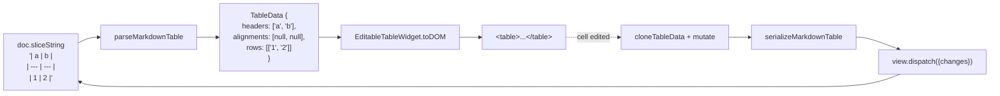
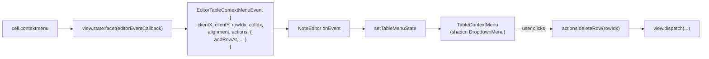

# 把 GFM Markdown 表格做成 Obsidian 体验：从 widget 替换到 ::before backdrop

> Markdown 表格在源码里是一坨 `| ... |` 字符——优美但难编辑。Obsidian 的 Live Preview 把它渲染成可交互的 HTML `<table>`：点击单元格就能编辑、hover 行/列浮出 `:::` 拖拽柄、右键弹出嵌套菜单。本文记录 SwarmNote 在 CodeMirror 6 上**从零实现这套体验**——包括 widget 替换式渲染、跨 widget/React 边界的 contextmenu 桥接、以及选中态如何用 `::before` 伪元素绕过 `border-collapse: collapse` 对 `border-radius` 的丢弃。

## 目录

1. [一句话总结](#1-一句话总结)
2. [先看效果](#2-先看效果)
3. [架构：widget 替换式渲染](#3-架构widget-替换式渲染)
   - 3.1 [为什么不能纯 CSS 装饰](#31-为什么不能纯-css-装饰)
   - 3.2 [Decoration.replace + StateField](#32-decorationreplace--statefield)
   - 3.3 [双向映射：markdown ↔ TableData](#33-双向映射markdown--tabledata)
4. [Cell 编辑：contentEditable + on-blur commit](#4-cell-编辑contenteditable--on-blur-commit)
5. [Affordance：行/列 `:::` handle](#5-affordance行列--handle)
6. [跨 widget/React 桥接：contextmenu via Facet](#6-跨-widgetreact-桥接contextmenu-via-facet)
7. [选中态：用 `::before` 伪元素绕过 collapse](#7-选中态用-before-伪元素绕过-collapse)
   - 7.1 [尝试一：border-collapse separate + 圆角](#71-尝试一border-collapse-separate--圆角)
   - 7.2 [尝试二：box-shadow inset](#72-尝试二box-shadow-inset)
   - 7.3 [最终方案：::before backdrop](#73-最终方案before-backdrop)
8. [视觉细节](#8-视觉细节)
9. [踩过的坑](#9-踩过的坑)
10. [总结](#10-总结)

---

## 1. 一句话总结

> **CodeMirror 把整段表格 markdown 用一个 `Decoration.replace` 替换为可交互的 HTML `<table>` widget；行/列 affordance 是 widget 内的 absolute 子元素；右键菜单走 Facet 事件桥接到主仓 React 层用 shadcn 渲染；选中环用 `::before` 伪元素 `inset: -1px` 做 backdrop，零 layout shift 同时拿到圆角。**

---

## 2. 先看效果

```
┌──────────────────────────────────────┐
│ 类型     │ 示例                       │
├──────────────────────────────────────┤
│ 粗体     │ 加粗文本                    │
│ 斜体     │ 斜体文本                    │
│ ┌──────────────────────────┐         │  ← 选中行：浅暖色背景
│ │ 行内公式 │ E = mc²        │ ◀── ::: │    + 2px 金色圆角 outline
│ └──────────────────────────┘         │
└──────────────────────────────────────┘
                                   ↓ 右键
                            ┌──────────────┐
                            │ 行 ▶          │
                            │ 列 ▶          │
                            │ 切换源码      │
                            │ 复制为 Markdown│
                            │ 删除表格      │
                            └──────────────┘
```

跟 Obsidian Live Preview 视觉等价。但实现里塞了三块业内不太常见的工程：

1. **widget 替换 + cell 编辑**：CodeMirror 的 widget 默认是 atomic 的（光标进不去）；要让 cell 内 contentEditable 可编辑，需要 widget 主动处理 mousedown/blur/Enter 三个事件。
2. **Facet 桥接 contextmenu**：widget 是原生 DOM，不在 React 树内；要让右键菜单跟主仓 EditorContextMenu 同体系（shadcn DropdownMenu），靠 `editorEventCallback` Facet 把 widget 内的 right-click 转成 `EditorTableContextMenu` 事件，主仓 `NoteEditor` 监听并渲染菜单。
3. **`::before` 选中环**：`border-collapse: collapse` 模式下 `border-radius` 在 cell 上被静默丢弃；选中行/列要圆角 outline，靠每 cell 的 `::before` 伪元素绝对定位 `inset: -1px` 做 backdrop。

下面分段拆开讲。

---

## 3. 架构：widget 替换式渲染

### 3.1 为什么不能纯 CSS 装饰

第一直觉：lezer markdown parser 已经把 GFM 表格识别为 `Table` / `TableRow` / `TableCell` 节点，给这些节点加 CSS class 不就完了？

不行。CodeMirror Live Preview 的"装饰"对应两类 Decoration：

| Decoration 类型 | 能做什么 |
|---|---|
| `Decoration.mark({ class })` | 给文本范围加 CSS class（不改变文本） |
| `Decoration.replace({ widget })` | 用 widget 替换文本范围（隐藏原文） |

如果只用 `Decoration.mark`，原始 markdown 字符（`|`、`---`、`-:`）始终可见，永远不会变成 `<table>`。要把"`| 姓名 | 年龄 |`"显示成网格，必须 `replace` 掉这段原文，画一个真正的 `<table>` widget。

### 3.2 Decoration.replace + StateField

block 级 widget 必须由 `StateField` 提供（不能用 `ViewPlugin`，CM6 限制）：

```ts
const tableField = StateField.define<DecorationSet>({
  create: (state) => buildTableDecorations(state),
  update(deco, tr) {
    const hasModeToggle = tr.effects.some((e) => e.is(setTableSourceMode));
    if (tr.docChanged || tr.reconfigured || hasModeToggle) {
      return buildTableDecorations(tr.state);
    }
    return deco;
  },
  provide: (f) => EditorView.decorations.from(f),
});

function buildTableDecorations(state: EditorState): DecorationSet {
  const decorations: Range<Decoration>[] = [];
  syntaxTree(state).iterate({
    enter: (node) => {
      if (node.name !== 'Table') return;
      const tableData = parseMarkdownTable(state.doc.sliceString(node.from, node.to));
      if (!tableData) return;
      decorations.push(
        Decoration.replace({
          widget: new EditableTableWidget(tableData, node.from, node.to),
          block: true,
        }).range(node.from, node.to),
      );
    },
  });
  return Decoration.set(decorations.sort((a, b) => a.from - b.from), true);
}
```

要点：

- `widget: new EditableTableWidget(...)` —— 每次 `buildTableDecorations` 跑都 new 一个新 widget 实例；CM6 通过 `widget.eq(other)` 决定是否复用 DOM（保留 contentEditable 焦点）。
- `block: true` —— widget 占独立行（不与文本同行）。
- range `[node.from, node.to)` 覆盖整段 markdown —— 替换后原文不可见。

`EditableTableWidget.eq()` 必须深比较 `TableData` 所有字段，否则每次输入都 destroy + 重建 DOM，光标会消失。

### 3.3 双向映射：markdown ↔ TableData



- `parseMarkdownTable(source)` 把 lezer 给的范围内文本解析成 `{ headers, alignments, rows }`。
- 任何 cell 编辑提交时调用 `cloneTableData(this.data)` 复制再改，再 `serializeMarkdownTable(updated)` 序列化回 markdown，最后 `view.dispatch({ changes: { from, to, insert: markdown } })` 一次写回。
- 单一职责：widget 只看 `TableData`，markdown 解析/序列化是纯函数，方便测试。

转义处理：`parseRow` 用 `\x00PIPE\x00` 占位符避开 `\\|`，序列化时单空格分隔。**不做"列宽对齐 padding"**——保留用户原始格式，跟 Obsidian 一致。

---

## 4. Cell 编辑：contentEditable + on-blur commit

CodeMirror 的 widget 默认是 atomic：光标进不去，键入不响应。要让 cell 可编辑，widget 必须主动放弃 atomic 性质，并自己处理输入。

```ts
private createCell(view, tag, value, colIdx, onCommit) {
  const cell = document.createElement(tag);
  cell.contentEditable = 'true';
  cell.spellcheck = false;
  cell.dataset.raw = value;
  cell.innerHTML = renderInlineMarkdown(value);

  let editing = false;

  cell.addEventListener('focus', () => {
    if (!editing) {
      editing = true;
      // 进入编辑：显示原始 markdown 字符（`**bold**` 而非 <strong>bold</strong>）
      cell.textContent = cell.dataset.raw ?? '';
    }
  });

  cell.addEventListener('blur', () => {
    commitIfChanged();
    editing = false;
    // 退出编辑：重新渲染装饰版本
    cell.innerHTML = renderInlineMarkdown(cell.dataset.raw ?? '');
  });

  cell.addEventListener('keydown', (e) => {
    if (e.key === 'Enter') { e.preventDefault(); cell.blur(); }
    else if (e.key === 'Tab') { e.preventDefault(); navigateCell(cell, e.shiftKey ? -1 : 1); }
    else if (e.key === 'Escape') { e.preventDefault(); cell.blur(); }
  });

  // ignoreEvent 返回 false 让 CM6 把事件交给 cell 处理
  return cell;
}

ignoreEvent(): boolean { return false; }
```

关键决策：

- **commit on blur, NOT on input**。每次 keydown 都 dispatch 会让 IME composition 中断（中文/日文输入卡顿）；blur 时 dispatch 一次产生单个 Yjs delta，干净。
- **focus 时把 innerHTML 切到原始 markdown**。否则用户编辑的是 `<strong>` DOM 节点，无法准确提取出 `**bold**` 字符串。
- **dataset.raw 是真相源**。`cell.textContent` 只在编辑期间临时持有，blur 后 raw 写回 markdown，innerHTML 重新装饰版本。

Tab 末格自动加行：

```ts
if (direction === 1 && idx === cells.length - 1) {
  pendingTableFocus.set(this.tableFrom, { row: this.data.rows.length, col: 0 });
  this.addRowAt(view, this.data.rows.length, 'below');
  return;
}
```

`pendingTableFocus` 是 module-level Map，dispatch 触发 widget 重建后 `toDOM` 检查这个 map，`requestAnimationFrame` 把焦点放到新行第一格。

---

## 5. Affordance：行/列 `:::` handle

Obsidian 的视觉范式是"纯网格 + hover 浮出 affordance"，不要常驻工具栏。每行最左、每列上方各浮出一个 `:::` handle：

```ts
private buildTable(view: EditorView): HTMLElement {
  const table = document.createElement('table');

  const thead = document.createElement('thead');
  const headerRow = document.createElement('tr');
  this.data.headers.forEach((header, colIdx) => {
    const th = this.createCell(view, 'th', header, colIdx, ...);
    th.appendChild(this.buildColumnHandle(colIdx));  // ← 列 handle
    headerRow.appendChild(th);
  });
  thead.appendChild(headerRow);
  table.appendChild(thead);

  const tbody = document.createElement('tbody');
  this.data.rows.forEach((row, rowIdx) => {
    const tr = document.createElement('tr');
    row.forEach((cell, colIdx) => {
      const td = this.createCell(view, 'td', cell, colIdx, ...);
      if (colIdx === 0) {
        td.appendChild(this.buildRowHandle(rowIdx));  // ← 行 handle
      }
      tr.appendChild(td);
    });
    tbody.appendChild(tr);
  });
  table.appendChild(tbody);
  return table;
}
```

行 handle 不能是独立 `<td>`——那样 thead 列数和 tbody 列数不一致，HTML table 会错位（实际遇到过：tbody 第一列空、列数 +1，整张表被推到右边）。改成 **`td[colIdx=0]` 内的 absolute 子元素**：

```css
.cm-table-widget tbody td {
  position: relative;
}
.cm-table-row-handle {
  position: absolute;
  left: -22px;       /* 浮在 cell 左侧 22px gutter 内 */
  top: 50%;
  transform: translateY(-50%);
  opacity: 0;
  transition: opacity 0.15s;
}
.cm-table-widget tbody tr:hover .cm-table-row-handle,
.cm-table-widget tbody tr.cm-table-row-selected .cm-table-row-handle {
  opacity: 1;
}
```

注意 hover 触发条件**只用 `:hover` 不用 `:focus-within`**——否则 cell focus 时 hover 行 + focus 行两个 ::: 同时浮起，视觉杂乱。

列 handle 同理放在 `<th>` 内，定位 `top: -18px` 浮在 thead 上方。Widget container 必须有 `padding-top: 24px` 给它留位，否则被裁切。

点击 handle 切换 row/col selection：

```ts
private toggleRowSelection(rowIdx: number) {
  const widgetEl = document.querySelector<HTMLElement>(
    `.cm-table-widget[data-table-from="${this.tableFrom}"]`,
  );
  // ... toggle .cm-table-row-selected on tr
}
```

`data-table-from` 是 widget 实例的稳定 ID（dispatch 加行不影响表格起始位置），用来在多 widget 场景下精确定位。

---

## 6. 跨 widget/React 桥接：contextmenu via Facet

主仓 `EditorContextMenu.tsx` 用 shadcn `ContextMenu` 渲染编辑器全局右键菜单（粗体、剪切、行宽切换…）。表格 cell 的右键菜单要跟它**同体系**——都是 shadcn 风格、同一套 i18n。但 widget 是原生 DOM，不在 React 树里。

第一版自建了一套手写 DOM popover + `<style>` 注入，用户一句"应该跟其他菜单一样放主模块"打回。

正确做法：**editor submodule 抛事件，主仓 React 监听并渲染菜单**。链路：



实现关键三块：

### Facet 把 onEvent 注入到 view.state

```ts
// events.ts
export const editorEventCallback = Facet.define<
  ((event: EditorEvent) => void) | undefined,
  ((event: EditorEvent) => void) | undefined
>({
  combine: (values) => values.find((v): v is (e: EditorEvent) => void => Boolean(v)),
});

// createEditor.ts
if (onEvent) {
  extensions.push(editorEventCallback.of(onEvent));
  // ...
}
```

Facet 是 CodeMirror 提供的"参数注入"机制——extensions 提供值，state 通过 facet 读出。这样 widget 在 `toDOM(view)` 时拿到 view，再 `view.state.facet(editorEventCallback)` 取出 onEvent，不需要在 widget 构造函数里传一堆参数。

### widget cell contextmenu 抛事件

```ts
cell.addEventListener('contextmenu', (e) => {
  e.preventDefault();
  e.stopPropagation();
  const rowIdx = tag === 'th' ? -1 : Number(cell.parentElement?.dataset.rowIdx ?? -1);
  const callback = view.state.facet(editorEventCallback);
  callback?.({
    kind: EditorEventType.TableContextMenu,
    clientX: e.clientX,
    clientY: e.clientY,
    rowIdx,
    colIdx,
    alignment: this.data.alignments[colIdx],
    rowCount: this.data.rows.length,
    colCount: this.data.headers.length,
    actions: this.buildContextMenuActions(view),
  });
});
```

`actions` 是一个普通 object，方法直接绑定到 widget 实例：

```ts
private buildContextMenuActions(view: EditorView): TableContextMenuActions {
  return {
    addRowAt: (rowIdx, position) => this.addRowAt(view, rowIdx, position),
    deleteRow: (rowIdx) => this.deleteRow(view, rowIdx),
    addColumnAt: (colIdx, position) => this.addColumnAt(view, colIdx, position),
    deleteColumn: (colIdx) => this.deleteColumn(view, colIdx),
    setAlignment: (colIdx, alignment) => this.setAlignment(view, colIdx, alignment),
    toggleSource: () => this.toggleSource(view),
    copyMarkdown: () => this.copyMarkdown(),
    deleteTable: () => this.deleteTable(view),
  };
}
```

主仓 React 不需要知道 widget 实例的存在——只调 `actions.deleteRow(rowIdx)`，闭包帮它 dispatch。

### 主仓用 invisible trigger 把菜单浮在 cursor 位置

shadcn `DropdownMenu` 默认靠 `<DropdownMenuTrigger>` 元素的位置确定菜单位置。我们要让它浮在右键的 `clientX/Y`——用一个 `1×1` 的 invisible div 作为 trigger：

```tsx
<DropdownMenu open={open} onOpenChange={onOpenChange} modal={false}>
  <DropdownMenuTrigger asChild>
    <div
      style={{
        position: "fixed",
        left: clientX,
        top: clientY,
        width: 1,
        height: 1,
        pointerEvents: "none",
      }}
    />
  </DropdownMenuTrigger>
  <DropdownMenuContent align="start" className="w-52">
    {/* 行/列嵌套子菜单 + 切换源码 / 复制 / 删除表格 */}
  </DropdownMenuContent>
</DropdownMenu>
```

`pointerEvents: 'none'` 让 trigger 不挡住下方 cell 的点击。`open` controlled 由 `tableMenuState.open` 驱动。

---

## 7. 选中态：用 `::before` 伪元素绕过 collapse

选中行/列要显示**圆角 + 浅暖色背景 + 2px 金色 outline**——这看起来简单，做了三轮才对。

### 7.1 尝试一：border-collapse separate + 圆角

```css
table { border-collapse: separate; border-spacing: 0; }
.cm-table-row-selected td {
  border-top: 2px solid var(--cm-table-selection-border);
  border-bottom: 2px solid var(--cm-table-selection-border);
}
.cm-table-row-selected td:first-child {
  border-left: 2px solid var(--cm-table-selection-border);
  border-top-left-radius: 6px;
  border-bottom-left-radius: 6px;
}
.cm-table-row-selected td:last-child { /* 同理右侧 */ }
```

问题：

- **layout shift**：border 从 1px 变 2px 让 row 高度增加 1-2px，每次 toggle 选中整个文档跳动。
- **邻接双线**：selected row 上方的 row borderBottom 是 1px 浅，selected row borderTop 是 2px 金，紧贴时视觉上 1px 浅 + 2px 金 = 3px 厚。
- **凹角**：selected first cell 圆角 6px，邻接的非 selected first cell 是直角 1px border，圆角处错位看起来"凹"。

### 7.2 尝试二：box-shadow inset

```css
table { border-collapse: collapse; }
.cm-table-row-selected td {
  box-shadow: inset 0 2px 0 var(--cm-table-selection-border),
              inset 0 -2px 0 var(--cm-table-selection-border);
}
.cm-table-row-selected td:first-child {
  box-shadow: inset 2px 2px 0 ..., inset 2px -2px 0 ...;
}
```

问题：

- **box-shadow inset 不延伸**到 cell 外，每 cell 自己画自己的 ring 段。
- 中间 cells 之间 cell border 还在（浅色 1px），ring 看起来被 vertical 分隔线**断成 segments**——整行不像连续 ring。
- 圆角通过 cell border-radius clip box-shadow，但 collapse 模式 cell border-radius 是被静默丢弃的，圆角失败。

### 7.3 最终方案：::before backdrop

灵感来自社区常见技巧：用 `td::before` 伪元素做绝对定位 backdrop，绕过 cell 的 layout 限制。

```css
table { border-collapse: collapse; }

/* 默认每 cell 4 边 1px 浅 border */
th, td {
  border: 1px solid var(--cm-table-border);
  position: relative;  /* ← ::before 的定位锚点 */
}

/* Selected row: 浅暖色背景 */
.cm-table-row-selected td {
  background: var(--cm-table-selection-bg);
}

/* Selected row: ::before 画 outline ring */
.cm-table-row-selected td::before {
  content: "";
  position: absolute;
  inset: -1px;       /* ← 关键：扩出 cell 1px 覆盖原 border */
  pointer-events: none;
  border-top: 2px solid var(--cm-table-selection-border);
  border-bottom: 2px solid var(--cm-table-selection-border);
}
.cm-table-row-selected td:first-child::before {
  border-left: 2px solid var(--cm-table-selection-border);
  border-top-left-radius: 6px;
  border-bottom-left-radius: 6px;
}
.cm-table-row-selected td:last-child::before {
  border-right: 2px solid var(--cm-table-selection-border);
  border-top-right-radius: 6px;
  border-bottom-right-radius: 6px;
}
```

为什么这个方案行：

| 痛点 | `::before` 方案怎么解 |
|---|---|
| Layout shift | cell 自身 border 不变（永远 1px 浅），背景色和 ring 都来自伪元素，不影响 layout |
| `border-radius` 被 collapse 丢弃 | 伪元素是普通 absolute 元素，不是 table cell，`border-radius` 正常生效 |
| 中间 cells 共享分隔被 outline 覆盖 | `inset: -1px` 让伪元素 ring 在 cell 边界外侧 1px 处，盖住自己的 1px 浅 border；中间 cells 没画 left/right ring，原 vertical 分隔保留 |
| 邻接行双线 | `inset: -1px` 把 ring 顶部画到 cell 外 1px，刚好替换原 1px 浅 borderTop（视觉是 2px 金，干净） |
| ring 不连续 | 每 cell 的 `::before` 顶/底 ring 在 cell 横向范围内，相邻 cells 拼接成连续直线 |

ToBeDocumented：CodeMirror 的 `EditorView.theme` 直接支持 `::before` 选择器，`content: '""'` 在 JS object value 里写两层引号即可。

列选中同理：

```css
.cm-table-col-selected::before {
  content: "";
  position: absolute;
  inset: -1px;
  pointer-events: none;
  border-left: 2px solid var(--cm-table-selection-border);
  border-right: 2px solid var(--cm-table-selection-border);
}
.cm-table-widget thead tr th.cm-table-col-selected::before {
  border-top: 2px solid var(--cm-table-selection-border);
  border-top-left-radius: 6px;
  border-top-right-radius: 6px;
}
.cm-table-widget tbody tr:last-child td.cm-table-col-selected::before {
  border-bottom: 2px solid var(--cm-table-selection-border);
  border-bottom-left-radius: 6px;
  border-bottom-right-radius: 6px;
}
```

---

## 8. 视觉细节

跟 Obsidian 对齐的细节：

- **表头无背景色，只加粗** —— `font-weight: 600`，不要 `background-color`。
- **不要斑马纹** —— `tr:nth-child(even)` 一律不染色，让行边框自己讲故事。
- **不要 cell focus 焦点环** —— 编辑 cell 时除了原生 caret blink 不需要其他视觉变化，否则字符切换+边框变化让人眼花。
- **不要 row hover 背景** —— 仅 row handle 区响应 hover；行本身保持纯净。
- **图片不限尺寸** —— Obsidian 让 cell 内图片自然显示（撑高行）；我们也不加 `max-height`。

主题 token 集中在 `createTheme.ts`：

```ts
const lightTableTokens = {
  '--cm-table-border': 'hsl(30, 10%, 87%)',
  '--cm-table-header-bg': 'hsl(33, 10%, 92%)',
  '--cm-table-selection-border': 'hsl(40, 72%, 46%)',
  '--cm-table-selection-bg': 'hsla(40, 72%, 46%, 0.10)',
  '--cm-table-affordance-fg': 'hsla(28, 10%, 14%, 0.6)',
  '--cm-table-affordance-bg-hover': 'hsl(33, 10%, 88%)',
};
```

`renderBlockTables.ts` 全 `var(--cm-table-*)`，零 `rgba(127,127,127,...)` 硬编码——主题切换时 widget DOM 不重建，CSS 变量值变化浏览器自动重渲染。

---

## 9. 踩过的坑

| 现象 | 根因 | 修法 |
|---|---|---|
| 第二列出现在 thead "第三格"，整张表错位 | 行删除 handle 是独立 `<td>`，让 tbody 列数比 thead 多 1 | handle 放在 `td[colIdx=0]` 内 absolute |
| `width: 0 !important` 不生效 | HTML table layout 算法忽略 cell `width: 0`，按内容平分 | 不依赖 width 隐藏，改用 absolute |
| 用户编辑后第一行多两个空格 | dispatch 范围错位 + Y.Doc 重置 reconciliation | 改用稳定的 `tableFrom` 而非每次重新查 |
| 顶部 `:::` drag handle 显示不全 | widget container `padding-top: 8px` 不够 | 加大到 24px 给 col handle 留位 |
| 内联数学公式不渲染（显示 `$E=mc^2$`） | `renderInlineMarkdown` 不识别 math | 加 placeholder + 异步 KaTeX hydrate（见另一篇） |
| HMR 后 CodeMirror MCP 自动化失效 | webview reload 让 `__MCP__.resolveRef` 状态丢失 | 重启 driver_session |

---

## 10. 总结

GFM 表格做到 Obsidian 体验的三条核心路径：

1. **widget 替换 + cell 编辑**：`Decoration.replace({ block: true })` 替换整段 markdown，cell 用 `contentEditable` + on-blur commit 模式编辑，`pendingTableFocus` 跨 widget 重建保留焦点。
2. **affordance 嵌入 cell**：行/列 `:::` handle 是 `td[colIdx=0]` / `th` 内的 absolute 子元素，避免增加 cell 数破坏列对齐；`:hover` 触发，**不用 `:focus-within`** 防双重显示。
3. **contextmenu 走 Facet 桥接**：editor submodule 抛 `EditorTableContextMenu` 事件，主仓用 shadcn `DropdownMenu` 渲染，invisible 1×1 trigger 浮在 cursor 位置；菜单项调 widget 提供的 `actions` 闭包，闭包内部 `view.dispatch`。

外加一条视觉小技巧：**`td::before` + `inset: -1px` 是 collapse 模式下做圆角 outline 的最干净办法**——零 layout shift，保留中间共享分隔，邻接行无双线，圆角原生支持。

下一步：v2 加真拖拽（行/列 reorder、表格在文档中拖动）、按列升降序、移动行/列。这些都是 markdown 序列化层面的改动，UI 层基础已经搭好。
