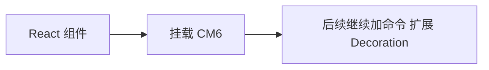

<!-- cspell:ignore codemirror tsx -->

# 01. 从 `pnpm create vite` 开始搭一个 CM6 学习环境

> 这一篇只做一件事：搭一个后面可以一直拿来练习 CodeMirror 6 的 React + TypeScript 项目。

## 本篇目标

读完你应该已经完成：

- 创建一个 React + TS 项目
- 安装 CM6 第一批依赖
- 清掉 Vite 默认模板
- 跑起一个干净的学习环境

## 1. 创建项目

执行：

```bash
pnpm create vite cm6-lab --template react-ts
cd cm6-lab
pnpm install
```

后面文档统一用 `cm6-lab` 这个项目名。

## 2. 先跑一次模板项目

执行：

```bash
pnpm dev
```

先确认默认模板本身能正常跑起来。

这一步的目的很简单：后面如果有问题，你能先排除掉 Vite 初始化本身的故障。

## 3. 安装第一批 CM6 依赖

执行：

```bash
pnpm add codemirror @codemirror/state @codemirror/view @codemirror/lang-markdown
```

先简单认识一下：

| 包 | 作用 |
| --- | --- |
| `codemirror` | 常用入口，通常会用到 `basicSetup` |
| `@codemirror/state` | 状态层 |
| `@codemirror/view` | 视图层 |
| `@codemirror/lang-markdown` | Markdown 语言支持 |

现在不用背 API，只先记住：**CM6 不是一个大包，而是一组模块。**

## 4. 清理模板代码

为了让后面的实验更干净，先把默认模板简化掉。

### `src/App.tsx`

改成：

```tsx
export default function App() {
  return (
    <main style={{ padding: 24 }}>
      <h1>CM6 Lab</h1>
      <p>下一篇开始把第一个 CodeMirror 6 编辑器挂进来。</p>
    </main>
  );
}
```

### `src/index.css`

改成：

```css
:root {
  font-family: Inter, system-ui, -apple-system, BlinkMacSystemFont, 'Segoe UI', sans-serif;
  color: #111827;
  background: #f9fafb;
}

* {
  box-sizing: border-box;
}

html,
body,
#root {
  margin: 0;
  min-height: 100%;
}

body {
  min-width: 320px;
}
```

## 5. 为什么用 React + TS 学 CM6

因为你平时主要就在这个技术栈里工作。



这样学的好处是：

- 后面的代码更容易直接迁回业务项目
- 你会更早接触真实问题，比如 `ref`、生命周期、实例管理
- 不需要先学一套纯 JS demo，再补一套 React 写法

## 6. 到这一步你应该得到什么

现在你应该已经有：

- 一个 `cm6-lab` 项目
- 一个能正常跑的 React + TS 页面
- 一组已经装好的 CM6 基础依赖

继续看下一篇：[`02-在 React 里挂一个最小 CodeMirror 6 编辑器`](./02-在-React-里挂一个最小-CodeMirror-6-编辑器.md)
