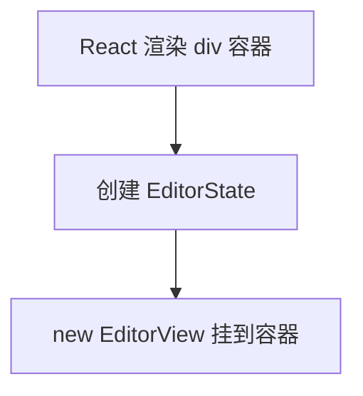

<!-- cspell:ignore codemirror tsx -->

# 02. 在 React 里挂一个最小 CodeMirror 6 编辑器

> 这一篇只做最小实例：准备一个容器，创建 `EditorState`，再把 `EditorView` 挂进去。

## 本篇目标

读完这一篇，你应该能：

- 写出一个最小 `Editor.tsx`
- 在 `useEffect` 里创建 `EditorView`
- 用 `ref` 把编辑器挂到 DOM
- 在页面里看到一个可输入的 CM6 编辑器

## 1. 新建 `src/Editor.tsx`

```tsx
import { useEffect, useRef } from 'react';
import { EditorState } from '@codemirror/state';
import { EditorView } from '@codemirror/view';
import { markdown } from '@codemirror/lang-markdown';
import { basicSetup } from 'codemirror';

export default function Editor() {
  const containerRef = useRef<HTMLDivElement | null>(null);

  useEffect(() => {
    if (!containerRef.current) return;

    const state = EditorState.create({
      doc: '# Hello CM6\n\n这是我的第一个 CodeMirror 6 编辑器。',
      extensions: [basicSetup, markdown()],
    });

    const view = new EditorView({
      state,
      parent: containerRef.current,
    });

    return () => {
      view.destroy();
    };
  }, []);

  return <div ref={containerRef} />;
}
```

## 2. 在 `App.tsx` 里挂载它

```tsx
import Editor from './Editor';

export default function App() {
  return (
    <main style={{ maxWidth: 860, margin: '0 auto', padding: 24 }}>
      <h1>CM6 Lab</h1>
      <p>下面这个区域就是我们挂出来的第一个 CodeMirror 6 编辑器。</p>
      <Editor />
    </main>
  );
}
```

## 3. 给编辑器一点最小样式

在 `src/index.css` 末尾补上：

```css
.cm-editor {
  border: 1px solid #d1d5db;
  border-radius: 12px;
  background: #ffffff;
}

.cm-scroller {
  min-height: 240px;
  font-family: 'JetBrains Mono', 'SFMono-Regular', Consolas, monospace;
}

.cm-content {
  padding: 16px;
}
```

## 4. 跑起来

执行：

```bash
pnpm dev
```

如果正常，你会看到一个能输入 Markdown 文本的编辑器区域。

## 5. 这段代码其实只有三步



### 第一步：React 提供容器

```tsx
const containerRef = useRef<HTMLDivElement | null>(null);
return <div ref={containerRef} />;
```

### 第二步：创建状态

```tsx
const state = EditorState.create({
  doc: '# Hello CM6',
  extensions: [basicSetup, markdown()],
});
```

这里先只关心两件事：

- 初始文本是什么
- 编辑器有哪些能力

### 第三步：创建视图

```tsx
const view = new EditorView({
  state,
  parent: containerRef.current,
});
```

`EditorView` 会把状态渲染到真实 DOM，并接管输入、光标、选区这些交互。

## 6. `extensions` 先怎么理解

现在先把它理解成“给编辑器加能力的清单”：

| 扩展 | 现在先理解成什么 |
| --- | --- |
| `basicSetup` | 一组常用基础能力 |
| `markdown()` | 让编辑器理解 Markdown 语言 |

后面再慢慢拆开看，不急着一口吃完。

## 7. 为什么这里要 `destroy()`

```tsx
return () => {
  view.destroy();
};
```

因为组件卸载时，编辑器实例也应该一起销毁。

这里先把它记成一个固定动作就行：

- 创建了 `EditorView`
- 离开页面时就 `destroy()` 它

继续看下一篇：[`03A-React 中管理 EditorView 生命周期`](./03A-React-中管理-EditorView-生命周期.md)
