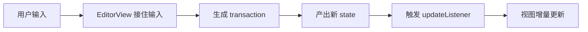
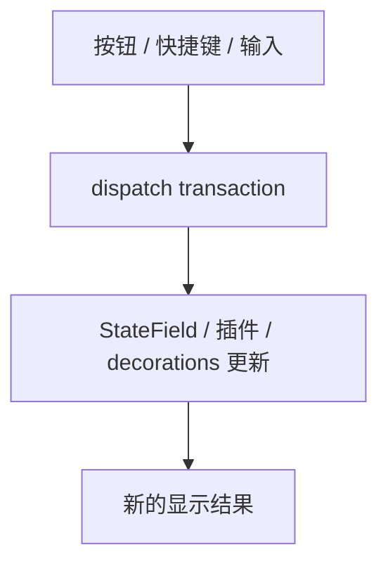

# 03. 在 React 里监听更新，理解 transaction 和更新循环

> 到这一步，你已经能把编辑器挂进 React 了。接下来最值得先学的，不是更多 API，而是弄清楚：CM6 里的变化到底是怎么流动的。

## 本篇目标

读完这一篇，你应该能：

- 在 React 里监听编辑器更新
- 拿到当前文档内容
- 理解 `dispatch` 和 `transaction` 的基本关系
- 建立“CM6 更新不是直接改 DOM”的直觉

## 1. 先给编辑器加一个更新监听

把 `src/Editor.tsx` 先改成这样：

```tsx
import { useEffect, useRef } from 'react';
import { EditorState } from '@codemirror/state';
import { EditorView } from '@codemirror/view';
import { markdown } from '@codemirror/lang-markdown';
import { basicSetup } from 'codemirror';

export default function Editor() {
  const containerRef = useRef<HTMLDivElement | null>(null);

  useEffect(() => {
    if (!containerRef.current) return;

    const view = new EditorView({
      state: EditorState.create({
        doc: '# Hello CM6\n\n试着输入一点内容。',
        extensions: [
          basicSetup,
          markdown(),
          EditorView.updateListener.of((update) => {
            if (update.docChanged) {
              console.log(update.state.doc.toString());
            }
          }),
        ],
      }),
      parent: containerRef.current,
    });

    return () => {
      view.destroy();
    };
  }, []);

  return <div ref={containerRef} />;
}
```

现在你每输入一次，控制台都会打印最新文档内容。

## 2. `updateListener` 在听什么

这一段是关键：

```tsx
EditorView.updateListener.of((update) => {
  if (update.docChanged) {
    console.log(update.state.doc.toString());
  }
})
```

它不是传统意义上的 `onChange(text)`。

它监听的是一次 **view update**。这次 update 里面会告诉你：

- 文档有没有变
- 选区有没有变
- 焦点有没有变
- 新的 state 是什么

所以它更像“编辑器更新观察点”，而不只是“输入事件”。

## 3. 先建立一条最重要的更新链路



你现在至少要先记住：

- 用户打字不是直接改 DOM
- 输入先变成 transaction
- transaction 让 state 变成新 state
- 然后 view 再根据新 state 更新显示

## 4. transaction 到底是什么

你可以先把 transaction 理解成：

> **一次完整的编辑器状态更新描述。**

最常见的内容包括：

- 文本变化 `changes`
- 选区变化 `selection`
- 其他扩展关心的附加信息

例如：

```tsx
view.dispatch({
  changes: {
    from: 0,
    insert: '# ',
  },
});
```

这段代码的意思不是“改一下字符串”，而是：

- 构造一次更新
- 把这次更新 dispatch 给编辑器
- 让编辑器自己沿着统一链路完成状态切换

## 5. 自己手动 dispatch 一次更新

你可以先试一个最小例子。给 `Editor.tsx` 加一个按钮：

```tsx
import { useEffect, useRef } from 'react';
import { EditorState } from '@codemirror/state';
import { EditorView } from '@codemirror/view';
import { markdown } from '@codemirror/lang-markdown';
import { basicSetup } from 'codemirror';

export default function Editor() {
  const containerRef = useRef<HTMLDivElement | null>(null);
  const viewRef = useRef<EditorView | null>(null);

  useEffect(() => {
    if (!containerRef.current) return;

    const view = new EditorView({
      state: EditorState.create({
        doc: 'hello',
        extensions: [basicSetup, markdown()],
      }),
      parent: containerRef.current,
    });

    viewRef.current = view;

    return () => {
      view.destroy();
      viewRef.current = null;
    };
  }, []);

  const insertHeading = () => {
    const view = viewRef.current;
    if (!view) return;

    view.dispatch({
      changes: {
        from: 0,
        insert: '# ',
      },
    });
  };

  return (
    <div>
      <button onClick={insertHeading}>在开头插入标题标记</button>
      <div ref={containerRef} />
    </div>
  );
}
```

点按钮后，你会看到文档开头被插入 `# `。

## 6. 为什么这套模型这么重要

因为后面你学到的大部分能力，都会沿着同一条链走：

- 命令
- 快捷键
- 格式化
- 自定义扩展
- 协作同步
- 装饰更新



所以 transaction 不是一个偏底层的小概念，而是 CM6 的主干。

## 7. 回到 React 视角，最该记住什么

在 React 里，很多人会本能地想：

- 输入了
- `setState`
- 重新 render

但 CM6 不是这条链。

在 CM6 里更接近：

- 输入了
- `dispatch`
- 新 `EditorState`
- `EditorView` 自己更新
- React 只在你真的需要同步外部 UI 时再介入

这也是为什么 CM6 通常不是完全受控组件。

## 8. 在项目里，更新监听是怎么被用起来的

如果你去看 `packages/editor/src/createEditor.ts`，会发现项目里也注册了 `EditorView.updateListener`。

它会根据不同更新类型抛出高层事件，比如：

- 文档变化
- 选区变化
- focus / blur

这说明 `updateListener` 不只是调试工具，它也是 editor 和 React host 之间的重要桥。

## 9. 本篇结论

这一篇你最该真正建立的直觉是：

- CM6 的变化先走 `transaction`
- `dispatch` 是进入更新链的入口
- `updateListener` 是观察更新链的入口
- 视图显示是 state 更新后的结果，不是你手动改 DOM 的结果

继续看下一篇：[`04-先学会判断一个功能该写成哪种扩展`](./04-先学会判断一个功能该写成哪种扩展.md)
