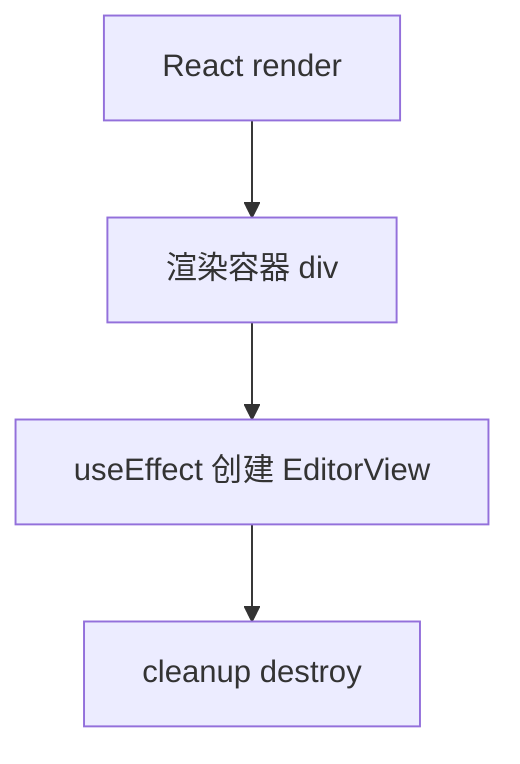
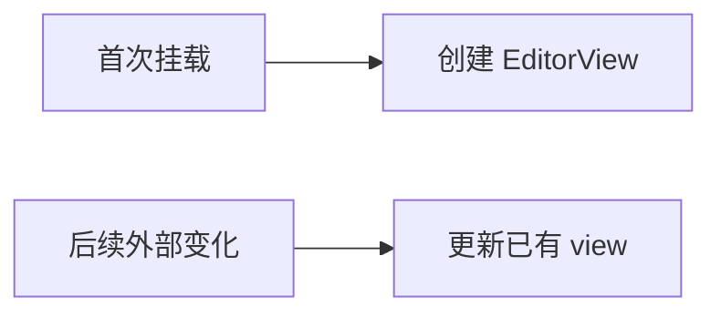

<!-- cspell:ignore codemirror tsx -->

# 03A. React 中管理 `EditorView` 生命周期

> 到这一步，代码已经能跑了。接下来要解决第一个真实坑：为什么 `EditorView` 不能在每次 render 时重建。

## 本篇目标

读完你应该能：

- 理解为什么 `EditorView` 不该反复创建
- 知道 `useRef`、`useEffect` 在这里各自负责什么
- 分清“初始化一次”和“后续更新内容”是两回事
- 写出一个更稳定的 React 封装骨架

## 1. 最容易写错的方式

很多人第一次会写成这样：

```tsx
export default function Editor() {
  const parent = document.getElementById('editor');

  const view = new EditorView({
    state: EditorState.create({ doc: 'hello' }),
    parent: parent!,
  });

  return <div id="editor" />;
}
```

问题在于：React 组件函数可能会重复执行，而这段代码每执行一次都会重新 `new EditorView(...)`。

后果通常是：

- 编辑器重复创建
- 光标和选区丢失
- undo/redo 历史丢失
- 事件监听残留

## 2. 正确思路



也就是：

- render 只负责输出容器
- `useEffect` 负责初始化实例
- cleanup 负责销毁实例

## 3. 一个更稳的基础写法

```tsx
import { useEffect, useRef } from 'react';
import { EditorState } from '@codemirror/state';
import { EditorView } from '@codemirror/view';

export default function Editor() {
  const containerRef = useRef<HTMLDivElement | null>(null);
  const viewRef = useRef<EditorView | null>(null);

  useEffect(() => {
    if (!containerRef.current || viewRef.current) return;

    const view = new EditorView({
      state: EditorState.create({ doc: 'Hello CM6' }),
      parent: containerRef.current,
    });

    viewRef.current = view;

    return () => {
      view.destroy();
      viewRef.current = null;
    };
  }, []);

  return <div ref={containerRef} />;
}
```

这里最关键的是：

- `containerRef` 存挂载 DOM
- `viewRef` 存编辑器实例
- `useEffect(..., [])` 只做初始化和清理

## 4. 为什么 `viewRef` 很重要

因为后面你会经常通过它操作已有实例，比如：

```tsx
viewRef.current?.focus();
```

或者读取当前文本：

```tsx
const text = viewRef.current?.state.doc.toString();
```

所以 `viewRef` 不只是“防止重复创建”，也是 React 和编辑器实例之间的桥。

## 5. 初始化一次，不等于以后都不更新

这里最容易误会。



关键点是：

- **初始化实例** 是一回事
- **更新实例内容** 是另一回事

不要一有外部变化就重建整个 `EditorView`。

## 6. 一个典型误区：把 `initialValue` 放进依赖

```tsx
function Editor({ initialValue }: { initialValue: string }) {
  useEffect(() => {
    const view = new EditorView({
      state: EditorState.create({ doc: initialValue }),
      parent: containerRef.current!,
    });

    return () => view.destroy();
  }, [initialValue]);
}
```

这样会导致：

- `initialValue` 一变就重建整个编辑器
- 用户当前光标和历史记录一起丢掉

如果它语义上真的是“初始值”，通常就只该参与第一次创建。

## 7. 那后续通常怎么更新

通常不是重建，而是对已有实例做更新。比如最简单的方向可以先记成：

```tsx
const view = viewRef.current;
if (!view) return;

view.dispatch({
  changes: {
    from: 0,
    to: view.state.doc.length,
    insert: '新的内容',
  },
});
```

这里先不用急着吃透 `dispatch` 和 `transaction` 的全部细节，你先建立一个直觉：

> **后续变化通常是更新已有实例，而不是重建实例。**

## 8. 本篇结论

如果你只记一句话，就记这一句：

> **在 React 里，`EditorView` 应该被稳定持有；初始化和销毁走生命周期，后续变化尽量更新已有实例。**

继续看下一篇：[`03-在 React 里监听更新，理解 transaction 和更新循环`](./03-在-React-里监听更新与理解-transaction-更新循环.md)
