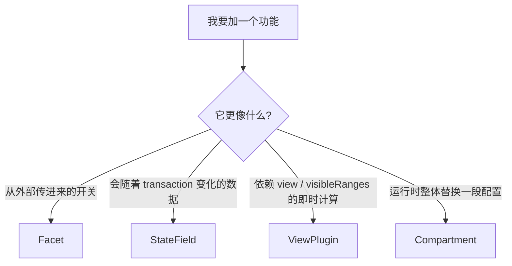
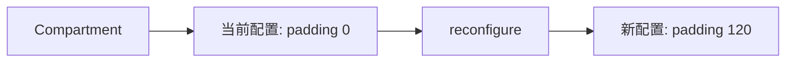
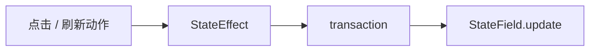

# 04. 先别背概念：直接做 4 个小功能，学会判断该写成哪种扩展

> 前一篇你已经知道 CM6 的更新会走 `dispatch -> transaction -> state -> view`。这一篇不要先背 `Facet`、`StateField`、`ViewPlugin`、`Compartment` 的定义，而是直接做 4 个很小的功能。你做完再回头看这些名字，会顺很多。

## 本篇目标

读完这一篇，你应该能：

- 知道 `Facet`、`StateField`、`ViewPlugin`、`Compartment` 分别解决什么实际问题
- 遇到新需求时，先按“配置 / 状态 / 视图逻辑 / 动态重配”判断落点
- 在自己的 `cm6-lab` 里写出最小可运行例子

## 1. 这一篇我们只做 4 个功能

继续用前面几篇的 `src/Editor.tsx`。

这次不空讲概念，直接做这 4 件事：

1. 给编辑器加一个“是否启用高亮”的开关
2. 统计文档被改了多少次
3. 只在可视区里给标题行加样式
4. 点按钮切换编辑器底部 padding



你先把这张图当成“选工具图”就够了。

## 2. 先准备一个稍微像样一点的 `Editor.tsx`

先把文件改成这个版本，后面四个例子都接着它往上加：

```tsx
import { useEffect, useRef, useState } from 'react';
import { Compartment, EditorState } from '@codemirror/state';
import { EditorView } from '@codemirror/view';
import { markdown } from '@codemirror/lang-markdown';
import { basicSetup } from 'codemirror';

const paddingCompartment = new Compartment();

export default function Editor() {
  const containerRef = useRef<HTMLDivElement | null>(null);
  const viewRef = useRef<EditorView | null>(null);
  const [largePadding, setLargePadding] = useState(false);

  useEffect(() => {
    if (!containerRef.current) return;

    const view = new EditorView({
      state: EditorState.create({
        doc: '# Hello CM6\n\n## Section\n\n试着输入一点内容。',
        extensions: [
          basicSetup,
          markdown(),
          paddingCompartment.of(
            EditorView.contentAttributes.of({
              style: 'padding-bottom: 0px',
            }),
          ),
        ],
      }),
      parent: containerRef.current,
    });

    viewRef.current = view;

    return () => {
      view.destroy();
      viewRef.current = null;
    };
  }, []);

  const togglePadding = () => {
    const view = viewRef.current;
    if (!view) return;

    const next = !largePadding;
    setLargePadding(next);

    view.dispatch({
      effects: paddingCompartment.reconfigure(
        EditorView.contentAttributes.of({
          style: `padding-bottom: ${next ? 120 : 0}px`,
        }),
      ),
    });
  };

  return (
    <div>
      <button onClick={togglePadding}>切换底部 padding</button>
      <div ref={containerRef} />
    </div>
  );
}
```

现在先不用完全吃透，后面每一小节只看这里的一部分。

## 3. 先做第一个最容易懂的：`Compartment`

上面的按钮已经是一个最小 `Compartment` 例子了。

重点看这一段：

```tsx
const paddingCompartment = new Compartment();
```

和这一段：

```tsx
view.dispatch({
  effects: paddingCompartment.reconfigure(
    EditorView.contentAttributes.of({
      style: `padding-bottom: ${next ? 120 : 0}px`,
    }),
  ),
});
```

它解决的问题是：

- 我不想销毁再重建整个编辑器
- 我只想把“某一段扩展配置”换掉

这就是 `Compartment` 最典型的场景。

你可以先把它记成：

> **给扩展留一个可替换插槽。**



## 4. 第二个功能：外部传一个开关，这更像 `Facet`

假设你现在想做一个很小的功能：

- 外部决定“标题高亮是否启用”
- 编辑器内部很多地方都可能读这个开关

这时它更像“配置”，不是状态。

先新建一个 `src/extensions/demoFacet.ts`：

```ts
import { Facet } from '@codemirror/state';

export const highlightHeadingsFacet = Facet.define<boolean, boolean>({
  combine: (values) => (values.length ? values[values.length - 1] : true),
});
```

然后在 `Editor.tsx` 里把它放进 `extensions`：

```tsx
highlightHeadingsFacet.of(true)
```

这个 `true` 的意思其实很像 React 里的：

```tsx
<Editor highlightHeadings />
```

只是到了 CM6 里，你往往不会层层传 props，而是把它放进 editor state，让别的扩展自己读取。

所以 `Facet` 最该先怎么记？

> **给编辑器内部注入配置。**

### 为什么这里不是 `StateField`

因为这个值不是跟着输入、选区、点击一起演化的。

它更像：

- 初始化时传入
- 或者宿主层在某个时刻切换
- 内部多个扩展统一读取

这种场景优先想到 `Facet`。

## 5. 第三个功能：统计文档改了多少次，这就是 `StateField`

现在来做一个真的会跟着 transaction 变化的数据。

新建 `src/extensions/changeCounter.ts`：

```ts
import { StateField } from '@codemirror/state';

export const changeCounterField = StateField.define<number>({
  create() {
    return 0;
  },
  update(value, tr) {
    return tr.docChanged ? value + 1 : value;
  },
});
```

然后加进 `Editor.tsx` 的 `extensions`：

```tsx
changeCounterField,
EditorView.updateListener.of((update) => {
  if (update.docChanged) {
    console.log('change count =', update.state.field(changeCounterField));
  }
}),
```

现在你每输入一次，控制台都会打印累计次数。

这时你会发现：

- 文本变了
- transaction 产生了
- `StateField.update` 跟着跑
- 新 state 里保存了新计数

这就是真正的“编辑器状态”。

所以 `StateField` 最该先怎么记？

> **给编辑器加一块会跟着 transaction 演化的数据。**

### 为什么这里不是 `Facet`

因为它不是外部给定的固定配置。

它会随着：

- 输入
- 删除
- 粘贴
- 命令触发

一路演化。

这就是 `StateField` 的地盘。

## 6. 第四个功能：只处理可视区标题行，这就是 `ViewPlugin`

接下来做一个最接近真实编辑器的例子：

- 只给当前可视区里的标题行加 class
- 滚动时重新计算

这种逻辑就不只是“存个状态”了，它强依赖当前 view。

新建 `src/extensions/headingHighlight.ts`：

```ts
import { syntaxTree } from '@codemirror/language';
import { Decoration, type DecorationSet, EditorView, ViewPlugin, ViewUpdate } from '@codemirror/view';
import { RangeSetBuilder } from '@codemirror/state';
import { highlightHeadingsFacet } from './demoFacet';

function buildDecorations(view: EditorView): DecorationSet {
  if (!view.state.facet(highlightHeadingsFacet)) {
    return Decoration.none;
  }

  const builder = new RangeSetBuilder<Decoration>();

  for (const { from, to } of view.visibleRanges) {
    syntaxTree(view.state).iterate({
      from,
      to,
      enter(node) {
        if (node.name !== 'ATXHeading1' && node.name !== 'ATXHeading2') return;

        const line = view.state.doc.lineAt(node.from);
        builder.add(
          line.from,
          line.from,
          Decoration.line({ attributes: { class: 'cm-demo-heading' } }),
        );
      },
    });
  }

  return builder.finish();
}

export const headingHighlightExtension = ViewPlugin.fromClass(
  class {
    decorations: DecorationSet;

    constructor(view: EditorView) {
      this.decorations = buildDecorations(view);
    }

    update(update: ViewUpdate) {
      if (update.docChanged || update.viewportChanged || update.selectionSet) {
        this.decorations = buildDecorations(update.view);
      }
    }
  },
  {
    decorations: (value) => value.decorations,
  },
);

export const headingHighlightTheme = EditorView.theme({
  '.cm-demo-heading': {
    backgroundColor: 'rgba(255, 215, 0, 0.12)',
  },
});
```

然后把它加进 `Editor.tsx`：

```tsx
highlightHeadingsFacet.of(true),
headingHighlightExtension,
headingHighlightTheme,
```

你现在得到的是一个非常真实的判断题：

- 它依赖 `visibleRanges`
- 它依赖当前 view
- 它会在滚动和更新时重算

这种功能天然更像 `ViewPlugin`。

所以 `ViewPlugin` 最该先怎么记？

> **把“强依赖 view 的即时计算逻辑”放进去。**

## 7. 到这里再回头看，四种扩展就没那么抽象了

你现在已经分别做过：

| 你刚做的功能 | 更适合的机制 | 为什么 |
| --- | --- | --- |
| 切换底部 padding | `Compartment` | 运行时替换一段配置 |
| 传入“标题高亮开关” | `Facet` | 它是配置，不是运行时状态 |
| 统计文档变更次数 | `StateField` | 它跟着 transaction 演化 |
| 只给可视区标题行加样式 | `ViewPlugin` | 它强依赖 view 和 visibleRanges |

这时候再背定义才有意义。

## 8. `StateEffect` 这时再讲就容易多了

很多人第一次听 `StateEffect` 会更晕。

你现在可以先这样理解：

- `StateField` 是那块状态本身
- `StateEffect` 是 transaction 里顺带带过去的一条消息

比如你以后做：

- 点击某个图片 widget 后标记“当前选中图片”
- 手动触发“刷新 block image”

这种“不是改文档文本，但要让某个 field 更新”的场景，就很适合 `StateEffect`。



在 SwarmNote 里，`renderBlockImages.ts` 就是很典型的例子。

## 9. 为什么你前面会觉得这些概念很飘

因为如果没有具体功能，`Facet`、`StateField`、`ViewPlugin` 听起来都像：

- 某种“扩展机制”
- 某种“插件写法”

但它们真正的区别不是语法，而是职责：

- `Facet` 处理配置
- `StateField` 处理状态
- `ViewPlugin` 处理贴着 view 的逻辑
- `Compartment` 处理动态重配

你以后遇到新需求，先别问“我要用哪个 API”，先问：

1. 这是配置还是状态？
2. 它是不是要跟着 transaction 演化？
3. 它是不是强依赖 view / visibleRanges？
4. 它是不是要运行时整体切配置？

## 10. 先对照一下项目里的真实例子

你现在再去看这些文件，就会比直接硬读顺很多：

1. `packages/editor/src/core/facets.ts`
2. `packages/editor/src/core/shouldShowSource.ts`
3. `packages/editor/src/createEditor.ts`
4. `packages/editor/src/extensions/inlineRendering/makeInlineReplaceExtension.ts`
5. `packages/editor/src/extensions/renderBlockImages.ts`

建议你带着下面这个对照表去看：

| 文件 | 现在重点看什么 |
| --- | --- |
| `facets.ts` | 配置是怎么注入进编辑器的 |
| `shouldShowSource.ts` | 代码怎么读取 facet 决定行为 |
| `createEditor.ts` | 很多扩展是怎么被装进去的 |
| `makeInlineReplaceExtension.ts` | 为什么某些显示逻辑更像 `ViewPlugin` |
| `renderBlockImages.ts` | 为什么 block widget 更像 `StateField` + `StateEffect` |

## 11. 本篇结论

这一篇最重要的不是把 4 个名词背下来，而是先建立这组手感：

- 一个开关配置，优先想 `Facet`
- 一块会演化的数据，优先想 `StateField`
- 一段贴着 view 即时重算的逻辑，优先想 `ViewPlugin`
- 一段要运行时替换的配置，优先想 `Compartment`

继续看下一篇：[`05-用 Decoration 和 Widget 做出最小 Live Preview`](./05-用-Decoration-和-Widget-做出最小-Live-Preview.md)
