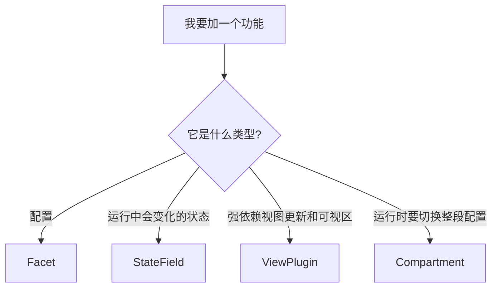
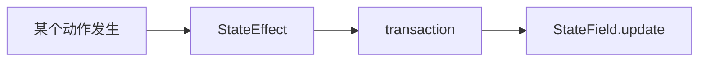
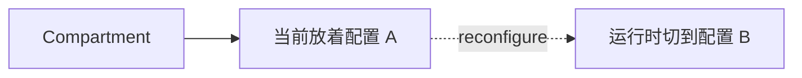

# 04. 先学会判断：一个功能该写成哪种扩展

> 学 CM6 最容易卡住的地方，不是不会写代码，而是不知道一个功能到底该放在哪种扩展里。这一篇专门练这个判断力。

## 本篇目标

读完这一篇，你应该能：

- 分清 `Facet`、`StateField`、`ViewPlugin`、`Compartment` 的角色
- 遇到一个功能时，先判断它是配置、状态还是视图逻辑
- 知道为什么有些显示逻辑能放 `ViewPlugin`，有些必须放 `StateField`

## 1. 先记住一张判断图



如果你现在只先记一句：

- `Facet` 偏配置
- `StateField` 偏状态
- `ViewPlugin` 偏视图逻辑
- `Compartment` 偏动态重配置

就够开始用了。

## 2. `Facet`：把配置送进编辑器内部

最适合放进 `Facet` 的东西通常是：

- 一个功能开关
- 一个 callback
- 一项需要被多个扩展读取的配置

项目里很干净的例子是：

- `packages/editor/src/core/facets.ts`
- `collapseOnSelectionFacet`

它表达的是：是否在选区相关场景下折叠显示 markdown 源码。

### 你可以先把它想成什么

在 React 里你可能会写：

```ts
const enabled = props.collapseOnSelection;
```

在 CM6 里，很多这种“从外面传进来的配置”，会更适合用 Facet 注入到 state 树里，让内部逻辑统一读取。

## 3. `StateField`：给编辑器增加一块会演化的状态

最适合放进 `StateField` 的东西通常是：

- 当前选中了哪个 widget
- 某组 decorations
- 某个统计值
- 某种 mode 或标记集

比如你前面练过的 change counter，就是一个最简单的 `StateField` 例子。

项目里更真实的例子在：

- `packages/editor/src/extensions/renderBlockImages.ts`

里面有一个 `selectedImageField`，用来表示：当前哪张 block 图片处于选中态。

这类数据就很明显不是配置，而是会跟着 transaction 一起变化的状态。

## 4. `StateEffect`：给 `StateField` 带消息

很多时候你不是想改文档文本，而是想告诉某个 `StateField`：

- 发生了一次点击
- 需要刷新一下图片
- 当前选中项变了

这类信息通常会通过 `StateEffect` 跟 transaction 一起传递。



所以你可以先把它记成：

> **StateEffect 是 transaction 里的“附加消息”。**

## 5. `ViewPlugin`：当逻辑强依赖可视区和 view update

有些逻辑天然更靠近视图层，比如：

- 只处理当前可视区域
- 每次 view update 后决定是否重算
- 依赖 `visibleRanges`
- 依赖当前 selection 的即时位置

这类情况就更像 `ViewPlugin`。

项目里的代表例子：

- `packages/editor/src/extensions/inlineRendering/makeInlineReplaceExtension.ts`

它做的是：

- 遍历当前可见区域
- 看语法树节点
- 判断当前该 reveal 还是 conceal
- 生成 inline decorations

这非常像“视图层上的增量计算器”。

## 6. `Compartment`：给配置留一个可替换插槽

当你希望运行时替换某一段扩展配置，但又不想重建整个编辑器时，就该想到 `Compartment`。

项目里用它来控制：

- scroll margins
- content padding

你可以先把它理解成一个“可重配插槽”：



这在产品级编辑器里很常见，因为很多 UI 配置都需要动态切换。

## 7. 一个最实用的判断表

| 需求 | 更适合的机制 |
| --- | --- |
| 从外部传一个 callback 给编辑器内部使用 | `Facet` |
| 记录当前选中的图片或状态 | `StateField` |
| 点击后通知状态切换，但不改文档文本 | `StateEffect` |
| 基于可视区和选区实时重算 inline decoration | `ViewPlugin` |
| 运行时切换某一段配置 | `Compartment` |

## 8. 一个特别重要的真实约束

在这个项目里，有一条非常值得直接记住的工程规则：

> **block decorations 不能通过 `ViewPlugin` 提供，必须通过 `StateField` 提供。**

这也是为什么像下面这些扩展会采用 `StateField` 路线：

- `renderBlockImages.ts`
- `renderBlockCode.ts`
- `renderBlockTables.ts`

如果你以后自己写 block widget，这条规则会非常重要。

## 9. 读项目代码时的顺序建议

如果你想把这一篇和真实项目对起来，建议这样读：

1. `packages/editor/src/core/facets.ts`
2. `packages/editor/src/events.ts`
3. `packages/editor/src/core/shouldShowSource.ts`
4. `packages/editor/src/extensions/inlineRendering/makeInlineReplaceExtension.ts`
5. `packages/editor/src/extensions/renderBlockImages.ts`

这个顺序的好处是：

- 先看配置怎么进来
- 再看状态怎么演化
- 再看显示怎么重算

## 10. 本篇结论

这一篇最重要的不是记住全部定义，而是形成一个稳定判断：

- 这件事是配置，还是状态？
- 它是跟着 transaction 演化，还是跟着 view update 重算？
- 它要不要运行时切换？
- 它是不是 block widget？

继续看下一篇：[`05-用 Decoration 和 Widget 做出最小 Live Preview`](./05-用-Decoration-和-Widget-做出最小-Live-Preview.md)
