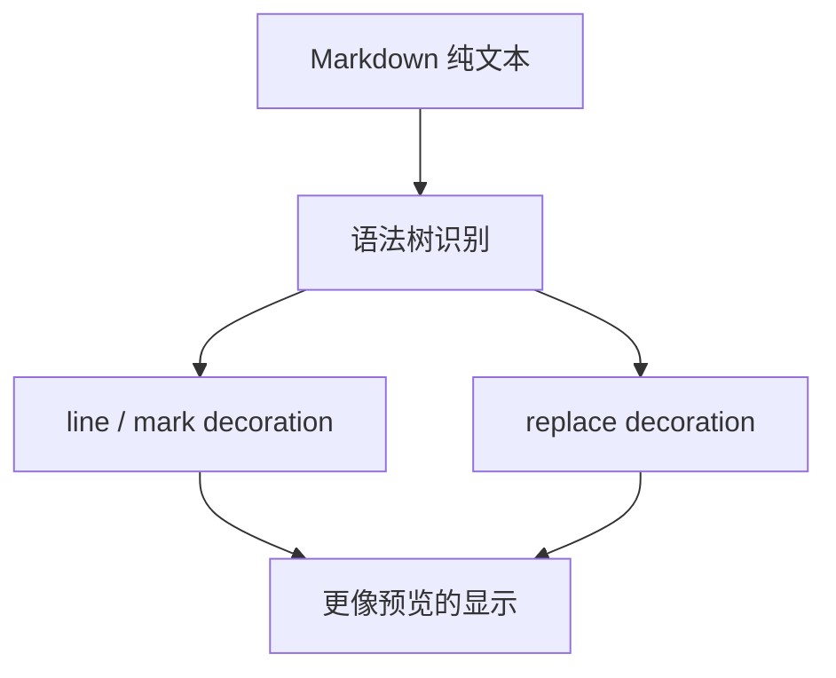
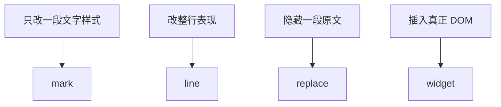

# 05. 别先研究 Obsidian：先在自己的 `cm6-lab` 里做一个最小 Live Preview

> 前一篇你已经做过配置、状态、视图逻辑、动态重配这 4 类功能。这一篇继续沿着同一个 `cm6-lab` 往前走，直接做一个能跑的最小 Live Preview。先让标题变得更像预览，再让 `**bold**` 的标记能在合适的时候露出和隐藏。

## 本篇目标

读完这一篇，你应该能：

- 在自己的练习项目里做出第一层 Live Preview
- 真正理解 `Decoration.line`、`Decoration.mark`、`Decoration.replace`、`Decoration.widget`
- 建立 reveal / conceal 的基本手感
- 知道为什么 CM6 很适合做“文档是纯文本，显示更像富文本”的编辑器

## 1. 这一篇不空讲，直接做两个效果

继续用上一章的 `cm6-lab`。

这次我们只做两个很小的效果：

1. 标题行看起来更像标题
2. `**bold**` 在平时弱化标记，光标进去时露出源码



先做出这两个效果，你对 Live Preview 的理解就不会停留在概念层。

## 2. 第一个效果：让标题行先看起来像标题

这一步最适合复用上一章做过的 `ViewPlugin`。

先新建 `src/extensions/basicPreview.ts`：

```ts
import { syntaxTree } from '@codemirror/language';
import { RangeSetBuilder } from '@codemirror/state';
import { Decoration, DecorationSet, EditorView, ViewPlugin, ViewUpdate } from '@codemirror/view';

function buildDecorations(view: EditorView): DecorationSet {
  const builder = new RangeSetBuilder<Decoration>();

  for (const { from, to } of view.visibleRanges) {
    syntaxTree(view.state).iterate({
      from,
      to,
      enter(node) {
        if (node.name === 'ATXHeading1' || node.name === 'ATXHeading2') {
          const line = view.state.doc.lineAt(node.from);
          builder.add(
            line.from,
            line.from,
            Decoration.line({ attributes: { class: 'cm-preview-heading' } }),
          );
        }
      },
    });
  }

  return builder.finish();
}

export const basicPreviewExtension = ViewPlugin.fromClass(
  class {
    decorations: DecorationSet;

    constructor(view: EditorView) {
      this.decorations = buildDecorations(view);
    }

    update(update: ViewUpdate) {
      if (update.docChanged || update.viewportChanged) {
        this.decorations = buildDecorations(update.view);
      }
    }
  },
  {
    decorations: (value) => value.decorations,
  },
);

export const basicPreviewTheme = EditorView.theme({
  '.cm-preview-heading': {
    fontWeight: '700',
  },
  '.cm-preview-heading .cm-line': {
    fontSize: '1.25rem',
  },
});
```

然后在 `Editor.tsx` 里加上：

```tsx
basicPreviewExtension,
basicPreviewTheme,
```

现在标题虽然还是 `# Hello CM6` 这种纯文本，但视觉上已经更像标题了。

这就是最朴素的一层 Live Preview。

## 3. 这里你实际用到的是 `Decoration.line`

刚才这段最关键的是：

```ts
Decoration.line({ attributes: { class: 'cm-preview-heading' } })
```

它适合做的是：

- 标题行
- blockquote 行
- 列表行
- 某一整行的 class

你可以先把它理解成：

> **给这一整行挂显示属性。**

### 为什么这里不是 `mark`

因为我们不是只想改一小段文本，而是想让整行都变成“标题行的样子”。

## 4. 第二个效果：让 `**bold**` 平时更干净一点

接下来做一点更像 Live Preview 的事。

假设你输入：

```md
这是 **bold** 文本。
```

我们想做的不是删掉 `**`，而是：

- 平时弱化或隐藏 `**`
- 光标进入这段附近时，再露出源码方便编辑

这就是 reveal / conceal。

## 5. 先做一个最小的 reveal 判断

先新建 `src/extensions/showMarkdownSource.ts`：

```ts
import type { EditorState } from '@codemirror/state';

export function shouldShowSource(state: EditorState, from: number, to: number) {
  for (const range of state.selection.ranges) {
    if (range.from <= to && range.to >= from) {
      return true;
    }
  }

  return false;
}
```

这版很简单，意思就是：

- 只要当前选区碰到了这个范围
- 就别做 preview，直接露出源码

等你以后去看项目里的 `packages/editor/src/core/shouldShowSource.ts`，会发现正式版只是把这件事做得更完整。

## 6. 再做一个最小 bold 标记隐藏

继续新建 `src/extensions/boldPreview.ts`：

```ts
import { syntaxTree } from '@codemirror/language';
import { RangeSetBuilder } from '@codemirror/state';
import { Decoration, DecorationSet, EditorView, ViewPlugin, ViewUpdate } from '@codemirror/view';
import { shouldShowSource } from './showMarkdownSource';

function buildDecorations(view: EditorView): DecorationSet {
  const builder = new RangeSetBuilder<Decoration>();

  for (const { from, to } of view.visibleRanges) {
    syntaxTree(view.state).iterate({
      from,
      to,
      enter(node) {
        if (node.name !== 'StrongEmphasis') return;
        if (shouldShowSource(view.state, node.from, node.to)) return;

        builder.add(
          node.from,
          node.from + 2,
          Decoration.mark({ attributes: { class: 'cm-preview-hidden-mark' } }),
        );

        builder.add(
          node.to - 2,
          node.to,
          Decoration.mark({ attributes: { class: 'cm-preview-hidden-mark' } }),
        );

        builder.add(
          node.from + 2,
          node.to - 2,
          Decoration.mark({ attributes: { class: 'cm-preview-bold-text' } }),
        );
      },
    });
  }

  return builder.finish();
}

export const boldPreviewExtension = ViewPlugin.fromClass(
  class {
    decorations: DecorationSet;

    constructor(view: EditorView) {
      this.decorations = buildDecorations(view);
    }

    update(update: ViewUpdate) {
      if (update.docChanged || update.selectionSet || update.viewportChanged) {
        this.decorations = buildDecorations(update.view);
      }
    }
  },
  {
    decorations: (value) => value.decorations,
  },
);

export const boldPreviewTheme = EditorView.theme({
  '.cm-preview-hidden-mark': {
    opacity: '0.25',
  },
  '.cm-preview-bold-text': {
    fontWeight: '700',
  },
});
```

然后在 `Editor.tsx` 里把它装进去：

```tsx
boldPreviewExtension,
boldPreviewTheme,
```

现在你会得到一个很有代表性的最小体验：

- 平时 `**` 被弱化
- 光标进入这段区域时，源码完整露出

这就是最小 reveal / conceal。

## 7. 这里你实际用到的是 `Decoration.mark`

上面最关键的是这三段：

```ts
Decoration.mark({ attributes: { class: 'cm-preview-hidden-mark' } })
```

和：

```ts
Decoration.mark({ attributes: { class: 'cm-preview-bold-text' } })
```

`mark` 更适合处理：

- 行内样式
- 链接样式
- inline code 背景
- 加粗、斜体、高亮这类范围样式

你可以先把它理解成：

> **给某一段文本范围挂显示样式。**

## 8. 那 `replace` 和 `widget` 又是什么

到这里你已经实际用了 `line` 和 `mark`。

剩下两个先不要死背，直接按用途理解。

### `Decoration.replace(...)`

适合：

- 隐藏原始 markdown 标记
- 把一段文本换成别的显示

比如你以后不想只是把 `**` 弱化，而是想让它直接看不见，这时往往会想到 `replace`。

### `Decoration.widget(...)`

适合：

- 在某个位置插入真正的 DOM 节点
- 图片预览
- 按钮
- richer code block preview

也就是说：

- `mark` / `line` 还是围着原文本做显示增强
- `widget` 是真的往视图里插 DOM



## 9. 为什么这时再看项目代码会顺很多

你现在已经自己做过一个最小版本，再去看项目里的文件会更有抓手。

先看这几个：

1. `packages/editor/src/extensions/markdownDecorationExtension.ts`
2. `packages/editor/src/extensions/inlineRendering/makeInlineReplaceExtension.ts`
3. `packages/editor/src/extensions/inlineRendering/revealStrategy.ts`
4. `packages/editor/src/core/shouldShowSource.ts`

你可以这样对照：

| 你在 lab 里做的东西 | 项目里的对应思路 |
| --- | --- |
| 标题行样式 | `markdownDecorationExtension.ts` |
| 选区碰到就露出源码 | `shouldShowSource.ts` |
| 平时弱化 `**` 标记 | `inlineRendering/*` |
| 光标进入时 reveal | `revealStrategy.ts` |

这样你读到真实项目时，就不会觉得它像一团抽象机制。

## 10. 为什么 CM6 特别适合做这种东西

因为这里最核心的一点始终没变：

- 文档本体仍然是纯文本
- 你改的是显示层
- 所以存储、同步、协作都还可以保持简单

这也是 SwarmNote 选择 Markdown + CM6 Live Preview 路线的重要原因。

## 11. 本篇结论

这一篇最重要的不是把四种 decoration 都背一遍，而是先做出一个最小可运行结果：

- 用 `Decoration.line` 让标题行更像标题
- 用 `Decoration.mark` 让 `**bold**` 更像 preview
- 用选区判断做最小 reveal / conceal
- 知道 `replace` 和 `widget` 是下一层更强的显示替换工具

继续看下一篇：[`06-拆解 packages/editor 的装配方式`](./06-拆解-packages-editor-的装配方式.md)
