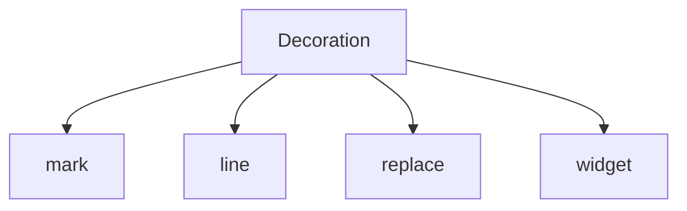
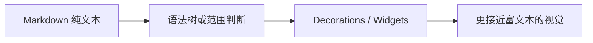

# 05. 用 Decoration 和 Widget 做出最小 Live Preview

> 到这一步，你已经知道编辑器是怎么挂起来的，也知道一个功能大概该写成哪种扩展了。接下来开始做最有成就感的部分：让编辑器变得更像真正的 Markdown Live Preview。

## 本篇目标

读完这一篇，你应该能：

- 理解 `Decoration` 是什么
- 分清 `mark`、`line`、`replace`、`widget` 这几类显示增强手段
- 知道为什么 CM6 能做到“文档是纯文本，显示却更像富文本”
- 建立 reveal / conceal 的基本直觉

## 1. `Decoration` 先理解成什么

你可以先把 `Decoration` 理解成：

> **加在视图上的显示规则。**

它通常不直接改文档文本，而是在告诉编辑器：

- 某一段文字该加什么样式
- 某一行该挂什么 class
- 某个位置该隐藏什么内容
- 某个位置该插入什么 widget

## 2. 先记住最常见的四类



### `Decoration.mark(...)`

适合：

- 行内样式
- 链接样式
- inline code 背景
- 某段文本的 class

### `Decoration.line(...)`

适合：

- 标题行样式
- blockquote 行样式
- 列表行样式

### `Decoration.replace(...)`

适合：

- 隐藏原始 markdown 标记
- 用别的显示替换原来的文本范围

### `Decoration.widget(...)`

适合：

- 在某个位置插入真正的 DOM 节点
- 比如图片、按钮、预览块

## 3. 最小 Live Preview 到底在做什么

先看一个最核心的思路：



关键点在于：

- 文档本体还是纯文本
- 增强发生在显示层
- 所以存储、同步、协作都还能保持简单

这正是 CM6 特别适合做 Markdown Live Preview 的原因。

## 4. 项目里的第一层增强：`markdownDecorationExtension`

在 `packages/editor/src/extensions/markdownDecorationExtension.ts` 里，最基础的一层 Live Preview 做的事情是：

- 遍历语法树
- 根据节点名决定挂什么 decoration
- 给标题、列表、blockquote、code block 等区域加 class

这层的特点是：

- 文本还在
- 没有复杂替换
- 更像“样式增强层”

你可以把它理解成：

> **先不藏源码，只先让它看起来更舒服。**

## 5. 第二层增强：把 markdown 标记字符藏起来

只有 line / mark decoration 还不够。

比如这些文本：

```md
**bold**
==highlight==
[text](url)
```

真正的 Live Preview 往往还会做一件事：

- 平时弱化或隐藏标记字符
- 光标进去时再把源码露出来

这就是 reveal / conceal 的核心体验。

项目里这一层主要在：

- `packages/editor/src/extensions/inlineRendering/makeInlineReplaceExtension.ts`
- `packages/editor/src/extensions/inlineRendering/revealStrategy.ts`

## 6. reveal / conceal 是什么感觉

你可以把它理解成这条交互链：


这套体验的重点不是“永远隐藏 markdown”，而是：

- 平时更干净
- 编辑时仍然自然

所以真正好用的 Live Preview，不是只会“藏”，还要会“在合适的时候露出来”。

## 7. 什么情况下需要 `Widget`

有些东西只靠样式和 replace 已经不够了，比如：

- 图片
- 表格
- 数学块
- richer code block preview

这时就要用 widget。

因为这些内容不是“给原文加点样式”就能变出来的，而是需要真正插入 DOM。

## 8. `renderBlockImages.ts` 为什么很值得读

这个文件几乎把很多关键点串在了一起：

- 先解析 markdown image 节点
- 判断是 block image 还是 inline image
- 生成 widget
- 用 `StateField` 管选中态
- 用 `StateEffect` 处理刷新和切换
- 通过 Facet 把事件抛回 host

这说明一个真实 widget 往往不是单独存在的，它会同时连着：

- 显示层
- 状态层
- 事件层
- 宿主层

## 9. 一个很实用的选择表

| 需求 | 更适合的机制 |
| --- | --- |
| 标题字号、blockquote 左边线 | `Decoration.line` |
| 链接样式、inline code 背景 | `Decoration.mark` |
| 隐藏 `**`、`==`、URL 等标记 | `Decoration.replace` |
| 图片、表格、数学块 | `WidgetType` + block decoration |
| 光标进入后露出源码 | reveal strategy + selection 判断 |

## 10. 本篇结论

这一篇最关键的收获是：

- CM6 的 Live Preview 本质是显示层增强
- `Decoration` 是最基础的增强工具
- `Widget` 是更强的替换型显示机制
- reveal / conceal 让“好看”和“好编辑”能同时成立

继续看下一篇：[`06-拆解 packages/editor 的装配方式`](./06-拆解-packages-editor-的装配方式.md)
