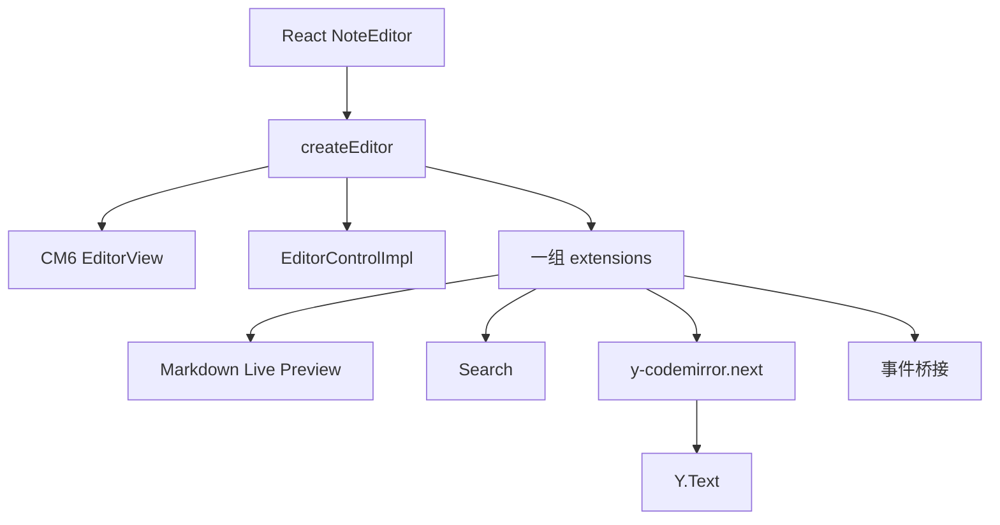
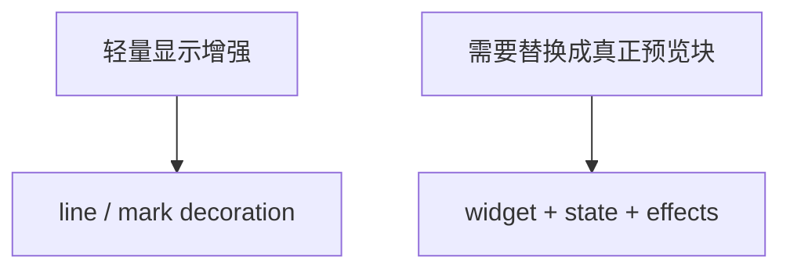
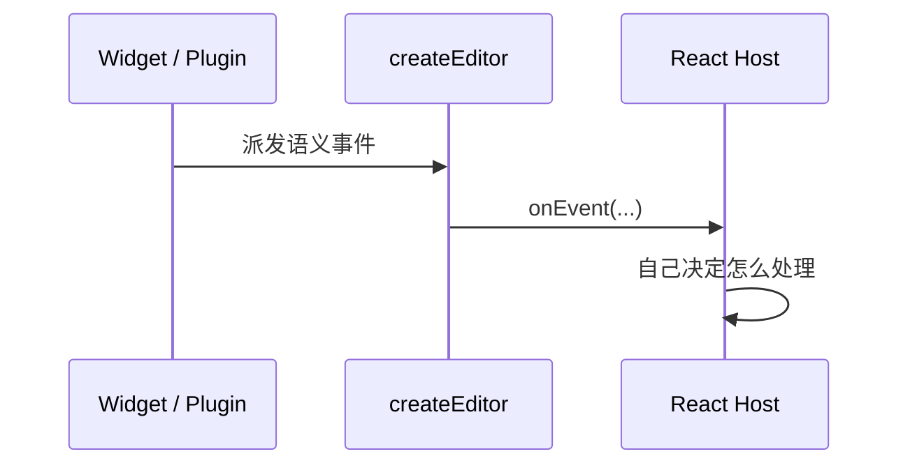
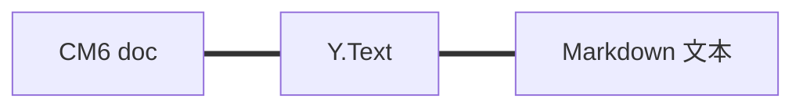

<!-- cspell:ignore Collab Tauri ytext CRDT -->

# 06. 别一下扎进源码海里：带着你刚做过的 lab，去拆 `packages/editor`

> 如果你前两篇已经在自己的 `cm6-lab` 里做过开关配置、change counter、标题行预览和最小 reveal，这一篇就终于可以回到真实项目了。重点不是“把 `createEditor.ts` 从上到下读完”，而是带着你刚做过的那几个小功能，去认出它们在真实工程里变成了什么样。

## 本篇目标

读完这一篇，你应该能：

- 知道 `packages/editor/src/createEditor.ts` 为什么是装配入口
- 把前面学过的小例子对照到真实项目代码里
- 理解 host、editor、扩展、协作、事件桥接是怎么拼起来的
- 建立一条更适合第一次读真实源码的顺序

## 1. 先记住：你现在不是从零看项目代码了

前面几篇你已经在自己的 lab 里做过这些东西：

- `Compartment`：切换底部 padding
- `Facet`：传一个开关配置
- `StateField`：统计 change count
- `ViewPlugin`：只给可视区标题行加样式
- `Decoration`：做最小 Live Preview
- `shouldShowSource`：选区碰到就 reveal

所以这一篇最好的读法不是“重新学一遍概念”，而是直接问：

> **这些小例子，在 SwarmNote 的真实编辑器里各自长成了什么样？**

## 2. 先只打开一个文件：`createEditor.ts`

如果你只读一个入口，先读：

- `packages/editor/src/createEditor.ts`

这个文件就是整个编辑器的装配线。



你可以先把它理解成：

- React host 把外部能力交进来
- `createEditor` 负责把这些能力和 CM6 装起来
- 最后返回的不只是 `EditorView`
- 还包括控制器、事件桥接和一整组扩展

## 3. 先按“你已经做过的东西”去读它

别急着逐行看。先把它拆成四段：

### 第一段：外部能力从哪里进来

看 `createEditor(parent, props)` 这一段参数。

你会看到：

- `initialText`
- `initialSelection`
- `settings`
- `collaboration`
- `onEvent`
- `imageResolver`
- `uploadFile`

这说明项目有个很重要的边界：

> **编辑器内核不直接依赖 React 或 Tauri，它只收参数。**

这跟你前面在 lab 里把配置和行为装进 `extensions` 的思路其实是同一类事，只是这里变成了产品级输入。

### 第二段：扩展是怎么一层层装进去的

继续看 `const extensions: Extension[] = [...]`。

这是整个文件里最值得慢慢看的部分。

它把这些能力一层层装进去：

- 基础编辑能力
- Markdown 语言
- Live Preview
- 图片 / 表格 / 代码块 / 数学块
- 搜索
- 协作
- 事件桥接
- 快捷键

你现在可以把它看成“比你 lab 里的 `extensions: [...]` 更大一版”。

### 第三段：state 和 view 真正创建出来

这一段你已经非常熟了：

- `EditorState.create(...)`
- `new EditorView(...)`

只是这里的 `extensions` 不再是 2 个，而是一大组工程化能力。

### 第四段：为什么最后返回的是 `EditorControlImpl`

这里代表项目做了一个很重要的设计决定：

- host 不直接操作内部扩展细节
- host 通过一个控制器调用高层行为

这会让 React 层更稳，也更容易维护。

## 4. 先对照你在 04 里做过的 `Compartment`

你上一章做过这个例子：

- 点击按钮
- `reconfigure` 一段 padding 配置

现在去看 `createEditor.ts`，你会马上看到：

```ts
const scrollMarginsCompartment = new Compartment();
const contentPaddingCompartment = new Compartment();
```

这是不是就不抽象了？

项目里也是同一套思路：

- 先留插槽
- 以后运行时换配置
- 不重建整个编辑器

也就是说，你在 lab 里做的不是玩具，而是真实项目里的缩小版。

## 5. 再对照你做过的 `Facet`

你上一章做过：

- `highlightHeadingsFacet`
- 把一个布尔开关注入到编辑器内部

现在去看：

- `packages/editor/src/core/facets.ts`

里面的 `collapseOnSelectionFacet` 本质就是同一类东西。

它表达的是：

- 编辑器在某些情况下是否应该折叠 markdown 源码

项目只是把这个配置用在了更复杂的 Live Preview 场景里。

再配合看：

- `packages/editor/src/core/shouldShowSource.ts`

你会发现它读取 facet 的方式，和你在 lab 里读取开关配置的思路是一致的：

- 配置先注入
- 逻辑里统一读取
- 决定当前要 reveal 还是继续 preview

## 6. 再对照你做过的 `ViewPlugin` 和 `Decoration`

你上一章和这一章做过：

- 只遍历可视区
- 看语法树节点
- 给标题行挂 `Decoration.line`
- 给 `**bold**` 挂 `Decoration.mark`
- 选区碰到时 reveal

现在去看真实项目，你就会看到它们只是被扩展到了更多节点上。

### 第一层：基础样式增强

先看：

- `packages/editor/src/extensions/markdownDecorationExtension.ts`

它做的事情很像你刚做的标题行预览，只是范围更广：

- 标题行样式
- 列表行样式
- blockquote 行样式
- 代码块外围样式

你可以直接把它理解成：

> **你在 lab 里做的 `basicPreviewExtension` 的工程化版本。**

### 第二层：更完整的 inline reveal / conceal

再看：

- `packages/editor/src/extensions/inlineRendering/makeInlineReplaceExtension.ts`
- `packages/editor/src/extensions/inlineRendering/revealStrategy.ts`

这里做的事情跟你刚做过的 `boldPreview` 也是同一方向：

- 平时隐藏或弱化 markdown 标记
- 光标进入时 reveal
- 离开后回到 preview

只是项目里处理的不再只有 `**bold**`，而是：

- emphasis
- strikethrough
- highlight
- link
- URL
- code marks

这时你就不会再把它看成“神秘抽象系统”，而会知道它只是你刚写过的 reveal 思路的升级版。

## 7. 为什么 block image / table / code 又是另一套路子

到了图片、表格、代码块这里，事情会再往前走一步。

继续看：

- `renderBlockImages.ts`
- `renderBlockTables.ts`
- `renderBlockCode.ts`

这里你会发现它们不像你前面那个简单 `ViewPlugin` 了，而是会连上：

- `StateField`
- `StateEffect`
- `WidgetType`
- host 事件

原因很简单：

- 标题样式只是在原文上加显示增强
- 但图片 / 表格 / 代码块经常要真的换成 richer UI

也就是说：



你前面已经在 lab 里摸到第一层了，这一篇就是让你知道第二层为什么会更复杂。

## 8. `onEvent` 这条线最好也顺手看懂

你在 lab 里更多是自己 `console.log(...)`。

但产品级编辑器不能一直靠打印，它需要把事件抛给外层 host。

在 `createEditor.ts` 里，最值得看的一个部分就是：

- `editorEventCallback`
- `EditorView.updateListener`
- `EditorEventType.*`

这里干的事其实很好理解：

- 编辑器内部知道发生了什么
- 但具体怎么处理，交给外层 React / Tauri

比如：

- 文档变化
- 选区变化
- focus / blur
- 打开链接
- 协作状态变化



这跟你前面理解的“React 不直接控制 CM6 内部状态”也是对得上的。

## 9. 协作为什么在这里看起来反而很短

很多人第一次看到这里会意外：

- 协作不是很复杂吗
- 为什么 `createCollaborationExtension(...)` 这么短

因为前面很多决定已经替它把复杂度吃掉了。

尤其是这条：



也就是：

- 编辑器是文本
- Y.Text 是文本
- Markdown 文件也是文本

三边对齐以后，协作层本身反而可以更薄。

## 10. 第一次读源码，最推荐的顺序

如果你现在准备真的开始读项目源码，最顺的顺序不是按文件名，而是按“你刚做过的能力”来读：

1. `packages/editor/src/createEditor.ts`
2. `packages/editor/src/core/facets.ts`
3. `packages/editor/src/core/shouldShowSource.ts`
4. `packages/editor/src/extensions/markdownDecorationExtension.ts`
5. `packages/editor/src/extensions/inlineRendering/makeInlineReplaceExtension.ts`
6. `packages/editor/src/extensions/renderBlockImages.ts`
7. `packages/editor/src/extensions/collaborationExtension.ts`
8. `packages/editor/src/events.ts`

你可以一路问自己：

- 这里是不是我在 lab 里做过的那个“配置开关”放大版？
- 这里是不是我做过的那个“只遍历可视区”放大版？
- 这里是不是我做过的最小 reveal 思路的工程版？
- 这里为什么开始需要 `StateField` / `StateEffect` / `WidgetType`？

这样读，真实项目代码会容易很多。

## 11. 本篇结论

这一篇最重要的不是把 `packages/editor` 的所有细节一次吃完，而是建立一个更稳的连接感：

- 你前面写过的小例子，不是和项目无关
- 它们正好就是项目里那些机制的缩小版
- `createEditor.ts` 只是把这些东西更系统地装在了一起
- 从 lab 回到真实项目，才是最顺的学习路径

继续看下一篇：[`07-自己写一个最小 CM6 扩展`](./07-自己写一个最小-CM6-扩展.md)
