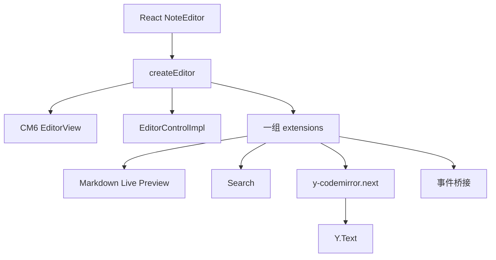
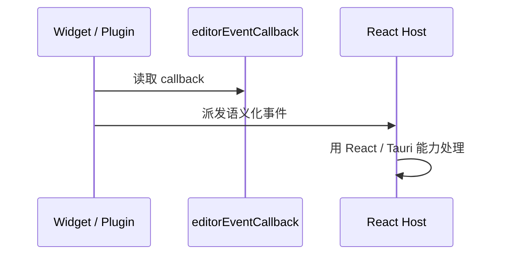
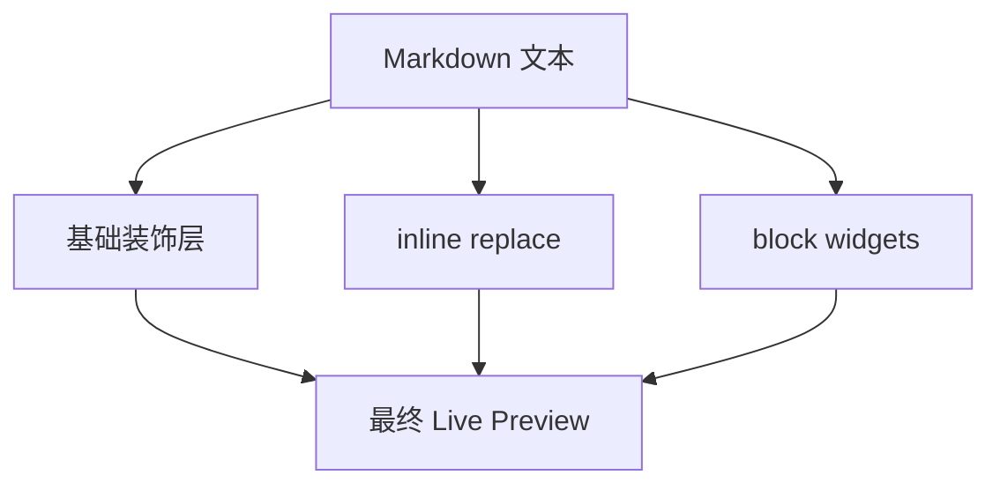
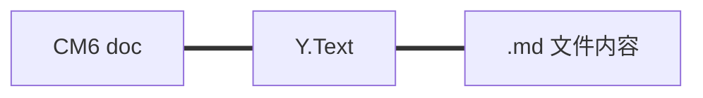

<!-- cspell:ignore Collab Tauri ytext CRDT -->

# 06. 拆解 `packages/editor`：一个真实 CM6 编辑器是怎么装起来的

> 前面几篇你已经自己搭过环境、挂过编辑器、看过 transaction 和扩展系统。这一篇开始回到真实项目：直接拆 `packages/editor/`，看一个产品级编辑器到底是怎么被装出来的。

## 本篇目标

读完这一篇，你应该能：

- 找到项目里编辑器真正的装配入口
- 看懂 `createEditor` 为什么是核心文件
- 理解 editor、host、协作、显示层是怎么拼起来的
- 建立一条更适合读真实源码的顺序

## 1. 先找到装配入口

如果你只打开一个文件，先打开：

- `packages/editor/src/createEditor.ts`

这个文件不是普通 helper，它就是整个编辑器的装配线。

## 2. 先看全景图



你可以先把它理解成：

- React host 提供外部环境
- `createEditor` 负责组装 CM6
- 组装结果不只是一个 `EditorView`
- 还包括控制器、扩展、协作绑定、事件桥接

## 3. `createEditor` 读的时候先分四段

### 第一段：接收 host 输入

这里你会看到很多从外部传进来的东西，比如：

- `initialText`
- `initialSelection`
- `settings`
- `collaboration`
- `onEvent`
- `imageResolver`
- `uploadFile`

这说明一件事：

> **编辑器内核不直接依赖平台，而是把平台能力作为参数接进来。**

### 第二段：组装 `extensions`

这一段通常最值得慢慢看。

它把很多能力一层层装进去：

- 基础编辑体验
- Markdown 语言能力
- Live Preview
- 搜索
- 协作
- 事件桥接
- 快捷键

### 第三段：创建 state 和 view

这一段你已经熟悉了：

- `EditorState.create(...)`
- `new EditorView(...)`

### 第四段：返回控制器

最后不是直接把 view 扔给外部，而是返回一个 `EditorControlImpl`。

这代表项目做了一个很重要的设计：

- 外部不直接和内部扩展细节耦合
- 外部通过统一控制器来操作编辑器

## 4. 为什么 `EditorControlImpl` 很重要

虽然这篇不展开它的全部实现，但你至少先要意识到：

- host 不用知道每个扩展细节
- host 不用直接去碰内部 `StateField` 或 `Facet`
- host 只需要通过控制器调用高层操作

这会让外部调用方更稳定，也更容易重构内部实现。

## 5. 项目里的事件桥接是怎么做的

接着建议打开：

- `packages/editor/src/events.ts`

这里定义了一组高层事件，比如：

- `change`
- `selectionChange`
- `focus`
- `blur`
- `searchStateChange`
- `collaborationUpdate`
- `linkOpen`
- `tableContextMenu`

然后再通过 `editorEventCallback` Facet，把 host 的 callback 注入进去。

你可以把这条链理解成：



这样 widget 和插件就不用直接依赖 React 或 Tauri。

## 6. Live Preview 在项目里不是一层，而是两层

如果你读 `packages/editor/` 里的显示逻辑，最值得先建立的是这个结构：

### 第一层：基础样式装饰

主要看：

- `packages/editor/src/extensions/markdownDecorationExtension.ts`

它负责：

- 标题行样式
- 列表行样式
- blockquote 行样式
- 其他基础 Markdown 区域样式

这一层更像“先让纯文本看起来顺眼”。

### 第二层：inline replace + block widget

主要看：

- `packages/editor/src/extensions/inlineRendering/*`
- `packages/editor/src/extensions/renderBlockImages.ts`
- `packages/editor/src/extensions/renderBlockTables.ts`
- `packages/editor/src/extensions/renderBlockCode.ts`

这一层负责：

- 隐藏部分 markdown 标记
- 做 reveal / conceal
- 把图片、表格、代码块换成 widget



## 7. 协作为什么能接得这么自然

继续看：

- `packages/editor/src/extensions/collaborationExtension.ts`

你会发现它本身非常短，核心只有一件事：

- 从 `Y.Doc` 里拿 `Y.Text`
- 交给 `yCollab(ytext, awareness)`

之所以能这么短，是因为项目的文档真相已经统一了：



这会让编辑器、协作层、磁盘层的复杂度一起下降。

## 8. 项目级约束也很重要

真实项目不是只靠通用 CM6 概念就能跑通的。

比如 `createEditor.ts` 里有一行：

```ts
(EditorView as unknown as { EDIT_CONTEXT: boolean }).EDIT_CONTEXT = false;
```

这是项目为了平台兼容性做的约束，尤其和 Android WebView / IME 行为有关。

所以你在读真实项目时，要同时注意两类信息：

- CM6 抽象本身
- 项目知识库里积累下来的工程约束

## 9. 推荐你怎么二刷这些源码

如果你现在准备真读一遍项目源码，我建议按这个顺序：

1. `packages/editor/src/createEditor.ts`
2. `packages/editor/src/events.ts`
3. `packages/editor/src/core/facets.ts`
4. `packages/editor/src/core/shouldShowSource.ts`
5. `packages/editor/src/extensions/markdownDecorationExtension.ts`
6. `packages/editor/src/extensions/inlineRendering/makeInlineReplaceExtension.ts`
7. `packages/editor/src/extensions/renderBlockImages.ts`
8. `packages/editor/src/extensions/collaborationExtension.ts`

这个顺序的好处是：

- 先看装配入口
- 再看 editor 和 host 的边界
- 再看显示层
- 最后看具体 widget 和协作

## 10. 本篇结论

这一篇你最该带走的不是某个具体 API，而是这条阅读思路：

- 先找装配入口
- 再看输入从哪里进来
- 再看扩展怎么分层
- 再看事件怎么桥接
- 最后看具体 feature 如何落地

继续看下一篇：[`07-自己写一个最小 CM6 扩展`](./07-自己写一个最小-CM6-扩展.md)
