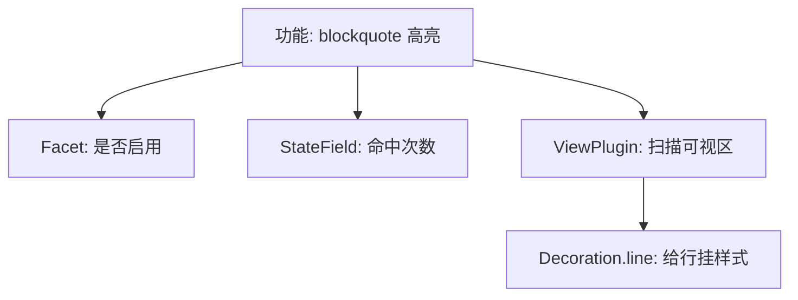

# 07. 别重新开新话题：继续在 `cm6-lab` 里把前面的能力收成一个小扩展

> 前面你已经在 `cm6-lab` 里分别做过开关配置、change counter、标题样式和最小 Live Preview。这一篇不要再零散加代码了，而是把前面的思路收成一个真正像“扩展”的小功能：做一个可以开关的 callout 行高亮。

## 本篇目标

读完这一篇，你应该能：

- 把前面零散练过的能力收成一个小扩展
- 知道一个最小扩展通常至少会有哪些部分
- 建立“配置、状态、显示”三层如何配合的手感

## 1. 这一篇只做一个小功能

继续用前面的 `cm6-lab`。

这次我们做一个很小但完整的功能：

- 当一行以 `> ` 开头时，给它加一个 callout 风格背景
- 这个功能可以开关
- 文档每变化一次，顺手累计一次命中次数

这个功能不炫，但它刚好能把前面几篇练过的东西串起来。



## 2. 先看最终会长什么样

先新建 `src/extensions/calloutDemo.ts`：

```ts
import { syntaxTree } from '@codemirror/language';
import { RangeSetBuilder, Facet, StateField } from '@codemirror/state';
import { Decoration, DecorationSet, EditorView, ViewPlugin, ViewUpdate } from '@codemirror/view';

export const calloutEnabledFacet = Facet.define<boolean, boolean>({
  combine: (values) => (values.length ? values[values.length - 1] : true),
});

export const calloutMatchCountField = StateField.define<number>({
  create(state) {
    let count = 0;
    for (let i = 1; i <= state.doc.lines; i++) {
      const line = state.doc.line(i);
      if (line.text.startsWith('> ')) {
        count += 1;
      }
    }

    return count;
  },
  update(value, tr) {
    if (!tr.docChanged) return value;

    let count = 0;
    for (let i = 1; i <= tr.state.doc.lines; i++) {
      const line = tr.state.doc.line(i);
      if (line.text.startsWith('> ')) {
        count += 1;
      }
    }

    return count;
  },
});

function buildDecorations(view: EditorView): DecorationSet {
  if (!view.state.facet(calloutEnabledFacet)) {
    return Decoration.none;
  }

  const builder = new RangeSetBuilder<Decoration>();

  for (const { from, to } of view.visibleRanges) {
    syntaxTree(view.state).iterate({
      from,
      to,
      enter(node) {
        if (node.name !== 'Blockquote') return;

        let line = view.state.doc.lineAt(node.from);
        while (line.from <= node.to) {
          builder.add(
            line.from,
            line.from,
            Decoration.line({ attributes: { class: 'cm-demo-callout' } }),
          );

          if (line.to >= node.to) break;
          line = view.state.doc.line(line.number + 1);
        }
      },
    });
  }

  return builder.finish();
}

export const calloutDemoExtension = ViewPlugin.fromClass(
  class {
    decorations: DecorationSet;

    constructor(view: EditorView) {
      this.decorations = buildDecorations(view);
    }

    update(update: ViewUpdate) {
      if (update.docChanged || update.viewportChanged || update.selectionSet) {
        this.decorations = buildDecorations(update.view);
      }
    }
  },
  {
    decorations: (value) => value.decorations,
  },
);

export const calloutDemoTheme = EditorView.theme({
  '.cm-demo-callout': {
    backgroundColor: 'rgba(255, 215, 0, 0.10)',
    borderLeft: '3px solid rgba(255, 180, 0, 0.8)',
  },
});
```

你现在先不用急着一次读完，下面拆着看。

## 3. 第一层：这个扩展的开关从哪里进

先看：

```ts
export const calloutEnabledFacet = Facet.define<boolean, boolean>({
  combine: (values) => (values.length ? values[values.length - 1] : true),
});
```

这里本质上还是你前面已经做过的那件事：

- 从外部传一个 boolean 开关
- 扩展内部统一读它

更自然一点可以写成：

```ts
export const calloutEnabledFacet = Facet.define<boolean, boolean>({
  combine: (values) => (values.length ? values[values.length - 1] : true),
});
```

所以这一层处理的是“配置从哪进来”。

## 4. 第二层：这个扩展自己要不要存状态

再看：

```ts
export const calloutMatchCountField = StateField.define<number>({
  create(state) {
    let count = 0;
    for (let i = 1; i <= state.doc.lines; i++) {
      const line = state.doc.line(i);
      if (line.text.startsWith('> ')) {
        count += 1;
      }
    }

    return count;
  },
  update(value, tr) {
    if (!tr.docChanged) return value;

    let count = 0;
    for (let i = 1; i <= tr.state.doc.lines; i++) {
      const line = tr.state.doc.line(i);
      if (line.text.startsWith('> ')) {
        count += 1;
      }
    }

    return count;
  },
});
```

这里故意没有做很复杂的状态，而是做一个最容易观察的：

- 当前文档里有多少行 blockquote

你会立刻看懂它为什么是 `StateField`：

- 它不是外部配置
- 它会跟着 `tr.docChanged` 变化
- 它属于编辑器状态的一部分

## 5. 第三层：真正显示还是交给 view 逻辑

再看：

```ts
function buildDecorations(view: EditorView): DecorationSet {
  if (!view.state.facet(calloutEnabledFacet)) {
    return Decoration.none;
  }

  const builder = new RangeSetBuilder<Decoration>();

  for (const { from, to } of view.visibleRanges) {
    syntaxTree(view.state).iterate({
      from,
      to,
      enter(node) {
        if (node.name !== 'Blockquote') return;

        let line = view.state.doc.lineAt(node.from);
        while (line.from <= node.to) {
          builder.add(
            line.from,
            line.from,
            Decoration.line({ attributes: { class: 'cm-demo-callout' } }),
          );

          if (line.to >= node.to) break;
          line = view.state.doc.line(line.number + 1);
        }
      },
    });
  }

  return builder.finish();
}
```

这一段其实就是把你在 `04`、`05` 做过的事收起来：

- 读 facet 开关
- 遍历可视区
- 看语法树
- 把命中的 blockquote 范围按行拆开
- 给每一行挂 `Decoration.line`

这里特意没有只给 `node.from` 那一行加样式，而是把整个 `Blockquote` 节点覆盖到的每一行都处理一遍。这样你输入连续的 `>` 时，callout 背景才会整段连起来。

所以一个扩展并不是“某个单一 API”，而是一组职责配合。

## 6. 把它真正接回 `Editor.tsx`

现在在 `src/Editor.tsx` 里把它装进去：

```tsx
import { useEffect, useRef } from 'react';
import { EditorState } from '@codemirror/state';
import { EditorView } from '@codemirror/view';
import { markdown } from '@codemirror/lang-markdown';
import { basicSetup } from 'codemirror';
import {
  calloutDemoExtension,
  calloutDemoTheme,
  calloutEnabledFacet,
  calloutMatchCountField,
} from './extensions/calloutDemo';

export default function Editor() {
  const containerRef = useRef<HTMLDivElement | null>(null);

  useEffect(() => {
    if (!containerRef.current) return;

    const view = new EditorView({
      state: EditorState.create({
        doc: '# Hello CM6\n\n> 第一行 blockquote\n> 第二行 blockquote\n\n普通段落',
        extensions: [
          basicSetup,
          markdown(),
          calloutEnabledFacet.of(true),
          calloutMatchCountField,
          calloutDemoExtension,
          calloutDemoTheme,
          EditorView.updateListener.of((update) => {
            if (update.docChanged) {
              console.log(
                'blockquote count =',
                update.state.field(calloutMatchCountField),
              );
            }
          }),
        ],
      }),
      parent: containerRef.current,
    });

    return () => view.destroy();
  }, []);

  return <div ref={containerRef} />;
}
```

现在你得到的是一个真正像样一点的小扩展闭环：

- 配置能传入
- 状态会演化
- 显示会更新
- 结果能观察到

## 7. 这时再回头看，前面的概念才真正连起来

你现在做的这个功能里，其实已经把前几篇都串起来了：

| 部分 | 它在解决什么 |
| --- | --- |
| `calloutEnabledFacet` | 扩展开关配置 |
| `calloutMatchCountField` | 跟 transaction 变化的状态 |
| `calloutDemoExtension` | 贴着 view 的可视区计算 |
| `Decoration.line` | 行级显示增强 |
| `calloutDemoTheme` | 最终样式落点 |

这也是为什么说：

> **扩展不是某一个类，而是一组围绕功能组织起来的机制。**

## 8. 第一次自己写扩展，最容易犯的 3 个错

### 1）一上来就想写 widget

这样会同时撞上：

- `WidgetType`
- `StateField`
- `StateEffect`
- reveal / selection
- host 协作

第一次练手很容易过载。

### 2）所有东西都往 `ViewPlugin` 塞

短期看写得快，后面会越来越乱。

你现在已经能感觉到：

- 配置不是它的事
- 状态也不一定该都放进去
- 它更像“视图层实时计算器”

### 3）功能太散，不收成完整闭环

如果你今天写一个小 field，明天写一点 theme，后天再写一段 decoration，但它们没有收成一个完整功能，学习时会一直有“懂了一点又没真懂”的感觉。

所以这一篇特意把它们收成了一个小功能闭环。

## 9. 你现在最该接着做的练习

你可以立刻在这篇基础上做 3 个非常合适的练习：

1. 把 `Blockquote` 换成 `ATXHeading2`
2. 把背景色改成你自己的风格
3. 给这个扩展再补一个 `Compartment`，允许运行时切换不同视觉模式

这三件事都不大，但都很练手。

## 10. 本篇结论

这一篇最重要的不是“我又认识了几个 API”，而是你已经第一次把这些能力收成了一个像样的小扩展：

- 配置从 Facet 进来
- 状态在 StateField 里演化
- ViewPlugin 决定怎样根据可视区生成显示
- Decoration 和 theme 负责把结果落到界面上

继续看下一篇：[`08-读懂 renderBlockImages 这个真实扩展`](./08-读懂-renderBlockImages-这个真实扩展.md)
