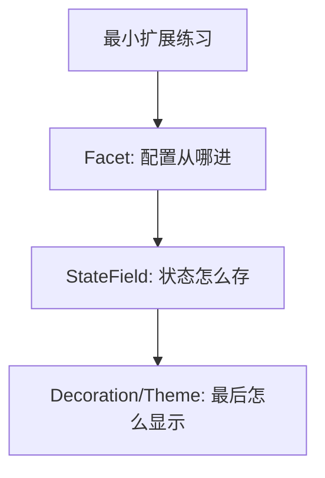

# 07. 自己写一个最小 CM6 扩展

> 学到这里，最好的下一步不是继续看更多概念，而是亲手写一个小扩展。只要你自己真正写过一次，前面那些 Facet、StateField、Decoration 才会开始连起来。

## 本篇目标

读完这一篇，你应该能：

- 自己写一个最小扩展
- 分清配置、状态、显示三层各放什么
- 用一个足够小的例子把扩展结构跑通

## 1. 第一个扩展不要一上来就写复杂 widget

第一次练手，最适合的目标不是图片、表格、数学公式，而是一个小而完整的功能。

这一篇我们用三步来练：

1. 写一个配置开关 `Facet`
2. 写一个状态计数器 `StateField`
3. 再把结果显示出来



## 2. 第一步：写一个配置开关

先定义一个 Facet：

```ts
import { Facet } from '@codemirror/state';

export const demoEnabledFacet = Facet.define<boolean, boolean>({
  combine: (values) => (values.length ? values[values.length - 1] : true),
});
```

它的意思很简单：

- 这个扩展可以从外部接收一个 boolean 配置
- 如果外部传了多个值，就取最后一个
- 默认是 `true`

使用时：

```ts
extensions: [demoEnabledFacet.of(true)];
```

## 3. 第二步：写一个最小 `StateField`

再加一个文档变更计数器：

```ts
import { StateField } from '@codemirror/state';

export const changeCounterField = StateField.define<number>({
  create() {
    return 0;
  },
  update(value, tr) {
    return tr.docChanged ? value + 1 : value;
  },
});
```

这段代码表达的是：

- 初始值是 0
- 每次文档真的发生变化，就加 1

现在你已经有了一个最小的“运行时状态”。

## 4. 第三步：给它一点显示结果

先不用急着写复杂 decoration，你可以先配一个最小 theme：

```ts
import { EditorView } from '@codemirror/view';

export const demoTheme = EditorView.theme({
  '.cm-content': {
    backgroundColor: 'rgba(255, 200, 0, 0.06)',
  },
});
```

虽然这个例子很简单，但它先帮你建立一个结构感：

- 配置从 Facet 进来
- 状态在 StateField 演化
- 显示最后落到 view 层

## 5. 一个更完整的最小骨架

把它们放在一起，大概会长这样：

```ts
import { Facet, StateField } from '@codemirror/state';
import { EditorView } from '@codemirror/view';

export const demoEnabledFacet = Facet.define<boolean, boolean>({
  combine: (values) => (values.length ? values[values.length - 1] : true),
});

export const changeCounterField = StateField.define<number>({
  create() {
    return 0;
  },
  update(value, tr) {
    return tr.docChanged ? value + 1 : value;
  },
});

export const demoTheme = EditorView.theme({
  '.cm-content': {
    backgroundColor: 'rgba(255, 200, 0, 0.06)',
  },
});
```

如果你现在看懂了这三块分别在干什么，就已经比“只会装 `basicSetup`”更进一步了。

## 6. 真正写扩展时先问自己三个问题

### 这是配置，还是状态？

- 配置 → `Facet`
- 状态 → `StateField`

### 它是在改文本，还是只改显示？

- 改文本 → command / transaction
- 改显示 → decoration / widget / theme

### 它强依赖 viewport 和 view update 吗？

- 是 → 往 `ViewPlugin` 方向想
- 否 → 很可能 `StateField` 就够了

## 7. 第一次写扩展最常见的错误

### 一开始就写复杂 widget

结果通常是同时面对：

- `WidgetType`
- `StateField`
- `StateEffect`
- 宿主通信
- reveal / selection

信息量会一下过大。

### 把所有逻辑都塞进 `ViewPlugin`

这样虽然一开始写得快，但后面容易状态边界混乱。

### 直接操作 DOM

这样会绕开 transaction 和 state 链路，后面很容易和 selection、collaboration、re-render 打架。

## 8. 推荐立刻做的练习

你可以接着这篇直接试三件小事：

1. 给扩展加一个 boolean 开关
2. 统计文档变了多少次
3. 在某种条件下给当前内容加一点背景色

只要这三步你能自己跑通，就已经完成了一次最小扩展闭环。

## 9. 本篇结论

第一次写 CM6 扩展时，最重要的不是功能有多炫，而是结构是不是对的。

你要先训练这套顺序：

- 配置从哪里进
- 状态放在哪里
- 变化如何跟 transaction 走
- 最后怎么映射成显示

继续看下一篇：[`08-读懂 renderBlockImages 这个真实扩展`](./08-读懂-renderBlockImages-这个真实扩展.md)
