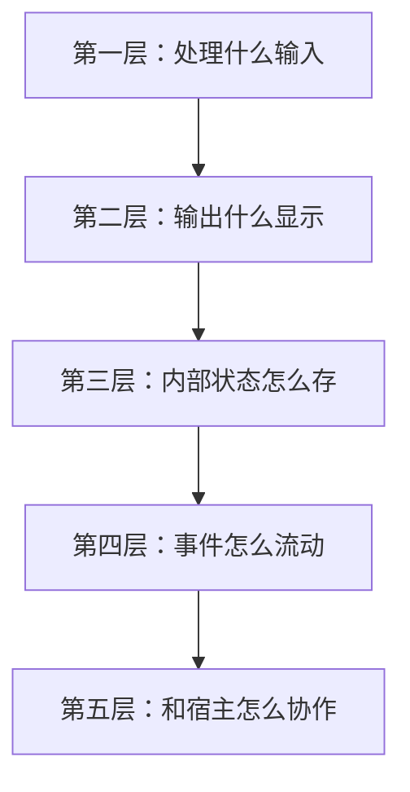
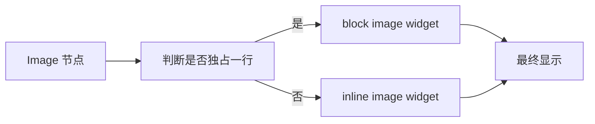
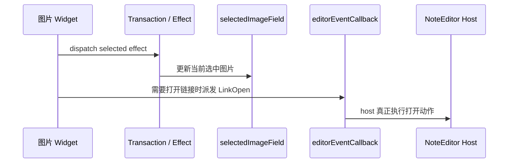

<!-- cspell:ignore Tauri -->

# 08. 读懂一个真实扩展：以 `renderBlockImages` 为例

> 学到这里，一个很自然的下一步就是：不要只看自己写的小 demo，而是开始真正读项目里的扩展。这一篇就带你拆一个很典型、也很有代表性的真实扩展：`renderBlockImages.ts`。

## 本篇目标

读完这一篇，你应该能：

- 建立一套阅读真实扩展的顺序
- 看懂 `renderBlockImages.ts` 主要在解决什么问题
- 分清它的输入、状态、显示、事件和宿主协作边界
- 把这套方法迁移到别的扩展上

## 1. 为什么选它做例子

因为这个文件几乎把很多重要能力都串到了一起：

- 语法节点解析
- inline / block 两条渲染路径
- `StateField` 管局部状态
- `StateEffect` 触发状态切换
- `WidgetType` 产出真实 DOM
- 通过 Facet 把事件抛回 host
- reveal / source-visible 交互
- 资源解析和宿主配合

所以它不是“图片功能”这么简单，而是一个很好的 CM6 工程样本。

## 2. 先不要急着逐行看代码

更好的方法是先按五层来读：

这套顺序对很多真实扩展都适用。

## 3. 第一层：它处理什么输入

先看两个解析函数：

- `parseImageMarkdown(...)`
- `getLinkedImageInfo(...)`

它们分别在处理：

- 普通 Markdown 图片
- 包在链接里的图片

也就是说，这个扩展第一步不是先画 UI，而是先把输入语法边界定义清楚。

如果你是第一次读真实扩展，这一步尤其重要。

## 4. 第二层：它输出什么显示

这个文件最核心的显示分支其实很简单：

也就是：

- 独占一行的图片，走 block path
- 嵌在别的内容里的图片，走 inline path

这张分支图一旦先建立起来，后面读代码就不会乱。

## 5. 第三层：内部状态怎么存

这里最关键的状态不是图片本身，而是：

- 当前哪张 block 图片处于选中态

项目里是通过 `selectedImageField` 来存的。

它会处理这些情况：

- 默认没有选中图片
- 点击图片后选中对应行
- 文档变化后清空
- 光标离开该图片行后清空

这就是一个非常标准的 `StateField` 用法。

## 6. 第四层：事件怎么流动

这里可以先分成两类事件来看。

### 第一类：内部状态事件

比如：

- `setSelectedImageEffect`
- `refreshBlockImagesEffect`

它们负责告诉状态层：

- 当前选中项变了
- 现在需要刷新图片显示了

### 第二类：抛给宿主的语义事件

比如：

- `dispatchLinkOpen(...)`

它不会自己直接打开链接，而是通过 `editorEventCallback` Facet 把 `LinkOpen` 事件交给外层 host。

## 7. 第五层：和宿主怎么协作

这个扩展并不是自给自足的，它依赖宿主提供一些外部能力。

最典型的是两类：

### 资源解析能力

Markdown 里的图片可能是：

- 相对路径
- 本地资源路径
- 平台相关 URL

扩展本身不该知道这些怎么转，所以它通过 `resolver` 把这部分能力交给外层。

### 链接打开能力

同理，扩展本身也不应该直接依赖浏览器或 Tauri 的打开链接能力，而是只抛一个高层事件，让 host 自己处理。

这就是 editor 内核和平台宿主之间很典型的解耦方式。

## 8. 读这种文件时最该反复问什么

读 `renderBlockImages.ts` 时，建议你一直问这几个问题：

### 为什么这里要有 `StateField`

因为图片 widget 不是纯静态显示，它还带选中态。

### 为什么这里要有 `StateEffect`

因为点击、刷新这类动作要跟 transaction 链路整合。

### 为什么这里要有 `resolver`

因为编辑器包不应该知道平台相关的资源映射规则。

### 为什么这里要通过 Facet 抛事件

因为 widget 不该直接依赖 React host。

## 9. 这套方法怎么迁移到别的扩展

如果你读下面这些文件，也可以继续用同一套五层法：

- `renderBlockTables.ts`
- `renderBlockCode.ts`
- `renderRawHtml.ts`
- `admonitionExtension.ts`

继续按这个顺序问：

1. 输入是什么语法节点
2. 输出是什么显示效果
3. 内部状态怎么存
4. 事件怎么流
5. 宿主怎么协作

## 10. 本篇结论

真正会读 CM6 项目代码的人，不是把每个 API 都背下来，而是能快速识别：

- 这个扩展的职责边界
- 它依赖哪条状态链
- 它通过什么机制影响显示
- 它怎样和宿主层解耦

如果你把 `renderBlockImages.ts` 读顺了，后面的复杂 widget 扩展会好读很多。

继续看下一篇：[`09-CM6 练习题与二刷地图`](./09-CM6-练习题与二刷地图.md)
