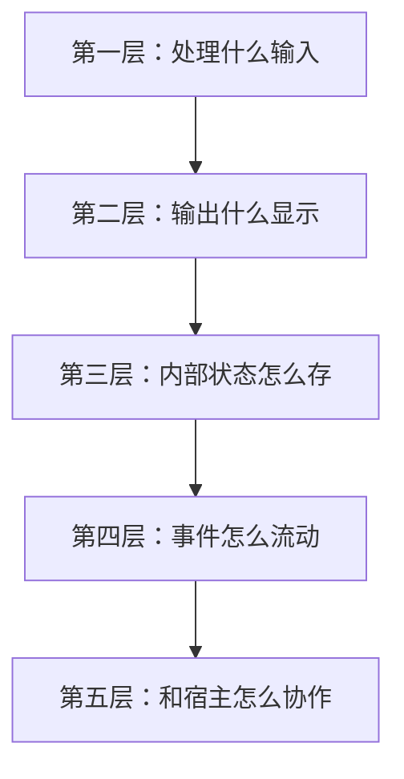
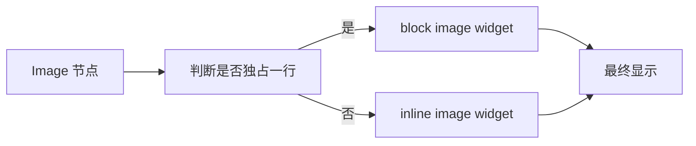
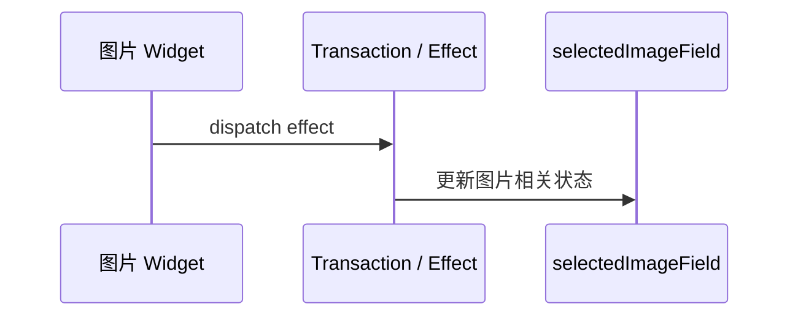
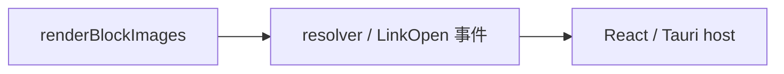

<!-- cspell:ignore Tauri -->

# 08. 别只是“读源码”：带着一个明确问题去拆 `renderBlockImages`

> 前一篇你已经自己写过一个小扩展了。现在终于可以读一个真实扩展，但最好别直接从第一行看到最后一行。更顺的做法是：先带着一个明确问题进去——**为什么图片预览不能只靠前面那套 line / mark decoration，而要变成更重的一套结构？**

## 本篇目标

读完这一篇，你应该能：

- 知道 `renderBlockImages.ts` 为什么比前面的小扩展复杂很多
- 看懂它的输入、状态、显示、事件、宿主协作五层结构
- 知道“什么时候 line/mark 不够了，必须上 widget”

## 1. 先带着这个问题去读

你前面在 lab 里做过的东西，大概都还是这种级别：

- 给一行挂 class
- 给一段文本挂样式
- 在 reveal / conceal 间切换

它们有个共同点：

> **原始 markdown 文本始终还躺在那里，只是显示变了一点。**

但图片预览不一样。

如果你想把：

```md

```

显示成真正的图片块，那么光靠 `Decoration.line` / `Decoration.mark` 就不够了。

这就是为什么 `renderBlockImages.ts` 值得读。

## 2. 先别逐行看，先建立五层图

最好的读法还是这五层：



你后面读 `renderBlockTables.ts`、`renderBlockCode.ts` 也都能继续用这一套。

## 3. 第一层：它到底在处理什么输入

先别看 widget，先看输入边界。

这个文件最先在做的是：

- 识别普通 Markdown 图片
- 识别包在链接里的图片

你可以重点先找这两个函数：

- `parseImageMarkdown(...)`
- `getLinkedImageInfo(...)`

它们在解决的不是“怎么画图”，而是：

- 这一段是不是图片语法
- 它是普通图片，还是图片链接
- 这一段 markdown 的边界到底在哪里

这一步很像你前面在 lab 里先用语法树找 `Blockquote`、`ATXHeading`。

只是这里处理的是图片语法。

## 4. 第二层：它为什么会分成 inline / block 两条路

接下来先抓最关键的一张图：



也就是说：

- 独占一行的图片，更像一个 block preview
- 嵌在别的内容里的图片，更像 inline preview

这一步特别重要，因为它回答了一个很实际的问题：

> **不是所有图片都该渲染成同一种 UI。**

这跟你前面只处理一类标题样式完全不一样。

## 5. 为什么这里不能只靠 `Decoration.line` / `mark`

你前面做的那套方式擅长的是：

- 让文本“更像标题”
- 让 `**` 标记弱化
- 让一段内容加粗、变色、加背景

但图片预览要的是：

- 真正插入 `` DOM
- 可能还要有外链按钮
- 可能还有选中态
- 还要处理 reveal / source-visible

也就是说，这里不是“给原文加点样式”了，而是：

> **用别的显示单元替换原文。**

这就是 widget 的地盘。

## 6. 第三层：为什么这里一定会出现 `StateField`

继续看这个文件，你会发现一个非常关键的状态：

- 当前哪张 block 图片处于选中态

项目里它对应的是：

- `selectedImageField`

这时你就能立刻理解为什么这里不能只是一个 `ViewPlugin`：

- 图片选中态不是一瞬间的样式判断
- 它是会随着 transaction 演化的一块状态
- 点击图片、文档变化、光标离开时都要更新它

这就是非常标准的 `StateField` 场景。

你可以把它和你在 `07` 里写过的 `calloutMatchCountField` 对照着看：

- 都是编辑器自己的运行时状态
- 都要随着 transaction 更新
- 只不过这里的状态更偏交互，不再只是统计数字

## 7. 第四层：为什么这里又会连上 `StateEffect`

再往下看，你会看到像这种东西：

- `setSelectedImageEffect`
- `refreshBlockImagesEffect`

这时你就能把它和前面学过的 transaction 主线连起来了。

它们在做的事是：

- 不是直接改文档文本
- 而是往 transaction 里塞一条“附加消息”
- 告诉相关的 `StateField`：该更新了



所以这里你会第一次更真实地感受到：

- `StateField` 是状态本体
- `StateEffect` 是告诉它“现在发生了什么”的消息

## 8. 第五层：为什么它还要依赖宿主

你继续看，会发现这个扩展并不是自给自足的。

最典型的两块依赖是：

### 资源解析

Markdown 里的图片地址可能是：

- 相对路径
- 本地路径
- 平台相关 URL

扩展自己不该知道怎么从这些路径变成真正能加载的资源地址。

所以它把这件事交给：

- `resolver`

### 链接打开

如果图片本身包在链接里，扩展也不该自己直接去调浏览器或 Tauri API。

所以它会通过：

- `editorEventCallback`
- `dispatchLinkOpen(...)`

把动作抛给宿主。

这就形成了很清楚的边界：



## 9. 现在再回头看，它其实只是比你的小扩展多了三层复杂度

如果拿你在 `07` 写的 lab 扩展来对照，差异大概是这样：

| 你在 lab 里做的 | `renderBlockImages.ts` 多出来的复杂度 |
| --- | --- |
| 只给行挂 class | 要真的插入图片 DOM |
| 只有一个简单 field | 要维护图片选中态 |
| 基本不和外界协作 | 要解析资源、打开链接 |
| 只改显示层样式 | 要在 widget / source reveal 间切换 |

所以它不是“完全不同的世界”，而是：

> **你已经练过的结构，被放大到了一个更真实的场景里。**

## 10. 读这种文件时，最该反复问什么

你现在读 `renderBlockImages.ts`，建议一直问这 5 个问题：

1. 输入边界是什么语法节点
2. 最终显示是 inline 还是 block
3. 哪些数据必须存成 `StateField`
4. 哪些动作只是 `StateEffect` 消息
5. 哪些能力必须交给宿主

只要这 5 个问题能答清楚，哪怕细节还没全记住，你也已经真的读懂了它。

## 11. 这套读法怎么迁移到别的扩展

接下来你读这些文件，也可以继续用同一套方法：

- `renderBlockTables.ts`
- `renderBlockCode.ts`
- `renderRawHtml.ts`
- `admonitionExtension.ts`

你会发现无非还是在换：

- 输入语法不同
- 输出 widget 不同
- 状态和事件细节不同
- 宿主依赖不同

但骨架是相通的。

## 12. 本篇结论

这一篇最重要的不是把 `renderBlockImages.ts` 的每个细节一次背下来，而是抓住一个很关键的升级点：

- 轻量预览时，`line` / `mark` 往往够用
- 真要变成 richer preview，通常就会进入 `widget + state + effect + host` 这一层
- 这不是另一套世界，而是你前面做过的小扩展往前再走一步

继续看下一篇：[`09-CM6 练习题与二刷地图`](./09-CM6-练习题与二刷地图.md)
