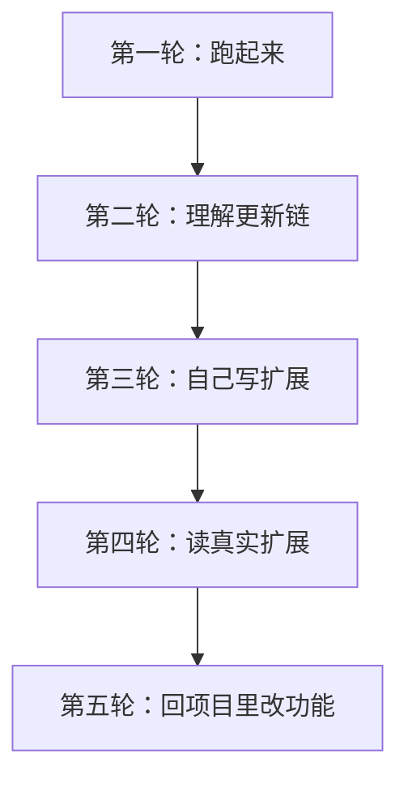
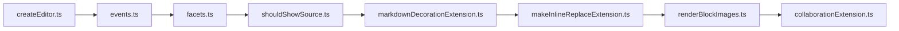

<!-- cspell:ignore Tauri tauri -->

# 09. CM6 学习路线、练习题与二刷地图

> 读到这里，你已经不只是“看过几篇教程”了。接下来最有价值的事，是把前面的内容变成真正能重复练习、反复对照、逐步升级的学习路径。

## 本篇目标

读完这一篇，你应该能：

- 给自己安排一条更稳的学习路线
- 知道每一轮应该重点练什么
- 找到合适的练习题
- 形成一条适合二刷源码的顺序

## 1. 先给自己定五轮学习节奏

## 2. 第一轮：先跑起来

这一轮重点只看：

- `01`
- `02`
- `03A`
- `03`

这一轮不要贪多，你只要求自己做到：

- 能用 React + TS 挂起一个 CM6 编辑器
- 知道 `EditorView` 该怎么管理生命周期
- 知道更新是通过 `dispatch` / transaction 流动的

## 3. 第二轮：开始理解扩展结构

这一轮重点看：

- `04`
- `05`
- `07`

目标是：

- 知道一个功能该写成哪种扩展
- 知道显示层增强主要靠什么工具
- 自己能写出一个最小扩展骨架

## 4. 第三轮：回到真实项目

这一轮重点看：

- `06`
- `08`
- `10`
- `11`
- `12`

目标是：

- 看懂 `createEditor.ts` 是怎么装配的
- 看懂一个真实 widget 扩展是怎么组织的
- 能理解命令系统、协作系统、宿主边界

## 5. 第四轮：开始动手改一点小功能

这时候你就别只看文档了，最好开始改点东西。

建议从这些点开始：

- 新增一个简单快捷键
- 调整一个 reveal 策略
- 给某类 markdown 节点补一个 line / mark decoration
- 给已有 widget 补一个轻量交互

重点不是功能大小，而是让你把前面的模型真正走一遍。

## 6. 最适合练手的几道题

### 练习 1：给某个 feature 做开关

目标：

- 自己定义一个 Facet
- 在装配入口提供它
- 在扩展里读取它

你会练到：

- 配置注入
- editor 装配入口
- 扩展间解耦

### 练习 2：写一个 change counter

目标：

- 自己写一个 `StateField<number>`
- 文档变一次就加 1

你会练到：

- `tr.docChanged`
- 状态演化
- field 读取

### 练习 3：给某类节点加样式

目标：

- 参考 `markdownDecorationExtension.ts`
- 给一个 Markdown 节点挂新 class

你会练到：

- syntax tree 遍历
- `Decoration.mark` / `Decoration.line`
- theme / CSS class 映射

### 练习 4：改 reveal 行为

目标：

- 找一个 inline rendering spec
- 把 reveal 策略从 `line` 改成 `active` 或 `select`

你会练到：

- selection 如何影响显示
- 为什么 Live Preview 不是静态样式

### 练习 5：读并解释一个真实 widget

目标：

- 选 `renderBlockImages.ts` 或 `renderBlockTables.ts`
- 用几分钟讲清楚：输入、状态、显示、事件、宿主协作

你会练到：

- 架构阅读能力
- 真实项目抽象能力

## 7. 一张最常见的概念纠正表

| 容易混淆 | 正确认知 |
| --- | --- |
| `EditorView` 存文档 | 文档主数据在 `EditorState` |
| 扩展就是插件列表 | 扩展本质是状态、配置、显示和行为的组合单元 |
| transaction 只是文本修改 | transaction 是一次完整状态更新描述 |
| decoration 会改文档 | decoration 通常只改显示，不改文档 |
| widget 就是 React 组件 | widget 是 CM6 的 DOM 级显示单元，不等于 React |
| Facet 和 StateField 差不多 | Facet 偏配置，StateField 偏状态 |

## 8. 推荐二刷源码顺序

如果你准备二刷项目源码，建议按这个顺序：

这个顺序的好处是：

- 先看总装配
- 再看 editor 和 host 的边界
- 再看具体显示层
- 最后看 widget 和协作

## 9. 如果你还想继续深入

### 深入方向 1：命令系统

重点文件：

- `packages/editor/src/editorCommands/*.ts`

适合想继续理解：

- 快捷键如何落到 transaction
- Markdown 格式化命令如何实现

### 深入方向 2：复杂 widget

重点文件：

- `renderBlockTables.ts`
- `renderRawHtml.ts`
- `admonitionExtension.ts`

适合想继续理解：

- block widget 的边界
- host 事件桥接
- richer preview 的组织方式

### 深入方向 3：协作

重点文件：

- `collaborationExtension.ts`
- `src/lib/TauriYjsProvider.ts`
- `dev-notes/blog/tauri-yjs-provider.md`

适合想继续理解：

- Y.Text / awareness
- 双端同步
- presence 相关约束

## 10. 本篇结论

这一篇的重点不是再讲新概念，而是帮你把前面的内容重新编排成一条能长期复用的学习路线。

最推荐的节奏就是：

- 先跑起来
- 再理解更新链和扩展系统
- 再写自己的扩展
- 再读真实项目
- 最后开始真的改功能

如果你按这个顺序练下来，CM6 会从“概念很多”慢慢变成“结构很清楚”。

继续看下一篇：[`10-给编辑器加命令和快捷键`](./10-给编辑器加命令和快捷键.md)
