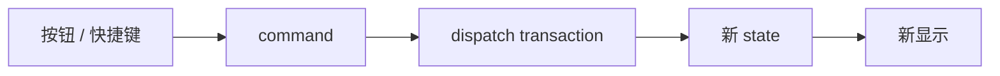

<!-- cspell:ignore keymap Keymap -->

# 10. 别先看项目命令系统：先在 `cm6-lab` 里写一个最小命令和快捷键

> 前面你已经能把扩展写起来了。接下来最顺的一步，不是直接去看项目里的 `toggleBold`，而是先在自己的 `cm6-lab` 里写一个最小命令，再亲手把它挂到快捷键上。这样你后面再看真实项目时，就不会只看到一堆工具函数。

## 本篇目标

读完这一篇，你应该能：

- 自己写一个最小 command
- 知道 command 和 keymap 分别负责什么
- 理解为什么命令里常常要顺手维护 selection
- 再去读项目里的 `buildFormatKeymap()` 时不会发懵

## 1. 这一篇先做两个非常小的动作

继续用前面的 `cm6-lab`。

这次我们先做两个命令：

1. 点按钮或按快捷键，在当前行开头插入 `# `
2. 点按钮或按快捷键，把选中的文字包成 `**bold**`



先把这张图记住：

> **command 负责“怎么改状态”，keymap 负责“什么按键触发它”。**

## 2. 先做一个最简单的命令：在当前行前面插入 `# `

先在 `src/editorCommands.ts` 里写：

```ts
import type { EditorView } from '@codemirror/view';

export function insertHeadingMarker(view: EditorView) {
  const line = view.state.doc.lineAt(view.state.selection.main.head);

  view.dispatch({
    changes: {
      from: line.from,
      insert: '# ',
    },
  });
}
```

这个命令非常简单，但已经是完整 command 思路了：

- 先读当前 state
- 算出当前位置所在行
- 构造 changes
- `dispatch` 一次 transaction

这就是命令的主干。

## 3. 再做一个更像格式化命令的：把选区包成 `**bold**`

继续在同一个文件里写：

```ts
import type { EditorView } from '@codemirror/view';

export function toggleBoldMarker(view: EditorView) {
  const { from, to } = view.state.selection.main;

  view.dispatch({
    changes: [
      { from, insert: '**' },
      { from: to, insert: '**' },
    ],
    selection: {
      anchor: from + 2,
      head: to + 2,
    },
  });
}
```

这里最值得注意的是：

- 它不只是插入文字
- 它还顺手修正了新的选区

这一步非常关键。

## 4. 为什么命令里常常要自己维护 selection

假设你选中了：

```txt
hello
```

执行后想得到的是：

```md
**hello**
```

但更重要的是，选区最好还留在 `hello` 这段上，而不是跑到外面。


如果你不手动维护 selection，常见问题就是：

- 光标跑到 marker 外
- 用户接着打字时手感不对
- 连续格式化很别扭

这也是为什么真实项目里的格式化命令经常不只是“改文本”，而是“改文本 + 修正选区”。

## 5. 先把按钮入口接起来

现在在 `src/Editor.tsx` 里接两个按钮：

```tsx
import { useEffect, useRef } from 'react';
import { EditorState } from '@codemirror/state';
import { EditorView, keymap } from '@codemirror/view';
import { markdown } from '@codemirror/lang-markdown';
import { basicSetup } from 'codemirror';
import { insertHeadingMarker, toggleBoldMarker } from './editorCommands';

export default function Editor() {
  const containerRef = useRef<HTMLDivElement | null>(null);
  const viewRef = useRef<EditorView | null>(null);

  useEffect(() => {
    if (!containerRef.current) return;

    const view = new EditorView({
      state: EditorState.create({
        doc: 'hello\n\n选中一段文字后试试加粗。',
        extensions: [basicSetup, markdown()],
      }),
      parent: containerRef.current,
    });

    viewRef.current = view;

    return () => {
      view.destroy();
      viewRef.current = null;
    };
  }, []);

  return (
    <div>
      <button onClick={() => viewRef.current && insertHeadingMarker(viewRef.current)}>
        插入标题标记
      </button>
      <button onClick={() => viewRef.current && toggleBoldMarker(viewRef.current)}>
        加粗选中文本
      </button>
      <div ref={containerRef} />
    </div>
  );
}
```

这时你已经验证了一件很重要的事：

- command 不是某种只能给快捷键用的东西
- 它也可以被按钮、菜单、右键菜单复用

## 6. 再把它们挂到快捷键上

接下来再把同样的命令接到 keymap。

把 `extensions` 改成这样：

```tsx
extensions: [
  basicSetup,
  markdown(),
  keymap.of([
    {
      key: 'Mod-Alt-h',
      run: (view) => {
        insertHeadingMarker(view);
        return true;
      },
    },
    {
      key: 'Mod-b',
      run: (view) => {
        toggleBoldMarker(view);
        return true;
      },
    },
  ]),
],
```

这里你应该会立刻感受到分工：

- `insertHeadingMarker` / `toggleBoldMarker` 是动作本体
- `keymap.of([...])` 只是绑定触发方式

这就是 command 和 keymap 的边界。

## 7. 这时你再看 `handled()` 就一点也不抽象了

项目里有个小 helper：

```ts
function handled(fn: (view: EditorView) => void) {
  return (view: EditorView) => {
    fn(view);
    return true;
  };
}
```

你现在已经能一眼看懂它在干嘛了：

- 很多项目内命令本身更自然写成 `void`
- 但 keymap 的 `run` 需要返回 `boolean`
- 所以它只是帮你顺手包一层

这时再去看 `createEditor.ts` 里的 `buildFormatKeymap()`，就不会觉得它神秘了。

## 8. 再回头看项目里的真实命令结构

你现在再去读这些文件会顺很多：

- `packages/editor/src/editorCommands/markdown.ts`
- `packages/editor/src/editorCommands/blockquote.ts`
- `packages/editor/src/createEditor.ts`

你可以重点看：

### `toggleInlineMarker`

它本质上就是你刚写的 `toggleBoldMarker` 的工程化版本，只不过处理得更完整：

- 读取选区前后文
- 判断当前是加 marker 还是去 marker
- 一次性生成 changes
- 修正 selection

### `toggleBlockquote`

它本质上是“行级命令”版本：

- 找到当前选区覆盖到的所有行
- 判断它们是不是都已经是 blockquote
- 决定插入还是移除 `> `

这时你就会发现：

- inline 命令更关心字符范围
- line / block 命令更关心行范围和结构

## 9. 为什么命令系统和 UI 能天然解耦

你现在自己已经验证过一次了：

- 同一个命令可以被按钮调用
- 也可以被快捷键调用

所以真实项目里：

- 快捷键
- 工具栏按钮
- 右键菜单
- 未来的命令面板

都可以复用同一批 command。

这也是为什么把“动作本体”独立成 command 很重要。

## 10. 本篇结论

这一篇最重要的不是背 API，而是亲手验证这条线：

- command 决定“怎么改状态”
- keymap 决定“什么触发它”
- 格式化命令经常要自己维护 selection
- 同一个命令可以被多个 UI 入口复用

继续看下一篇：[`11-把协作编辑接到 Y.Text、y-codemirror.next 和 awareness 上`](./11-把协作编辑接到-YText-y-codemirror-next-和-awareness-上.md)
