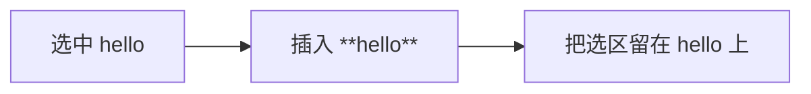

<!-- cspell:ignore keymap Keymap -->

# 10. 给编辑器加命令和快捷键

> 到这一步，你已经能把编辑器跑起来，也开始理解 transaction 和扩展系统了。接下来最自然的一步，就是给它加真正能用的动作：命令和快捷键。

## 本篇目标

读完这一篇，你应该能：

- 理解 command 和 keymap 的分工
- 看懂一个最小格式化命令是怎么写的
- 知道为什么命令里常常要手动维护 selection
- 知道怎么把一个命令挂到快捷键上

## 1. 先记一句最关键的话

> **command 决定“怎么改状态”，keymap 决定“什么按键触发这个命令”。**

这句一旦记住，后面很多代码都会顺很多。

## 2. command 到底在做什么

在 CM6 里，一个 command 通常会做这几件事：

- 读取当前 state
- 计算 changes / selection
- `dispatch` 一次 transaction
- 返回这次动作是否已经处理


所以 command 不是“按钮回调”，而是 transaction 的上游入口。

## 3. 在项目里它是怎么挂到快捷键上的

先看 `packages/editor/src/createEditor.ts` 里的 `buildFormatKeymap()`。

这里会把一组命令绑定到按键上，比如：

- `Mod-b` → `toggleBold`
- `Mod-i` → `toggleItalic`
- `Mod-k` → `insertLink`
- `Mod-Shift-q` → `toggleBlockquote`

这说明这里其实有三层：

1. 命令函数
2. `{ key, run }` 这样的按键绑定
3. `keymap.of([...])` 这样的扩展注入

## 4. `keymap.of([...])` 先怎么理解

你可以先把它理解成：

> **往编辑器里注册一组按键规则。**

这些规则不是一个简单哈希表，而是一条匹配链，顺序会影响谁先命中。

这也是为什么项目里会把自己的格式化快捷键放在 `standardKeymap` 前面。

## 5. `handled()` 这种小 helper 在解决什么问题

项目里有一个非常小但很常见的 helper：

```ts
function handled(fn: (view: EditorView) => void) {
  return (view: EditorView) => {
    fn(view);
    return true;
  };
}
```

它解决的是：

- 很多项目内命令本身更自然写成 `void`
- 但 keymap 的 `run` 需要返回 `boolean`

所以这个 helper 的作用就是：

- 执行命令
- 顺手告诉 keymap：这次按键已经处理了

## 6. 看一个最小命令：`toggleInlineMarker`

项目里 `packages/editor/src/editorCommands/markdown.ts` 的 `toggleInlineMarker` 很值得读。

它的大致流程是：

1. 读取当前 selection
2. 读取选区前后的文档上下文
3. 判断当前是“加 marker”还是“去 marker”
4. `dispatch` 文本 changes
5. 修正新的 selection

这就是最标准的 CM6 命令结构。

## 7. 为什么命令里经常要手动维护 selection

因为命令不只是“把文本改掉”，还要保证编辑体验自然。

比如用户选中了 `hello`，你执行“加粗”后：



如果你不显式维护 selection，常见后果就是：

- 光标跑到 marker 外
- 选区范围不符合预期
- 连续格式化时手感很差

## 8. 再看一个行级命令：`toggleBlockquote`

行级命令和 inline 命令的思路会不一样。

`toggleBlockquote` 更像是在做：

1. 找到当前选区覆盖到的所有行
2. 判断这些行是不是都已经是 blockquote
3. 如果都是，就移除前缀
4. 否则给没有命中的行加上 `> `
5. 一次性 `dispatch` 一组 changes

所以你也可以顺便建立一个区分：

- inline 命令更关注选区前后字符
- line / block 命令更关注行范围和结构

## 9. 命令系统和 UI 为什么能解耦

项目里 `editorCommands/index.ts` 只是把命令导出出来。

这意味着同一个命令可以被很多入口复用：

- 快捷键
- 工具栏按钮
- 右键菜单
- 未来的命令面板

这就是很典型的解耦：

- command 是动作本体
- keymap 只是一个触发入口

## 10. 本篇结论

这一篇最重要的收获是：

- command 负责“怎么改状态”
- keymap 负责“什么按键触发动作”
- 命令经常要显式维护 selection
- 同一个命令可以被多个 UI 入口复用

继续看下一篇：[`11-把协作编辑接到 Y.Text、y-codemirror.next 和 awareness 上`](./11-把协作编辑接到-YText-y-codemirror-next-和-awareness-上.md)
