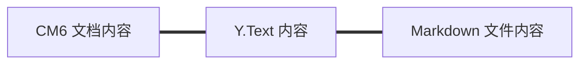
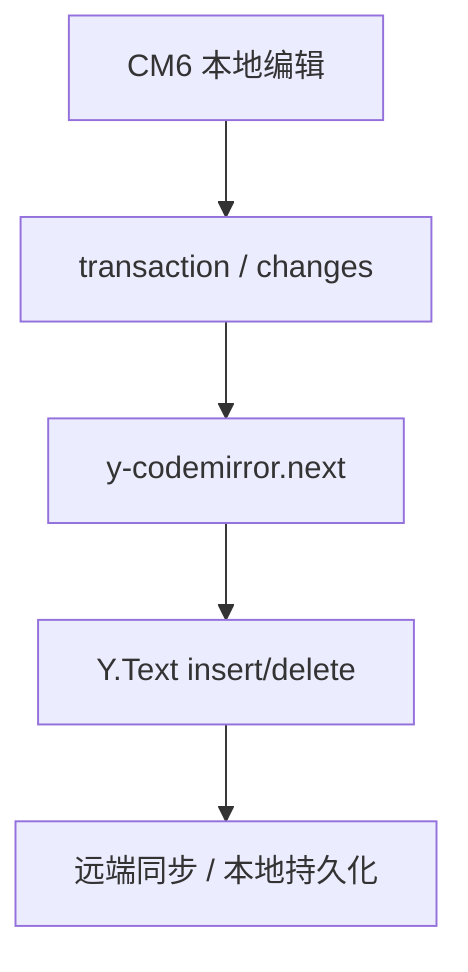
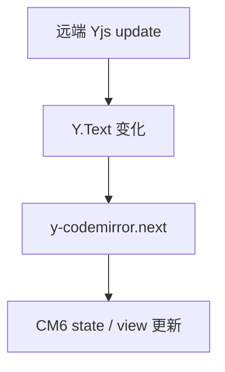
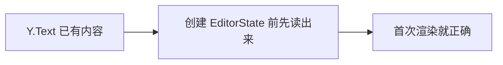
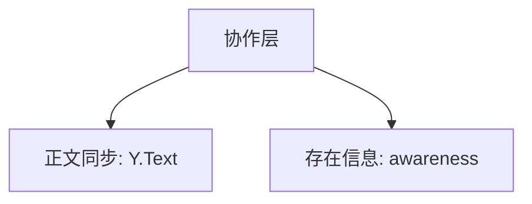
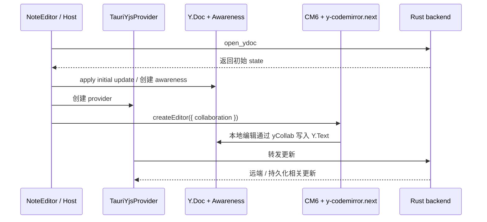

<!-- cspell:ignore ytext codemirror CRDT Tauri tauri awareness ysync -->

# 11. 别一上来就想“做协作编辑”：先把最小协作链看顺

> 到这一步，你已经知道本地编辑器是怎么工作的了。接下来可以看更大的链路：如果编辑器不是单机玩的，而是要接到协作系统上，CM6 这一层到底接在哪里。这里最容易晕的地方，是一上来就同时想 Y.Doc、provider、网络同步、presence。更顺的方式是先只看最小协作链。

## 本篇目标

读完这一篇，你应该能：

- 理解为什么 CM6 很适合接 `Y.Text`
- 知道 `y-codemirror.next` 在中间到底做什么
- 理解为什么初始化时必须先从 `Y.Text` seed 文档
- 分清正文同步和 awareness 的职责差异

## 1. 先只记住最小协作链

先别想得太大，先只看这条最小链：



这张图非常关键。

因为它意味着：

- 你的编辑器文档模型是文本
- `Y.Text` 也是文本型 CRDT
- 磁盘上的 `.md` 文件仍然是文本

三边天然对齐。

这也是 SwarmNote 这条路线成立的根基。

## 2. 为什么这比“富文本协作”更容易接顺

因为现在你不用维护两套完全不同的文档真相。

不需要：

- block tree ↔ Y.Doc XML 的复杂映射
- 一套编辑器 JSON 再转一套存储结构
- 本地模型和协作模型之间的大量编解码

这里更直接：

- 前端编辑器改文本
- Y.Text 同步文本
- 后端持久化文本

所以你可以先把这条路线理解成：

> **先把文档真相统一成文本，再把协作接上来。**

## 3. `y-codemirror.next` 在中间到底做什么

这时再看 `y-codemirror.next`，就不会那么玄了。

你可以先把它理解成一个翻译层：



反过来也是一样：



所以它最核心的作用不是“帮你做协作产品逻辑”，而是：

- 把 CM6 的更新翻译成 Yjs 操作
- 再把 Yjs 的变化翻回 CM6

## 4. 为什么 `createCollaborationExtension` 反而这么短

去看：

- `packages/editor/src/extensions/collaborationExtension.ts`

你会发现它很短，核心差不多就是：

```ts
const ytext = ydoc.getText(collaboration.fragmentName ?? 'document');
return [yCollab(ytext, awareness)];
```

它之所以短，不是因为协作很简单，而是因为前面的架构决定已经把复杂度压下去了。

比如这些前提都已经成立了：

- 顶层 fragment 名统一成 `document`
- 文档真相统一成纯文本
- host 自己负责 `Y.Doc` 生命周期
- 网络传播和 provider 在更外层处理

所以 editor 包里这层绑定就能做得很薄。

## 5. 为什么初始化时一定要先从 `Y.Text` seed 文档

这是最容易漏掉的一步。

项目里在 `createEditor.ts` 会先做这件事：

```ts
let initialDoc = initialText;
if (collaboration) {
  const ydoc = collaboration.ydoc as { getText: (name: string) => { toString(): string } };
  initialDoc = ydoc.getText(collaboration.fragmentName ?? 'document').toString();
}
```

意思其实很直接：

- 如果 `Y.Text` 在编辑器挂上来之前已经有内容
- 那第一次渲染时，CM6 就应该先拿这份内容做初始 `doc`

不然会发生什么？

- `Y.Text` 里明明已经有字
- 但编辑器第一次还是先显示空文档
- 后面你会感觉状态像是“没对上”



这一步可以说是协作接入里最重要的工程细节之一。

## 6. awareness 和正文同步根本不是一回事

很多人第一次学协作编辑时，会把这些东西混成一团。

你现在可以强行把它拆成两层：



### 正文同步关注什么

- 文档内容怎么同步
- 插入删除怎么传播
- 本地和远端文本怎么对齐

### awareness 关注什么

- 谁在线
- 谁的光标在哪
- 用户名、颜色、设备信息是什么

也就是说：

- `Y.Text` 解决“文档本体”
- awareness 解决“人在不在、光标在哪”

## 7. 为什么项目里特别强调 awareness 生命周期

一旦你明白 awareness 不是正文同步，你就会更容易理解这些工程细节为什么重要。

项目里有两个很关键的经验：

### 第一：destroy 顺序敏感

如果你先卸 listener，再 `setLocalState(null)`，远端就收不到“你下线了”的广播。

所以正确顺序应该是：

1. `setLocalState(null)`
2. 再拦截后续异步 update
3. 再 `off(...)`
4. 最后 `destroy()`

### 第二：展示层按 `deviceId` 去重

因为 awareness 的 `clientID` 是 Y.Doc 实例级别的，不是设备级别。

所以：

- 不要试图复用 clientID
- 应该在 UI 展示层按 `deviceId` 折叠

这些规则如果你前面没分清“正文同步”和“presence”，就会显得很难理解。

## 8. 把完整链路再放回宿主层看一眼

虽然 editor 包里的协作绑定很薄，但完整协作链其实并不薄。

它更像这样：



这张图最重要的不是记细节，而是看清分层：

- editor 包只处理编辑器内的绑定
- provider / host 处理平台通信和生命周期
- Rust 后端处理持久化和跨端同步

## 9. 这时再回头看，协作并没有脱离前文

其实它和前面几篇仍然是连着的：

- 你前面学的 transaction，仍然是本地更新入口
- 只是现在这些更新又被翻译到了 `Y.Text`
- 你前面学的文档真相，这里变成了“文本三边对齐”
- 你前面学的 host / editor 边界，这里变成了 provider / awareness / backend 分层

所以协作不是另一门课，而是把前面的编辑器链路继续往外延伸。

## 10. 本篇结论

这一篇最重要的不是一口吃下全部 Yjs 细节，而是先把最小协作链看顺：

- CM6、`Y.Text`、Markdown 文本天然同构
- `y-codemirror.next` 是两边的翻译层
- 协作初始化时必须先从 `Y.Text` seed 文档
- awareness 管的是 presence，不是正文内容
- editor 内核和 host / provider 之间要明确分层

继续看下一篇：[`12-自己设计一套 Markdown Live Preview 架构`](./12-自己设计一套-Markdown-Live-Preview-架构.md)
