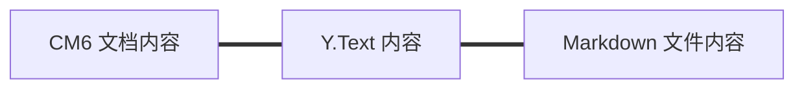
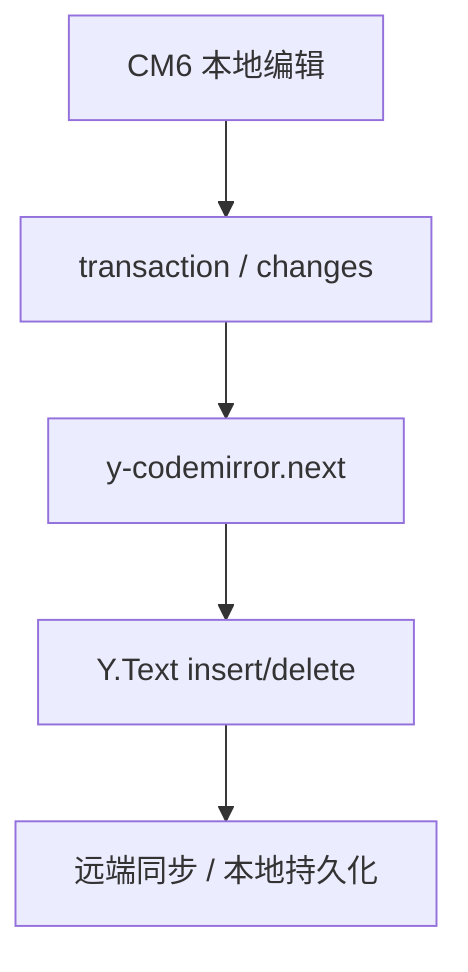
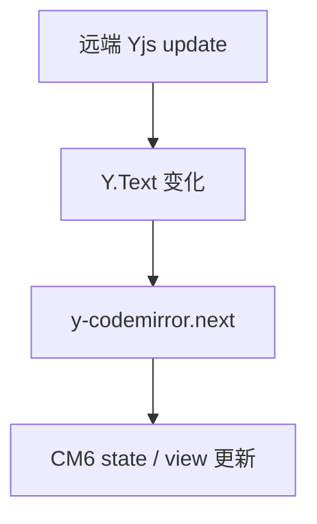
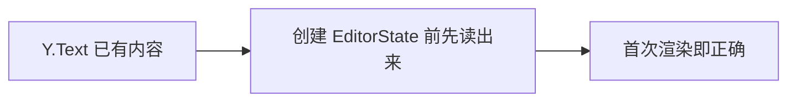
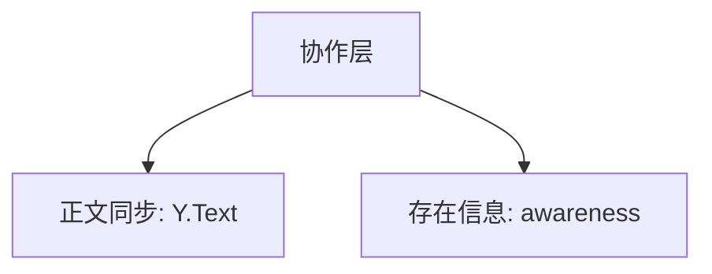

<!-- cspell:ignore ytext codemirror CRDT Tauri tauri awareness ysync -->

# 11. 把协作编辑接到 Y.Text、y-codemirror.next 和 awareness 上

> 到这一步，你已经理解了编辑器本地是怎么工作的。接下来就可以看更大的链路：如果编辑器不是单机玩的，而是要接到协作系统上，CM6 这一层会怎么和 Yjs 对接。

## 本篇目标

读完这一篇，你应该能：

- 理解为什么 CM6 很适合接 `Y.Text`
- 看懂 `y-codemirror.next` 在中间做了什么
- 知道为什么初始化时必须从 `Y.Text` seed 文档
- 分清正文同步和 awareness 的职责差异

## 1. 先看最关键的对齐关系



这张图非常重要。

因为它意味着：

- CM6 文档模型是文本
- `Y.Text` 也是文本型 CRDT
- `.md` 文件本身也是文本

三者天然同构。

## 2. 为什么这会让协作变简单

因为这时候你不需要维护两份完全不同的文档真相。

不需要：

- block tree ↔ Y.Doc XML 的复杂映射
- 结构化节点编解码
- 一套编辑器数据模型再转另一套存储模型

现在的链路更直接：

- 前端编辑器改文本
- Y.Text 同步文本
- 后端持久化文本

## 3. `createCollaborationExtension` 为什么这么短

去看：

- `packages/editor/src/extensions/collaborationExtension.ts`

你会发现它核心只有一件事：

```ts
const ytext = ydoc.getText(collaboration.fragmentName ?? 'document');
return [yCollab(ytext, awareness)];
```

它之所以这么短，不是因为协作简单，而是因为复杂度已经被前面的架构选择吃掉了。

比如这些前提都已经成立了：

- 顶层 fragment 名统一成 `document`
- host 负责 `Y.Doc` 生命周期
- awareness 的网络传播由外层负责
- 文档真相已经统一成纯文本

## 4. `y-codemirror.next` 在中间做什么

你可以先把它理解成一个翻译层：



反过来也是一样：



所以它最核心的价值就是：

- 把 CM6 的更新翻译成 Yjs 操作
- 再把 Yjs 的变化翻回 CM6

## 5. 为什么初始化时一定要 seed 文档

这是协作接入里非常容易漏掉的一步。

项目里在 `createEditor.ts` 会做这件事：

```ts
let initialDoc = initialText;
if (collaboration) {
  const ydoc = collaboration.ydoc as { getText: (name: string) => { toString(): string } };
  initialDoc = ydoc.getText(collaboration.fragmentName ?? 'document').toString();
}
```

原因很简单：

- `y-codemirror.next` 更偏后续 observer 事件桥接
- 如果 `Y.Text` 在挂载前已经有内容
- 但 CM6 初始 `doc` 没从它读
- 编辑器首次渲染就会先显示空文档



## 6. awareness 和正文同步不是一回事

正文同步关注的是：

- 文档内容怎么同步

awareness 关注的是：

- 谁在线
- 谁的光标在哪
- 用户名、颜色、设备信息是什么

所以你可以直接把它们分成两层：



一个要持久化，一个通常不需要持久化。

## 7. awareness 生命周期为什么要特别小心

这个项目里有两个很关键的经验。

### 第一：destroy 顺序敏感

如果你先把 listener 卸掉，再 `setLocalState(null)`，远端就收不到你“下线了”的广播。

正确顺序应该是：

1. `setLocalState(null)`
2. 再拦截后续异步 update
3. 再 `off(...)`
4. 最后 `destroy()`

这样才能保证下线事件真的广播出去。

### 第二：展示层按 `deviceId` 去重

因为 awareness 的 `clientID` 是 Y.Doc 实例级别，不是设备级别。

所以：

- 不要试图复用 clientID
- 应该在 UI 展示层按 `deviceId` 折叠

## 8. host / provider 为什么很关键

虽然 editor 包里的协作绑定本身很薄，但完整协作链其实并不薄。

它更像这样：


这说明：

- editor 包只处理“编辑器内协作绑定”
- provider / host 处理“平台通信和生命周期”

## 9. 本篇结论

这一篇最重要的收获是：

- CM6、`Y.Text`、Markdown 文本天然同构
- `y-codemirror.next` 是两边的翻译层
- 协作初始化时必须先从 `Y.Text` seed 文档
- awareness 解决的是 presence，不是正文内容
- editor 内核和 host/provider 之间要明确分层

继续看下一篇：[`12-自己设计一套 Markdown Live Preview 架构`](./12-自己设计一套-Markdown-Live-Preview-架构.md)
