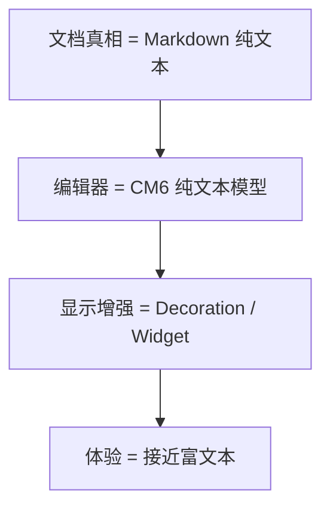
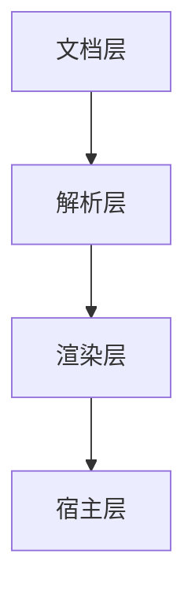
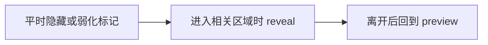
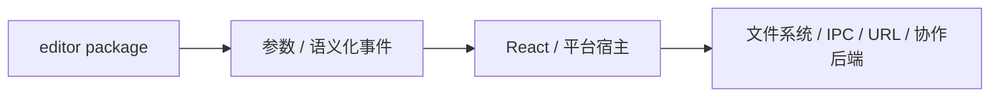

<!-- cspell:ignore codemirror ytext markdownlint -->

# 12. 别直接谈“架构设计”：先从你已经做过的 lab 反推一套 Live Preview 架构

> 如果前面 01 到 11 你是跟着一路做下来的，那到这里其实已经攒够材料了。你已经做过最小编辑器、更新监听、扩展、Live Preview、命令、协作链，也看过真实项目的装配和图片扩展。所以这一篇不再从抽象概念讲起，而是反过来问：**如果现在让你自己设计一套 Markdown Live Preview 编辑器，你应该先定哪些边界？**

## 本篇目标

读完这一篇，你应该能：

- 把前面做过的 lab 和项目经验收成一套架构判断
- 知道文档层、解析层、渲染层、宿主层为什么要拆开
- 判断哪些能力适合轻装饰，哪些能力必须升级到 widget
- 理解为什么“显示增强”和“文档真相”最好分开

## 1. 先别急着画大图，先回头看看你已经做过什么

前面这些篇章里，你其实已经隐含做过很多架构选择了：

- `02`：你确认了编辑器本体是 `EditorState + EditorView`
- `03`：你确认了所有变化都走 `dispatch -> transaction -> state -> view`
- `04`：你练过配置、状态、视图逻辑、动态重配的职责边界
- `05`：你做过最小 Live Preview，知道显示增强不一定要改文档
- `07`：你把这些能力收成过一个小扩展
- `10`：你知道命令其实是在改 state，而不是直接改 DOM
- `11`：你又确认了 CM6、`Y.Text`、Markdown 文本可以三边对齐

也就是说，你现在不是“还没开始设计”，而是已经做过很多局部设计了。

这篇要做的，只是把这些局部判断收成一张更大的图，让你以后自己搭编辑器时知道先做什么、后做什么。

## 2. 先从一个最根本的问题开始：你的文档真相到底是什么

如果你真的要自己做编辑器，第一件事不是追求像 Notion、Obsidian 还是 Typora，而是先回答：

- 你真正存的是什么
- 协作时同步的是什么
- 预览是不是只是显示层投影

对这套教程一路走下来的人来说，最自然的一条路线其实已经很明确了：

这条路线最核心的承诺就是：

> **文档真相保持简单，复杂性交给渲染层。**

这也是为什么前面你能顺利把：

- 本地编辑
- Live Preview
- 命令系统
- 协作文本同步

都串到同一条线上。

## 3. 如果回头看你的 lab，它其实已经天然拆成了四层

前面你做过的那些例子，其实已经可以反推出一个四层结构：

### 文档层

这一层回答的是：

- 真正存的是什么数据
- 持久化格式是什么
- 协作同步时对齐的是什么

在这套教程里，它最终落到的是：

- Markdown 纯文本
- CM6 `doc`
- `Y.Text`

### 解析层

这一层回答的是：

- 怎么从文本里识别 heading、blockquote、image、link、table

你前面在 lab 里已经做过：

- 识别 `ATXHeading`
- 识别 `Blockquote`
- 识别 `StrongEmphasis`

所以这层其实不是新东西，只是你之前没把它叫成“解析层”。

### 渲染层

这一层回答的是：

- 哪些内容只需要加样式
- 哪些内容需要 reveal / conceal
- 哪些内容已经不能只靠样式，必须换成 widget

你前面做过的：

- 标题行样式
- `**bold**` 的 reveal / conceal
- callout 行高亮
- 图片扩展的阅读

都属于这一层。

### 宿主层

这一层回答的是：

- 图片 URL 怎么解析
- 链接怎么真正打开
- 文件怎么上传
- 协作 provider / awareness / backend 怎么桥接

这也是为什么前面你会一再看到：

- `resolver`
- `onEvent`
- provider
- Tauri / React host

它们本来就不该塞进编辑器内核里。

## 4. 回头看 05 和 08，你其实已经知道“什么该轻，什么该重”了

做 Live Preview 最容易做乱的一点，就是上来什么都想用 widget。

但如果按你前面做过的例子回看，其实判断已经很清楚了。

## 5. 第一类：只需要轻装饰的内容

比如：

- heading
- inline code
- blockquote 行样式
- task list 行样式

这一类最适合：

- `Decoration.line`
- `Decoration.mark`

因为它们本质上只是：

> **原文还在那里，只是显示更像预览。**

这就是你在 `05` 和 `07` 里已经做过的事情。

## 6. 第二类：需要 reveal / conceal 的内容

比如：

- `**bold**`
- `==highlight==`
- link 标记字符
- URL 的显示切换

这一类最适合：

- inline replace
- reveal strategy
- selection / active range 判断

因为这里的重点已经不只是“加个样式”，而是：

- 平时更干净
- 光标进去时源码还得自然可编辑
- 离开后还要回到 preview

所以 reveal 设计做得好不好，直接决定编辑体验是否自然。

## 7. 第三类：必须升级到 richer preview 的内容

再往前走一步，你在 `08` 已经看到另一类场景了：

- 图片
- 表格
- 数学块
- richer code block preview

这里通常已经不能只靠 `line` / `mark` 了。

因为你要的是：

- 真正插入 DOM
- 可能有选中态
- 可能有按钮、点击事件
- 还要处理 reveal / source-visible
- 还要和宿主协作

这一类才更适合：

- `WidgetType`
- block decoration
- `StateField`
- `StateEffect`
- host event bridge

所以不是 widget 高级就该优先用，而是：

> **当“显示增强”已经变成“另一种 UI 单元”时，才该升级到 widget。**

## 8. 为什么 reveal 其实是整套架构里的分水岭

很多人会以为 Live Preview 的关键是“能不能把 markdown 藏起来”。

但你一路做下来会发现，真正的分水岭其实是：

- 藏起来之后，什么时候露出来
- 光标进去后还能不能自然编辑
- 装饰和源码会不会打架

如果这一层做不好，用户感知到的会是：

- 光标跳
- 样式闪烁
- 选区不稳定
- 一编辑就“露馅”

所以 reveal 不是一个边角交互，而是 Live Preview 架构里最影响体感的一层判断。

## 9. 为什么宿主边界一定要守住

这是很多编辑器项目最容易越写越乱的地方。

你前面在真实项目里已经看到很多例子：

- 图片地址转换不该写死在编辑器里
- 打开外链不该直接绑浏览器 / Tauri API
- 文件上传不该塞到 widget 内部
- provider / awareness 生命周期不该混进 editor 内核

所以一条非常值得反复记住的原则是：

也就是：

> **编辑器内核只负责编辑器；平台能力交给宿主。**

只要这条边界守不住，后面几乎一定会返工。

## 10. 如果现在让你自己从零做，最稳的实现顺序是什么

你其实已经按这套顺序练过一遍了，所以现在可以直接把它收成一张“自己实现时的路线图”。以后真要新开一个编辑器项目，也可以先照这个顺序搭第一版。

### 第一步：先做纯文本编辑器

先确保：

- 文档可输入
- 选区正常
- lifecycle 稳定
- `dispatch` / transaction 跑顺

### 第二步：补轻装饰

先做：

- heading
- blockquote
- inline code
- task list 行样式

### 第三步：补 reveal / conceal

再做：

- bold / italic / link / highlight 标记字符的隐藏
- 光标进入时源码可见

### 第四步：最后再上 block widget

最后做：

- 图片
- 表格
- 数学块
- 更重的 block preview

### 第五步：再接宿主和协作

再补：

- resolver
- 链接打开
- 文件上传
- `Y.Text` / awareness / provider

这个顺序的好处非常现实：

- 每一步都能工作
- 每一步都能单独验证
- 不会一开始把所有复杂性叠在一起

## 11. 把前面整套教程压成一个架构判断表

到这里，你其实已经可以得到一张很实用的判断表：

| 问题 | 优先怎么想 |
| --- | --- |
| 文档本体存什么 | 先定文档真相 |
| 这一段结构怎么识别 | 放到解析层 |
| 只是想更像预览 | 先试 `line` / `mark` |
| 需要 reveal / conceal | 放到渲染层 + selection 判断 |
| 需要真正换成另一种 UI | 往 widget + state + host 协作想 |
| 涉及 URL / 文件 / 外链 / 平台 API | 交给宿主层 |

这张表其实就是你前面 01-11 的浓缩版。

## 12. 本篇结论

这一篇最重要的不是再多学一堆术语，而是把你已经做过的事收成一套稳定判断：

- 先定文档真相
- 再分清文档层、解析层、渲染层、宿主层
- 能轻装饰就先别急着上 widget
- reveal 设计会直接决定编辑体验
- 宿主边界守不住，后面一定会乱

回到练习和复习时，建议再配合看一遍：[`09-CM6 练习题与二刷地图`](./09-CM6-练习题与二刷地图.md)
