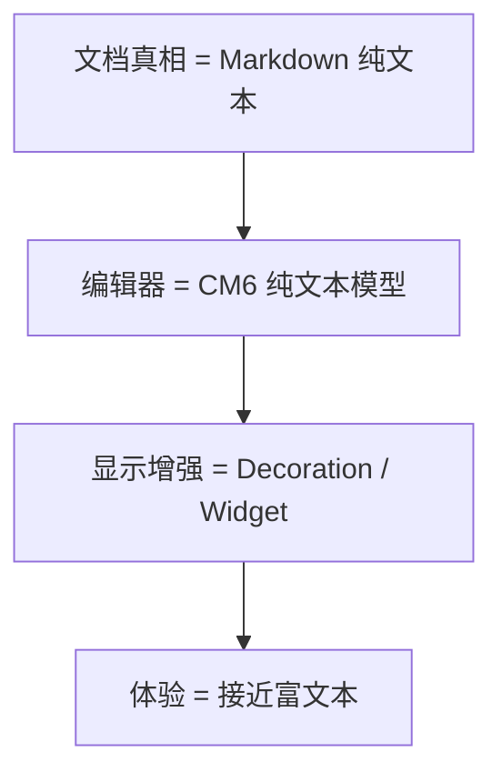
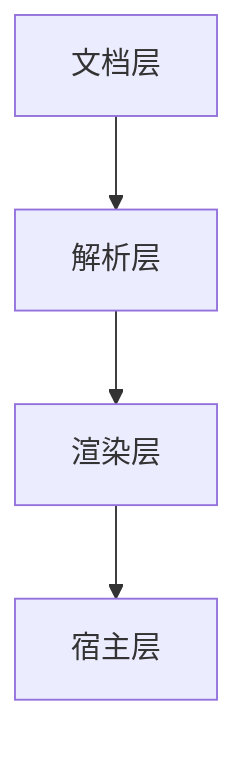
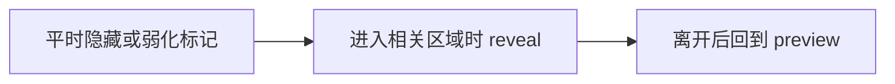
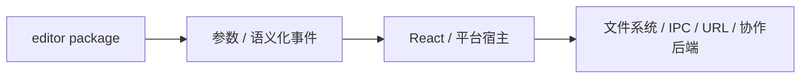

<!-- cspell:ignore codemirror ytext markdownlint -->

# 12. 自己设计一套 Markdown Live Preview 架构

> 学到最后，很自然就会走到这个问题：如果不是继续读别人的编辑器，而是要自己设计一套 Markdown Live Preview 架构，我该先做哪些决策？这一篇就专门解决这个问题。

## 本篇目标

读完这一篇，你应该能：

- 先定义清楚文档真相是什么
- 把系统拆成文档层、解析层、渲染层、宿主层
- 判断哪些内容适合轻装饰，哪些适合 widget
- 知道为什么“显示增强”和“文档真相”最好分开

## 1. 先别急着追效果

很多编辑器项目一开始都会先想：

- 我要像 Notion
- 我要像 Obsidian
- 我要像 Typora
- 我要像富文本，但底层还想存 Markdown

真正更该先定的是三件事：

### 你的文档真相是什么

- 纯文本 Markdown
- 结构化 block tree
- 富文本 JSON
- CRDT 原生结构

### 你的用户主要在编辑什么

- 代码
- 技术文档
- 笔记
- 混合媒体内容

### 你最想优化哪一层

- 存储与互操作性
- 编辑体验
- 协作能力
- 自定义内容块能力

## 2. 如果你选 Markdown Live Preview，本质上是在选什么

SwarmNote 现在走的是这条路线：

这一条路线的核心承诺是：

> **文档真相保持简单，复杂性交给渲染层。**

## 3. 设计时先把系统拆成四层

这是最值得先建立的结构：

### 文档层

负责回答：

- 真正存什么数据
- 持久化格式是什么
- 协作同步结构是什么

### 解析层

负责回答：

- 怎么识别 heading、link、image、table、callout 等结构

### 渲染层

负责回答：

- 哪些内容只加样式
- 哪些内容需要 reveal / conceal
- 哪些内容要替换成 widget

### 宿主层

负责回答：

- 图片 URL 怎么解析
- 链接怎么打开
- 文件怎么上传
- 协作更新怎么桥接

## 4. 一个很实用的决策表

| 问题 | 应该放在哪层 |
| --- | --- |
| 文档本体是不是 Markdown | 文档层 |
| `` 怎么识别 | 解析层 |
| 识别后显示成真正图片 | 渲染层 |
| 图片路径怎么映射成本地 URL | 宿主层 |
| 链接点击后怎么真正打开 | 宿主层 |
| 光标进入时是否 reveal markdown 源码 | 渲染层 + state |

如果一个项目越做越乱，很多时候就是因为这些边界一开始没有划清楚。

## 5. 不同内容，适合不同显示策略

不是所有 Markdown 结构都该用同一种渲染方式。

### 第一类：只需要样式增强

例如：

- heading
- inline code
- blockquote
- task list 行样式

更适合：

- `Decoration.mark`
- `Decoration.line`

### 第二类：需要 reveal / conceal

例如：

- `**bold**`
- `==highlight==`
- link 标记字符
- URL 可见性切换

更适合：

- inline replace
- reveal strategy

### 第三类：需要真正替换成 richer UI

例如：

- 图片
- 表格
- 数学块
- HTML block

更适合：

- `WidgetType`
- block decoration

## 6. reveal 设计决定编辑体验好不好用

Markdown Live Preview 的关键不只是“能不能把源码藏起来”，而是：

- 什么时候该露出源码
- 光标进去后编辑是否自然
- 离开后能否平滑回到 preview

如果这条链做不好，用户就会感觉到：

- 光标跳
- 装饰闪烁
- 编辑和显示互相打架

## 7. block widget 很强，但别滥用

一旦你把某类结构做成 block widget，就要同时考虑：

- 它通常要走 `StateField`
- 它会和 selection / reveal 发生关系
- 它往往依赖宿主能力
- 它要处理光标如何进入和退出源码模式

所以 block widget 特别适合：

- 图片
- 表格
- 数学块

但如果只是轻样式增强，通常没必要一上来就用 widget。

## 8. 宿主边界一定要清楚

这也是很多编辑器项目最容易返工的地方。

以 SwarmNote 为例，编辑器包本身并不直接负责：

- `asset://` URL 映射
- Tauri 打开外链
- 媒体文件保存
- 协作状态生命周期

它只通过参数和事件协议与 host 协作。

这是一条非常值得复用的原则：

> **编辑器内核只负责编辑器；平台能力交给宿主。**

## 9. 一个更稳的实现顺序

如果你真要自己做一套 Live Preview，我建议按这个顺序长：

### 第一步：先做纯文本编辑器

先确保：

- 文档可输入
- 选区正常
- 快捷键正常
- 基础语法树可用

### 第二步：补轻装饰

先做：

- heading
- blockquote
- inline code
- task list 样式

### 第三步：补 reveal / conceal

再做：

- bold / italic / link / highlight 的标记字符隐藏
- 光标进入时源码可见

### 第四步：再上 block widget

最后再做：

- 图片
- 表格
- 数学块

### 第五步：最后接宿主与协作

再补：

- 图片 resolver
- 链接打开
- 文件上传
- Y.Text / awareness / provider

这个顺序的好处是：

- 每一步都能工作
- 每一步都能单独验证交互
- 不会一开始把所有复杂性叠在一起

## 10. 本篇结论

如果你以后要自己设计 Markdown Live Preview 编辑器，最值得先记住的不是某个具体 API，而是这些结构原则：

- 先定文档真相
- 再分离文档层、解析层、渲染层、宿主层
- 能轻装饰就先别上 widget
- 显示增强尽量别污染文档真相

只要这几个边界先站稳，后面的实现会顺很多。

回到练习和复习时，建议再配合看一遍：[`09-CM6 练习题与二刷地图`](./09-CM6-练习题与二刷地图.md)
