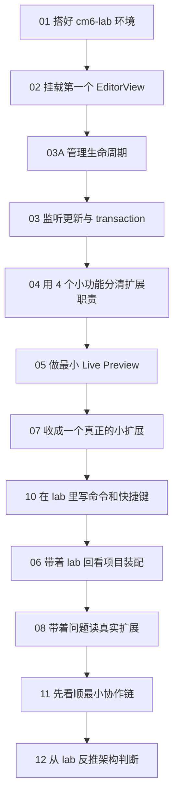

<!-- cspell:ignore swarmnote ytext codemirror keymap tsx -->

# CodeMirror 6 学习教程：从 React + TypeScript 入门，到 SwarmNote 项目实战

> 这是一套面向 React + TypeScript 开发者的 CodeMirror 6 教程。你会先从 `pnpm create vite` 搭一个最小学习环境，再一路围着同一个 `cm6-lab` 学会挂载编辑器、管理 `EditorView` 生命周期、监听更新、写扩展、做最小 Live Preview，最后再回到 `packages/editor/` 看真实项目是怎么装起来的。

## 这套教程适合谁

- 平时主要写 React + TypeScript
- 想从零学会怎么把 CM6 真正跑起来
- 不想一开始就被 Facet、StateField、Widget 吓住
- 想最后能看懂真实项目里的 CM6 代码

## 推荐阅读顺序

### 第一部分：先做出一个能跑的编辑器

1. [01-从 `pnpm create vite` 开始搭一个 CM6 学习环境](./01-从-pnpm-create-vite-开始搭一个-CM6-学习环境.md)
1. [02-在 React 里挂一个最小 CodeMirror 6 编辑器](./02-在-React-里挂一个最小-CodeMirror-6-编辑器.md)
1. [03A-React 中管理 `EditorView` 生命周期](./03A-React-中管理-EditorView-生命周期.md)
1. [03-在 React 里监听更新，理解 transaction 和更新循环](./03-在-React-里监听更新与理解-transaction-更新循环.md)

### 第二部分：开始自己扩展编辑器能力

1. [04-先学会判断：一个功能该写成哪种扩展](./04-先学会判断一个功能该写成哪种扩展.md)
1. [05-用 Decoration 和 Widget 做出最小 Live Preview](./05-用-Decoration-和-Widget-做出最小-Live-Preview.md)
1. [07-自己写一个最小 CM6 扩展](./07-自己写一个最小-CM6-扩展.md)
1. [10-给编辑器加命令和快捷键](./10-给编辑器加命令和快捷键.md)

### 第三部分：回到真实项目

1. [06-拆解 `packages/editor` 的装配方式](./06-拆解-packages-editor-的装配方式.md)
1. [08-读懂一个真实扩展：以 `renderBlockImages` 为例](./08-读懂-renderBlockImages-这个真实扩展.md)
1. [11-把协作编辑接到 Y.Text 和 awareness 上](./11-把协作编辑接到-YText-y-codemirror-next-和-awareness-上.md)
1. [12-自己设计一套 Markdown Live Preview 架构](./12-自己设计一套-Markdown-Live-Preview-架构.md)

### 第四部分：练习、复习、二刷

1. [09-CM6 练习题与二刷地图](./09-CM6-练习题与二刷地图.md)

## 每篇会带你做什么

| 章节 | 你会完成或理解什么 |
| --- | --- |
| 01 | 搭好一个 React + TS 的 CM6 学习环境 |
| 02 | 在 React 中挂出第一个最小可输入的 CM6 编辑器 |
| 03A | 学会稳定管理 `EditorView` 生命周期 |
| 03 | 学会监听编辑器更新，并建立 transaction 直觉 |
| 04 | 在 lab 里通过 4 个小功能真正分清 Facet、StateField、ViewPlugin、Compartment |
| 05 | 在 lab 里做出最小 Live Preview，理解 line / mark / replace / widget |
| 06 | 带着 lab 里的例子回看 `packages/editor/` 的真实装配方式 |
| 07 | 把前面零散能力收成一个真正的小扩展 |
| 08 | 带着明确问题去读 `renderBlockImages` 这个真实扩展 |
| 09 | 给自己安排练习题、复习顺序和二刷路径 |
| 10 | 在 lab 里先写命令和快捷键，再回看项目实现 |
| 11 | 先看顺最小协作链，再理解 Y.Text、y-codemirror.next 和 awareness |
| 12 | 把前面的编辑、预览、协作经验收成一套架构判断 |

## 配套源码入口

如果你想一边读教程一边对照项目代码，建议顺手打开这些文件：

- `packages/editor/src/createEditor.ts`
- `packages/editor/src/core/facets.ts`
- `packages/editor/src/core/shouldShowSource.ts`
- `packages/editor/src/extensions/markdownDecorationExtension.ts`
- `packages/editor/src/extensions/inlineRendering/makeInlineReplaceExtension.ts`
- `packages/editor/src/extensions/renderBlockImages.ts`
- `packages/editor/src/extensions/collaborationExtension.ts`
- `packages/editor/src/events.ts`

## 学习总图

## 一句话总览

> **先把编辑器跑起来，再把扩展写起来，最后把真实项目看明白。**
