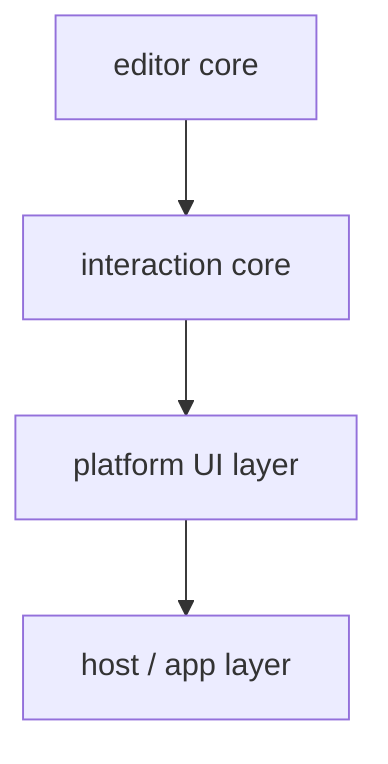

# Editor Core / Interaction / Host Boundary 清单

> **更新（2026-05-12）**：本文档下方"interaction core"是否单独成包的问题已在 [editor-plugin-architecture.md](./editor-plugin-architecture.md) 中闭环——**interaction 作为 first-party plugin 留在 `editor-core/plugins/interactions/`**，与第三方插件共用同一 `EditorPlugin` API。本文档其余分层归类仍有效。

## 目的

这份清单用于回答一个非常具体的问题：

> 当前 SwarmNote 编辑器里，哪些东西应该留在 editor core，哪些应该抽到 interaction core，哪些属于平台 UI 层，哪些本来就是 host/app 层？

如果这条边界不先理清，后续继续加入 slash command、浮动工具栏、`[[` note link 插入时，新能力仍然很容易长到错误的位置。

本清单主要服务于 `dev-notes/plans/editor-open-source-rfc.md` 的后续实施。

---

## 先给出四层定义

### 1. editor core

负责：

- 编辑器文档与状态
- 命令系统
- preview / widget / decoration
- collaboration binding
- 平台无关的语义事件

典型特点：

- 不依赖 React / RN
- 不依赖 Tauri / Expo
- 不依赖具体菜单或工具栏 UI
- 输入是配置与回调，输出是编辑器状态变化与语义事件

### 2. interaction core

负责：

- slash trigger 检测
- `[[` wikilink trigger 检测
- selection toolbar 是否该显示
- query / match / anchor range 等语义状态
- interaction command payload 结构

典型特点：

- 仍然平台无关
- 不直接渲染 UI
- 更像 editor core 上方的一层交互语义协议

### 3. platform UI layer

负责：

- Web / 桌面端的右键菜单、popover、floating toolbar
- 移动端的 bottom toolbar、keyboard accessory、bottom sheet
- 坐标定位、焦点切换、关闭策略
- 将 editor event / interaction state 转成可见 UI

典型特点：

- 明确依赖 React DOM 或 React Native
- 可以有默认官方组件
- 不应该重新实现底层编辑器逻辑

### 4. host / app layer

负责：

- 业务数据源
- workspace / note / asset / provider 生命周期
- 外链打开
- 文件上传
- note 搜索
- 协作实例创建与销毁
- 应用级状态管理与埋点

典型特点：

- 明显带业务上下文
- 不适合作为开源编辑器内核的一部分

---

## 当前代码里的边界判断

下面按当前已有实现逐项判断。

---

## 一、明确属于 editor core 的内容

### 1. `packages/editor/src/createEditor.ts`

**归属**：editor core

**原因**：

- 它负责装配 CM6 内核能力
- 它本身不依赖 React / RN
- 它通过参数接收 `onEvent`、`imageResolver`、`uploadFile`、`collaboration`
- 它输出的是 `EditorControl`

**应继续保留在 core 的内容**：

- `EditorState.create`
- keymap 与 command 装配
- preview / search / collaboration extension 注册
- `EditorView.updateListener` 派发基础语义事件

**相关文件**：
- `packages/editor/src/createEditor.ts`

---

### 2. 命令系统

**归属**：editor core

**原因**：

- 命令本质上是在改文本状态
- 不应绑定到某个平台的具体 UI
- 同一个命令应可被快捷键、右键菜单、浮动工具栏、移动端 toolbar 复用

**应保留在 core 的内容**：

- `toggleBold`
- `toggleItalic`
- `toggleCode`
- `toggleList`
- `cycleHeading`
- `insertLink`
- `insertImage`
- 表格编辑动作

**相关文件**：
- `packages/editor/src/editorCommands/*`

---

### 3. Markdown preview / widget / decoration 体系

**归属**：editor core

**原因**：

- 这是编辑器本身的显示逻辑
- 它依赖 CM6 state / decoration / widget 体系
- 它不该放在宿主应用里

**包括**：

- inline rendering
- markdown decoration
- block images / tables / code blocks
- admonition
- link tooltip extension
- search extension

**相关文件**：
- `packages/editor/src/extensions/*`

---

### 4. collaboration binding

**归属**：editor core

**原因**：

- `y-codemirror.next` 与 CM6 的绑定是编辑器内核的一部分
- 但 collaboration provider 生命周期不属于 core

**应保留在 core 的内容**：

- `createCollaborationExtension`
- `Y.Text` 与 CM6 文档绑定
- awareness 与编辑器光标呈现的结合

**不属于 core 的内容**：

- `Y.Doc` 创建
- provider 创建与销毁
- 远端 update 运输

**相关文件**：
- `packages/editor/src/extensions/collaborationExtension.ts`

---

### 5. 基础语义事件模型

**归属**：editor core

**原因**：

`EditorEventType` 是 editor 与 host 之间的稳定契约。

当前明显应属于 core 的事件：

- `Change`
- `SelectionChange`
- `SelectionFormattingChange`
- `Focus`
- `Blur`
- `SearchStateChange`
- `CollaborationUpdate`
- `LinkOpen`
- `Remove`

这些都描述“编辑器里发生了什么”，而不是“某个平台该怎么画 UI”。

**相关文件**：
- `packages/editor/src/events.ts`

---

## 二、建议抽成 interaction core 的内容

> **已落实于 OpenSpec change `add-editor-interaction-trio-v03`**（v0.3，
> 2026-05-13）：slash / wikilink / selectionToolbar 三个 interaction
> plugin 都已升级为真实 runtime（plugins/interactions/{slash,wikilink,
> selectionToolbar}），SDK 表面（registerSlashItems / registerWikilinkItems /
> registerSelectionToolbarActions / on / host.get*）全部 stable。
> CharTrigger family 抽象（slash + wikilink 共用 helper）见
> `../knowledge/editor.md` 的「Interaction trigger 三类」节。

这部分当前还没有完整抽出，但从后续目标看，应该独立收束。

### 1. slash command trigger

**建议归属**：interaction core

**原因**：

- 它不是基础 markdown preview
- 也不是平台 UI
- 它更像“编辑器语义层发现当前光标触发了命令插入态”

**应该抽出的内容**：

- `/` 触发条件
- query 提取
- 替换范围
- slash 会话状态
- 与 command item schema 的对接协议

---

### 2. `[[` wikilink trigger

**建议归属**：interaction core

**原因**：

- 它是编辑器语义，不是业务搜索 UI
- 但它也不该直接长在 React/RN 组件里

**应该抽出的内容**：

- `[[` 是否被触发
- query 提取
- 替换范围
- 插入 markdown link 的命令 helper

---

### 3. selection toolbar state

**建议归属**：interaction core

**原因**：

- “当前选区是否该弹格式工具栏”是一个交互语义判断
- 它可以在 Web 上驱动浮动工具栏，也可以在移动端驱动底部 formatting bar

**应该抽出的内容**：

- 是否有有效选区
- 当前 formatting 状态
- 当前锚点 range
- 是否适合显示 formatting actions

---

### 4. 新的交互事件

**建议归属**：interaction core 输出，event 契约仍定义在 core 事件体系里

未来候选：

- `SlashTriggerChange`
- `WikiLinkTriggerChange`
- `SelectionToolbarChange`

这些事件的重点是：

- 描述交互态变化
- 不直接携带平台 UI 对象
- 让宿主或平台 UI 层决定怎么展示

---

## 三、明确属于 platform UI layer 的内容

### 1. 桌面端右键菜单

**归属**：platform UI layer（Web/Desktop）

**原因**：

- 右键菜单是桌面端交互壳
- 它消费 command，但不应定义 command
- 它消费 `EditorEventType`，但不应污染 core

当前桌面端已有这类模式：

- `EditorContextMenu`
- `TableContextMenu`

尤其 `TableContextMenu` 已经很接近正确模式：

- widget 不直接画菜单
- editor 发出 `TableContextMenu` 事件
- React 层根据事件渲染菜单
- 菜单调用 `actions.*()` 反向操作文档

这是一个值得保留并推广到其他交互的模式。

**相关文件**：
- `src/components/editor/EditorContextMenu.tsx`
- `src/components/editor/TableContextMenu.tsx`
- `src/components/editor/NoteEditor.tsx`

---

### 2. 桌面端未来的浮动工具栏 / slash popover / wikilink popover

**归属**：platform UI layer（Web/Desktop）

**原因**：

- 这些 UI 强依赖 DOM 定位与鼠标/键盘行为
- 它们不应写进 core
- 它们应是 `editor-react` 包的一部分

**应负责的内容**：

- tooltip / popover 定位
- 打开/关闭策略
- 键盘导航
- hover / focus 行为

---

### 3. RN 底部 toolbar / keyboard accessory / sheet

**归属**：platform UI layer（React Native）

**原因**：

- 这些是移动端触控友好的官方交互壳
- 它们应消费共享 command 和 interaction state
- 但不应重写底层编辑器逻辑

**应负责的内容**：

- 底部 formatting toolbar
- slash command sheet
- wikilink 搜索 sheet
- 选区命令条
- keyboard / safe area 适配

**相关文件线索**：
- `SwarmNote-RN/src/components/editor/EditorToolbar.tsx`
- `SwarmNote-RN/src/components/editor/MarkdownEditor.tsx`

---

## 四、明确属于 host / app layer 的内容

### 1. `NoteEditor.tsx` 中的 Y.Doc / provider 生命周期

**归属**：host / app layer

**原因**：

- `openYDoc(relPath, wsId)` 是业务语义
- `TauriYjsProvider` 依赖应用 IPC 和后端同步体系
- provider 生命周期与工作区、当前文档、应用窗口状态强相关

这些不能放进开源 editor core。

**相关文件**：
- `src/components/editor/NoteEditor.tsx`
- `src/lib/TauriYjsProvider.ts`

---

### 2. `imageResolver`

**归属**：host / app layer 提供的能力

**原因**：

- editor core 只知道需要一个 resolver
- 具体如何把 workspace 相对路径转成 `asset://` URL，是宿主平台职责

当前这条边界已经是对的。

**相关文件**：
- `src/components/editor/NoteEditor.tsx`

---

### 3. `uploadFile` / `saveMedia`

**归属**：host / app layer

**原因**：

- 文件保存路径、命名规则、workspace 目录结构都是业务决策
- editor core 只需要一个“上传后得到可插入目标”的能力

**相关文件**：
- `src/components/editor/NoteEditor.tsx`
- `src/commands/document.ts`

---

### 4. `openUrl` / 外链打开

**归属**：host / app layer

**原因**：

- Web、Tauri、RN 打开链接的方式不同
- core 只应发 `LinkOpen` 事件
- host 决定实际调用什么平台 API

当前这条边界也是对的。

**相关文件**：
- `src/components/editor/NoteEditor.tsx`
- `packages/editor/src/events.ts`

---

### 5. note 搜索与 slash item 数据源

**归属**：host / app layer

**原因**：

- editor core 不知道“笔记”是什么
- slash command 的候选项也常常带业务语义
- 这类数据源应由宿主注入

未来最好以接口形式注入，例如：

- `searchNotes(query)`
- `getSlashItems(context)`

---

### 6. RN bridge / WebView 容器

**归属**：host / app layer 与 platform UI layer 之间的适配层

**原因**：

- 它不属于 editor core
- 但也不完全是业务层
- 更像 `editor-react-native` 包中的平台适配基础设施

从开源视角看，这部分应该被视作正式适配层，而不是临时 glue code。

**相关文件**：
- `SwarmNote-RN/src/components/editor/useEditorBridge.ts`
- `SwarmNote-RN/packages/editor-web/*`

---

## 五、当前最值得调整的地方

### 1. `TableContextMenu` 事件是一个好模式，但也暴露了一个边界问题

当前 `EditorTableContextMenuEvent` 带了：

- `clientX`
- `clientY`
- `actions`

这对桌面端 React 很方便，但如果未来要跨平台复用，需要再考虑：

- 哪些字段是平台无关语义
- 哪些字段是 Web/Desktop 特有定位信息

建议后续把这类事件拆成：

- 语义部分（table selection / table actions capability）
- 平台渲染部分（定位点、anchor rect）

否则 RN 端会天然不适配 `clientX/clientY` 这类字段。

---

### 2. 右键菜单不应成为命令系统唯一入口

当前桌面端命令偏 Obsidian 路径，较多依赖右键菜单。

后续引入：

- slash command
- 选区浮动工具栏
- `[[` note link 插入

时，应让这些新入口都复用同一套 command，不要在 UI 层各自拼文本修改逻辑。

---

### 3. `EditorEventType` 需要分层看待

当前 `EditorEventType` 里有两类事件混在一起：

#### 纯语义事件
- `Change`
- `SelectionChange`
- `SelectionFormattingChange`
- `Focus`
- `Blur`
- `LinkOpen`

#### 偏桌面 UI 事件
- `TableContextMenu`

后续建议逐步明确：

- 哪些是稳定 core event
- 哪些更适合作为 interaction event
- 哪些只是平台 UI convenience event

---

## 六、建议的拆分结果

> **已落实（部分）于 OpenSpec change [`split-editor-react-packages`](../../openspec/changes/split-editor-react-packages/proposal.md)（v0.2）**：sibling 仓 swarmnote-editor 已新增 3 个包（editor-web / editor-react / editor-react-native），架子搭起。
>
> v0.2 范围（按 design D12 修订）：包内只含**通用组件示例**（EditorView / EditorToolbar 简版 / I18nProvider）+ **干净的 hooks/adapter**（useEditorBridge / useEditorFormatting / comlink-webview-adapter）。SwarmNote 桌面的 ContextMenu / TableContextMenu 和 SwarmNote-RN 的 MarkdownEditor / EditorToolbar / EditorHeadingSheet **仍保留在 host**（业务编排级耦合，按组件库哲学留 v0.2.1 重写为通用版本）。

### 应保留在 `editor-core`

- `createEditor`
- `EditorControl`
- `EditorEventType` 的基础语义部分
- commands
- preview / widget / decoration
- collaboration extension
- interaction core

### 应演化为 `editor-react`

- React wrapper
- 桌面/Web 默认右键菜单
- 浮动工具栏
- slash popover
- wikilink popover
- command palette UI

### 应演化为 `editor-react-native`

- RN `MarkdownEditor`
- WebView 容器与 bridge
- 底部 formatting toolbar
- slash command sheet
- wikilink 搜索 sheet
- keyboard accessory bar

### 应保留在应用层注入

- `imageResolver`
- `uploadFile`
- `onLinkOpen`
- `searchNotes`
- `getSlashItems`
- `Y.Doc` / provider 生命周期
- workspace / note / document 业务模型

---

## 七、下一步建议

建议按下面顺序继续推进：

1. 先把 `EditorEventType` 做一次分层草案
2. 再为 slash / wikilink / selection toolbar 定 interaction state 协议
3. 然后桌面端先实现一版 `editor-react` 风格的默认交互组件
4. 最后再将同一套语义接到 RN 端 UI

这样可以避免一上来就同时重构 core、桌面 UI、移动端 UI，复杂度太高。
