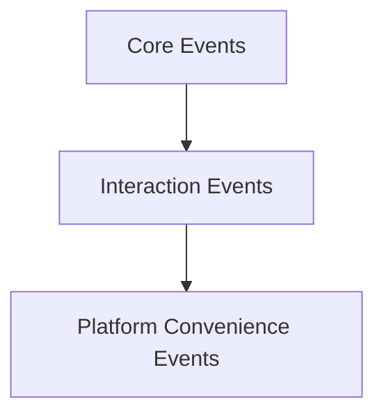
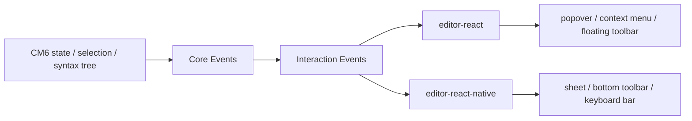

# EditorEventType 演进草案

> **更新（2026-05-12）**：v0.1 采纳本文提出的"三层分类"路线。最终类型形态、`MermaidZoomRequest` 归类、`SlashTriggerChange` / `WikiLinkTriggerChange` / `SelectionToolbarChange` 三个 interaction event 的 `@unstable` 标记，均已在 [editor-plugin-architecture.md #editor-event-三层分类-v01](./editor-plugin-architecture.md#editorevent-三层分类v01) 中收敛。本文档保留为推导过程。

## 目的

这份草案回答的问题是：

> 未来如果要把 SwarmNote 编辑器重构成可开源、可跨端复用的 Markdown 编辑器，`EditorEventType` 应该如何演进，才能既服务当前桌面端，又支撑后续的 slash command、浮动工具栏、`[[` note link 插入，以及 React / RN 的平台差异化交互？

核心目标不是单纯“多加几个 event”，而是让事件模型本身成为一个稳定的、平台无关的编辑器协议层。

---

## 背景

当前 `packages/editor/src/events.ts` 中已有这些事件：

- `Change`
- `SelectionChange`
- `SelectionFormattingChange`
- `Focus`
- `Blur`
- `SearchStateChange`
- `CollaborationUpdate`
- `LinkOpen`
- `Remove`
- `TableContextMenu`

这些事件已经证明当前架构有一个正确方向：

- editor core 不直接渲染宿主 UI
- editor 内核通过 `onEvent` 把语义事件抛给 React host
- host 再决定是否显示右键菜单、执行外链打开、更新应用状态

但随着未来要加入更多交互能力，当前事件模型会面临两个问题：

1. **纯语义事件和偏平台 UI 的事件混在一起**
2. **还缺少 interaction state 层面的事件协议**

因此现在需要先给出一份演进草案。

---

## 设计目标

### 1. 把事件当成稳定契约，而不是临时回调

`EditorEventType` 不只是内部实现细节，而是未来开源产品里的重要对外协议。

### 2. 区分“编辑器里发生了什么”和“某个平台准备怎么显示 UI”

- 前者应该稳定、跨端、平台无关
- 后者可以作为平台 convenience event，或者完全留在 UI 层内部处理

### 3. 为 interaction core 提供一层明确语义

未来的：

- slash command
- `[[` wikilink
- selection toolbar
- command palette request

都需要“介于 editor core 和 UI 之间”的状态表达。

### 4. 支持 Web / Desktop 和 RN 使用不同交互形态

同样的交互语义：

- 在桌面端可变成 popover / context menu / floating toolbar
- 在移动端可变成 sheet / keyboard bar / bottom toolbar

所以事件模型不能过早绑定到某种 UI 坐标和 DOM 结构。

---

## 事件分层原则

建议未来把事件分成三层：



### 1. Core Events

描述：

- 编辑器文档、选区、焦点、协作、搜索等基础状态变化
- 与具体 UI 形态无关
- 应长期稳定

### 2. Interaction Events

描述：

- 编辑器已经识别出某种交互态
- 例如 slash 被触发、wikilink 被触发、selection toolbar 可显示
- 仍然不直接携带平台 UI 组件或平台 API

### 3. Platform Convenience Events

描述：

- 为某个平台的默认官方 UI 提供更直接的数据
- 例如桌面端右键菜单定位、表格上下文菜单快捷动作
- 可以存在，但不应污染核心语义层

---

## 第一层：Core Events 草案

这一层应该成为未来编辑器最稳定的事件协议。

### 建议保留 / 稳定化的事件

#### `Change`

表示文档内容发生变化。

```ts
type EditorChangeEvent = {
  kind: 'change';
};
```

说明：

- 保持轻量即可
- 需要更多 diff 信息时，优先走 command/transaction 或专门 API，不要让基础事件膨胀

---

#### `SelectionChange`

表示主选区发生变化。

```ts
type EditorSelectionChangeEvent = {
  kind: 'selectionChange';
  selection: EditorSelectionRange;
};
```

说明：

- 这是很多交互的上游信号
- slash / toolbar / link preview 都会依赖它

---

#### `SelectionFormattingChange`

表示当前选区对应的格式状态变化。

```ts
type EditorSelectionFormattingChangeEvent = {
  kind: 'selectionFormattingChange';
  formatting: SelectionFormatting;
};
```

说明：

- 这是 React toolbar 和 RN formatting bar 的共享输入
- 应保留在 core event

---

#### `Focus` / `Blur`

表示编辑器焦点变化。

```ts
type EditorFocusEvent = { kind: 'focus' };
type EditorBlurEvent = { kind: 'blur' };
```

说明：

- 对 tooltip、floating UI、移动端键盘联动都很重要

---

#### `SearchStateChange`

表示搜索状态变化。

```ts
type EditorSearchStateChangeEvent = {
  kind: 'searchStateChange';
  search: SearchState | null;
  source?: string;
};
```

说明：

- 可保留现状
- 这是比较典型的 editor → host 状态同步事件

---

#### `CollaborationUpdate`

表示本地产生了可向外同步的协作更新。

```ts
type EditorCollaborationUpdateEvent = {
  kind: 'collaborationUpdate';
  update: Uint8Array;
};
```

说明：

- 这更像传输事件，但目前仍可视作 core event
- RN 端因为桥接限制，也可以继续保留 top-level 回调优化

---

#### `LinkOpen`

表示编辑器内某个链接请求被打开。

```ts
type EditorLinkOpenEvent = {
  kind: 'linkOpen';
  url: string;
};
```

说明：

- 这是一个典型“editor core 只发语义，host 决定平台实现”的好事件
- 应保持

---

#### `Remove`

表示某个编辑器实体或 widget 触发了删除请求。

```ts
type EditorRemoveEvent = {
  kind: 'remove';
};
```

说明：

- 如果未来没有明确使用场景，可以考虑继续保留但弱化其对外地位
- 也可在后续整理时确认是否需要更具体化

---

## 第二层：Interaction Events 草案

这一层是未来最关键的新增部分。

它描述的是：

> 编辑器已经识别出某种“交互机会”或“交互状态”，但还没有绑定最终 UI。

---

### 1. `SlashTriggerChange`

表示当前光标附近出现了 slash command 触发态。

```ts
type SlashTriggerMatch = {
  from: number;
  to: number;
  query: string;
};

type EditorSlashTriggerChangeEvent = {
  kind: 'slashTriggerChange';
  match: SlashTriggerMatch | null;
};
```

说明：

- `match === null` 表示当前不在 slash 会话中
- `from/to` 是替换范围
- `query` 是 `/` 后已输入内容

Web/Desktop 端可以据此弹出 slash popover。
RN 端可以据此弹出 slash command sheet。

---

### 2. `WikiLinkTriggerChange`

表示当前光标附近出现了 `[[` note link 插入态。

```ts
type WikiLinkTriggerMatch = {
  from: number;
  to: number;
  query: string;
};

type EditorWikiLinkTriggerChangeEvent = {
  kind: 'wikiLinkTriggerChange';
  match: WikiLinkTriggerMatch | null;
};
```

说明：

- `match === null` 表示不在 wikilink 会话中
- `query` 用于搜索 note
- 宿主负责提供 `searchNotes(query)` 数据源

---

### 3. `SelectionToolbarChange`

表示当前是否适合显示 selection-based formatting UI。

```ts
type SelectionToolbarState = {
  visible: boolean;
  anchor: number;
  head: number;
  formatting: SelectionFormatting;
};

type EditorSelectionToolbarChangeEvent = {
  kind: 'selectionToolbarChange';
  state: SelectionToolbarState;
};
```

说明：

- 这里的 `visible` 是语义判断，不是最终 UI 是否已打开
- Web/Desktop 端可据此显示 floating toolbar
- RN 端可据此高亮底部 formatting bar 或显示选区命令条

---

### 4. `CommandPaletteRequest`

表示编辑器内出现了一个更泛化的命令请求入口。

```ts
type EditorCommandPaletteRequestEvent = {
  kind: 'commandPaletteRequest';
  source: 'keyboard' | 'slash' | 'selection' | 'programmatic';
};
```

说明：

- 这是可选事件
- 适合后续统一 command palette 体系
- 当前不一定立即实现，但值得预留

---

### 5. `HoverTargetChange`（可选）

如果未来要做块级 hover actions，可以预留。

```ts
type HoverTarget = {
  type: 'paragraph' | 'heading' | 'blockquote' | 'image' | 'table' | 'codeBlock';
  from: number;
  to: number;
};

type EditorHoverTargetChangeEvent = {
  kind: 'hoverTargetChange';
  target: HoverTarget | null;
};
```

说明：

- 这不是第一阶段必须做
- 但如果未来有 block-level 操作按钮，会很有用

---

## 第三层：Platform Convenience Events 草案

这一层的事件可以存在，但要有意识地标记为：

> 为官方平台 UI 提供便利，不应成为最核心的编辑器协议。

---

### 1. `TableContextMenu`

当前已有：

```ts
type EditorTableContextMenuEvent = {
  kind: 'tableContextMenu';
  clientX: number;
  clientY: number;
  rowIdx: number;
  colIdx: number;
  alignment: TableAlignment;
  rowCount: number;
  colCount: number;
  actions: TableContextMenuActions;
};
```

问题在于：

- `clientX/clientY` 是桌面/Web 坐标语义
- `actions` 对 React 菜单很方便，但也带有明显的宿主便利性

建议：

- 继续保留，服务当前桌面端 UI
- 但在文档与类型层面明确它是 **platform convenience event**
- 后续如果需要 RN 端或更平台无关的 table action，可再抽一层纯语义状态

---

### 2. 未来可能的 `SelectionPopoverAnchor`

不建议过早引入这类事件到 core 协议中。

例如：

```ts
type SelectionPopoverAnchorEvent = {
  kind: 'selectionPopoverAnchor';
  rect: DOMRect;
};
```

这种事件不适合做 core event，因为：

- `DOMRect` 不是跨平台抽象
- RN 不存在同样语义对象
- 更适合作为 `editor-react` 内部 UI 层计算

结论：

- 平台坐标类信息最好留在平台 UI 层内部处理
- 除非确实需要跨组件共享，否则不要轻易进 core event 模型

---

## 当前事件的分层归类建议

| 当前事件 | 建议分层 | 备注 |
| --- | --- | --- |
| `Change` | Core Event | 保留 |
| `SelectionChange` | Core Event | 保留 |
| `SelectionFormattingChange` | Core Event | 保留 |
| `Focus` | Core Event | 保留 |
| `Blur` | Core Event | 保留 |
| `SearchStateChange` | Core Event | 保留 |
| `CollaborationUpdate` | Core Event | 保留 |
| `LinkOpen` | Core Event | 保留 |
| `Remove` | Platform Convenience Event | 2026-05-12 定位：作为 platform convenience |
| `TableContextMenu` | Platform Convenience Event | 不建议当成核心协议代表 |
| `MermaidZoomRequest` | Platform Convenience Event | 2026-05-12 补：携带 `renderedSvg: string` HTML，Web 假设强，跨端不稳定 |

---

## 建议新增事件归类

| 候选事件 | 建议分层 | 目标 |
| --- | --- | --- |
| `SlashTriggerChange` | Interaction Event | slash command |
| `WikiLinkTriggerChange` | Interaction Event | `[[` note link 插入 |
| `SelectionToolbarChange` | Interaction Event | 桌面浮动工具栏 / 移动端格式栏 |
| `CommandPaletteRequest` | Interaction Event | 命令面板入口 |
| `HoverTargetChange` | Interaction Event（可选） | 块级 hover 操作 |

---

## 类型组织建议

未来 `events.ts` 可以按层组织，而不是所有类型平铺在一起。

例如：

```ts
// core events
export type EditorCoreEvent = ...

// interaction events
export type EditorInteractionEvent = ...

// platform convenience events
export type EditorPlatformEvent = ...

export type EditorEvent =
  | EditorCoreEvent
  | EditorInteractionEvent
  | EditorPlatformEvent;
```

这样做有几个好处：

1. 文档更清楚
2. 开源时更容易说明“哪些是稳定协议”
3. React/RN 包可以按层消费事件
4. 更容易做渐进式演进，而不一次打碎现有 API

---

## 演进策略建议

### Phase 1：先文档化分层

先不急着大改实现，先把类型和文档上分清：

- 哪些是 core event
- 哪些是 interaction event
- 哪些是 platform convenience event

### Phase 2：新增 interaction event

优先补：

- `SlashTriggerChange`
- `WikiLinkTriggerChange`
- `SelectionToolbarChange`

### Phase 3：让平台 UI 层消费 interaction event

- 桌面端：floating toolbar / slash popover / wikilink popover
- RN：bottom sheet / toolbar / keyboard bar

### Phase 4：再考虑 convenience event 的收束

如果后续发现 `TableContextMenu` 这类事件越来越多，再考虑：

- 平台事件命名空间化
- 从 `EditorEvent` 主协议里弱化其地位

---

## 设计上的几个重要约束

### 1. Event 不应直接携带 React 组件或平台对象

不要出现：

- ReactNode
- DOM 元素引用
- RN ref
- 平台 API handle

事件应该保持可序列化、可桥接、可测试。

### 2. Event 尽量描述“状态”，而不是“要求 UI 立刻怎么画”

好的事件：

- 当前 selection toolbar 可以显示
- 当前 slash 会话 query 是什么
- 当前 wikilink 匹配范围是什么

不好的事件：

- 请立刻弹一个 320px 宽 popover
- 请把菜单画在这个具体 React 容器下

### 3. 平台坐标类信息要谨慎进入核心协议

`clientX/clientY`、`DOMRect` 这种字段很容易把 Web 假设带进核心层。

如无必要，优先让平台 UI 层自己通过 selection / editor API 计算锚点。

---

## 一个推荐的最终形态



这个模型的重点是：

- editor core 只负责“感知并描述”
- interaction event 负责“把交互机会表达出来”
- 平台 UI 层负责“把它变成最适合该平台的交互组件”

---

## 建议的下一步

下一步最适合做的是：

1. 从 `events.ts` 中把当前事件先按注释层面标注为 core / convenience
2. 为 `SlashTriggerChange`、`WikiLinkTriggerChange`、`SelectionToolbarChange` 起草最小 payload
3. 再基于这三类 interaction event 设计 `editor-react` 与 `editor-react-native` 的默认组件接口

这样后续进入真正实现时，事件协议会先于 UI 稳定下来。