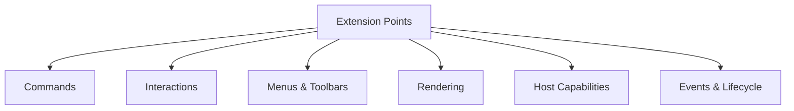

# Editor Extension Points Draft

## 目的

这份草案回答的问题是：

> 如果未来希望将 SwarmNote 编辑器开源成一个可开箱即用、又允许开发者二次扩展的 Markdown 编辑器，那么在真正做“插件系统”之前，应该先明确哪些 extension points？

这份文档的重点不是直接设计完整插件平台，而是先设计一套稳定、克制、可逐步演化的扩展点体系。

---

## 为什么现在先谈 extension points，而不是完整插件系统

当前目标仍然是：

- 把编辑器 core / react / rn / interaction layer 边界理顺
- 支撑 slash command、浮动工具栏、`[[` note link 插入
- 让编辑器能够对外开源并开箱即用

在这个阶段，直接做 Obsidian / Inkdrop 那种完整插件系统会过重，因为它意味着：

- manifest
- runtime loading
- 插件生命周期
- enable/disable
- 权限与隔离
- 插件设置页
- sandbox

而这些并不是开源第一版最急迫的问题。

当前更需要的是：

> **先让编辑器具备稳定的可扩展点，让别人可以在不 fork core 的前提下增加命令、菜单、交互和渲染能力。**

也就是先做：

- extension points
- registries
- host injection contracts
- hookable interaction surfaces

而不是一步跳到 runtime plugin platform。

---

## 设计目标

### 1. 开箱即用，但不封死

编辑器官方包需要提供默认能力和默认 UI，保证接入方可以很快用起来。

同时也必须允许：

- 新增 command
- 新增 slash item
- 新增 menu item
- 新增 selection toolbar item
- 新增 widget / preview 规则
- 新增 trigger 与 interaction

### 2. Core 只暴露稳定扩展面，不暴露内部偶然实现

扩展点应该围绕：

- command schema
- interaction schema
- event contracts
- rendering registration
- host capability injection

而不是暴露大量只能靠阅读内部源码才能理解的隐式细节。

### 3. 先支持“代码级扩展”，后支持“运行时插件”

第一阶段允许：

- npm package 扩展
- app 内注册扩展
- 通过配置或 registry 挂入新能力

后续如有必要，再演化到运行时插件系统。

### 4. Web / Desktop 与 RN 共享扩展语义，允许 UI 表现不同

扩展点应优先作用于：

- command
- trigger
- interaction state
- event
- rendering

而不是直接作用于某个具体 DOM 菜单组件。

---

## 扩展点总览



建议第一版重点围绕六类扩展点设计。

---

## 一、Command Extension Points

命令系统是最核心的扩展面。

很多交互入口其实都应该复用同一套 command：

- 右键菜单
- slash command
- 选区浮动工具栏
- 移动端底部 toolbar
- 快捷键
- command palette

### 目标

允许开发者注册新的 command，而不需要改 core 里的 switch / if-else 分发。

### 草图

```ts
type EditorCommandSpec = {
  id: string;
  title: string;
  description?: string;
  icon?: string;
  when?: (ctx: EditorCommandContext) => boolean;
  run: (ctx: EditorCommandContext) => void | Promise<void>;
};
```

### 上下文应包含什么

```ts
type EditorCommandContext = {
  control: EditorControl;
  state: EditorState;
  selection: EditorSelectionRange;
  formatting: SelectionFormatting;
  host: EditorHostCapabilities;
};
```

### 第一阶段可开放的扩展能力

- 注册新 command
- 覆写某些默认 command 的 metadata
- 为命令添加分组/标签，用于 toolbar / slash / palette 复用

### 需要避免的事

- 让 command 直接依赖 React 组件
- 让 command 直接访问 Tauri / Expo API
- 把业务数据源写死在 command 内部

---

## 二、Interaction Extension Points

这一层服务未来的：

- slash command
- `[[` wikilink
- selection toolbar
- command palette
- 可能的 `@mention` / `#tag` / custom trigger

### 目标

允许开发者注册新的 trigger 和 interaction provider。

### 2.1 Trigger 注册

```ts
type EditorTriggerSpec = {
  id: string;
  detect: (ctx: TriggerDetectContext) => TriggerMatch | null;
};
```

例如：

- `/` → slash
- `[[` → wikilink
- `@` → mention
- `#` → tag

### 2.2 Interaction Provider

```ts
type InteractionProviderSpec<TMatch, TItem> = {
  id: string;
  resolveItems: (match: TMatch, host: EditorHostCapabilities) => Promise<TItem[]> | TItem[];
  onSelect: (item: TItem, ctx: InteractionSelectContext<TMatch>) => void;
};
```

### 第一阶段最值得做的

- slash trigger + provider
- wikilink trigger + provider
- selection toolbar state provider

### 未来可演化的

- mention provider
- AI command provider
- inline suggestion provider

---

## 三、Menu / Toolbar Extension Points

未来官方会有：

- 桌面端右键菜单
- 选区 floating toolbar
- RN 底部 formatting toolbar
- slash menu
- command palette

这些不应该各自维护一套完全独立的 item 结构。

### 目标

让同一个 command 或 action 能够投影到不同交互容器中。

### 3.1 通用 Action Item 结构

```ts
type EditorActionItem = {
  id: string;
  title: string;
  icon?: string;
  group?: string;
  shortcut?: string;
  when?: (ctx: EditorActionContext) => boolean;
  run: (ctx: EditorActionContext) => void | Promise<void>;
};
```

### 3.2 可扩展的菜单面

建议支持这些 registry：

- context menu items registry
- selection toolbar items registry
- slash items registry
- command palette items registry
- mobile toolbar items registry

### 核心原则

- 注册的是 item schema，不是某个平台的具体组件
- React / RN 包分别决定如何呈现这些 items

### 示例

一个 `toggleBold` command 可以：

- 在桌面端右键菜单里显示为一项
- 在 floating toolbar 里显示为一个按钮
- 在移动端底部 toolbar 里显示为图标按钮
- 在 command palette 里显示为命令项

但底层仍然指向同一个 command。

---

## 四、Rendering Extension Points

这是编辑器作为 Markdown Live Preview 内核的关键扩展点。

当前已有很多内置能力：

- inline rendering
- markdown decorations
- image/table/code block widgets
- admonition
- link tooltip

未来开源后，开发者很可能希望扩展：

- 新的 block preview
- 新的 inline replacement
- 新的 markdown syntax handling
- 新的 widget

### 目标

提供受控的 rendering registration API，而不是鼓励外部直接深入内部 extension 装配细节。

### 可考虑的扩展面

#### 4.1 Inline rendering rule

```ts
type InlineRenderRule = {
  id: string;
  nodeNames: string[];
  build: (ctx: InlineRenderContext) => DecorationSet | null;
};
```

#### 4.2 Block widget rule

```ts
type BlockWidgetSpec = {
  id: string;
  match: (ctx: BlockWidgetMatchContext) => BlockWidgetMatch | null;
  create: (ctx: BlockWidgetCreateContext) => WidgetType;
};
```

#### 4.3 Markdown decoration rule

```ts
type MarkdownDecorationRule = {
  id: string;
  apply: (ctx: MarkdownDecorationContext) => DecorationSet;
};
```

### 第一阶段建议

不要立即开放“任意接管全部渲染管线”。

更稳的做法是：

- 先开放少量显式扩展点
- 通过 registry 装配到官方渲染流程中
- 保持核心行为可预期

---

## 五、Host Capability Extension Points

这部分其实不是“插件”，而是开源编辑器最重要的宿主注入协议。

### 当前已经存在或未来明确需要的能力

- `imageResolver(url)`
- `uploadFile(file)`
- `openLink(url)`
- `searchNotes(query)`
- `getSlashItems(context)`
- `getCommandPaletteItems(context)`
- collaboration provider / awareness / Y.Doc 注入

### 目标

把这些宿主能力收成一个明确的 `EditorHostCapabilities` 协议，而不是散落在 props 中各自为政。

### 草图

```ts
type EditorHostCapabilities = {
  openLink?: (url: string) => void | Promise<void>;
  resolveImage?: (url: string) => string;
  uploadFile?: (file: File | Blob) => Promise<string>;
  searchNotes?: (query: string) => Promise<NoteSearchItem[]>;
  getSlashItems?: (ctx: SlashItemsContext) => Promise<SlashItem[]>;
  getCommandPaletteItems?: (ctx: CommandPaletteContext) => Promise<PaletteItem[]>;
};
```

### 为什么这很重要

因为未来大量交互和扩展都需要它：

- wikilink 需要 note 搜索
- slash command 需要业务数据源
- link open 需要平台实现
- 上传图片需要宿主文件系统/云端接入

---

## 六、Events & Lifecycle Extension Points

### 目标

允许外部：

- 订阅编辑器事件
- 在编辑器创建/销毁时挂入逻辑
- 在 command 执行前后插入钩子

但这部分要做得克制，避免把 core 变成 hook soup。

### 可考虑的扩展面

#### 6.1 Event subscriptions

```ts
type EditorEventListener = (event: EditorEvent) => void;
```

#### 6.2 Lifecycle hooks

```ts
type EditorLifecycleHooks = {
  onCreate?: (ctx: EditorLifecycleContext) => void;
  onDestroy?: (ctx: EditorLifecycleContext) => void;
  onCommandRun?: (commandId: string, ctx: EditorCommandContext) => void;
};
```

### 原则

- 适合作为 extension mechanism
- 不适合承载大量业务副作用
- 更不适合让插件随意改核心状态流

---

## 官方包与扩展点的关系

未来的 `editor-react` 和 `editor-react-native` 应该都建立在这些扩展点之上。

### `editor-react`

可以内置：

- 默认 context menu
- 默认 floating toolbar
- 默认 slash menu
- 默认 wikilink menu
- 默认 command palette

这些组件本身不该有隐藏的 command 逻辑，而应消费：

- command registry
- menu/toolbar item registry
- interaction state
- host capabilities

### `editor-react-native`

可以内置：

- BottomFormattingToolbar
- KeyboardAccessoryBar
- SlashCommandSheet
- WikiLinkSearchSheet
- SelectionCommandBar

这些组件也应消费同一套 schema，只是 UI 表现不同。

---

## 从 extension points 到插件系统的演化路径

### Phase A：应用内可扩展

先支持：

- 在 app 内注册 command
- 注册 slash items
- 注册 toolbar/menu items
- 注册 rendering rule

### Phase B：包级扩展

允许通过 npm 包方式提供扩展，例如：

- `@swarmnote/editor-extension-math`
- `@swarmnote/editor-extension-wikilink`
- `@swarmnote/editor-extension-callout`
- `@swarmnote/editor-extension-table-tools`

### Phase C：运行时插件系统（未来）

如果未来真的要接近 Obsidian / Inkdrop 的插件平台，再考虑：

- manifest
- enable/disable
- settings
- sandbox
- runtime loading

这一步不应成为开源第一版阻塞项。

---

## 当前最值得先落地的扩展点

### 第一优先级

- command registry
- slash items registry
- context menu items registry
- selection toolbar items registry
- host capabilities contract

### 第二优先级

- wikilink provider
- command palette items registry
- rendering rule registry（有限开放）

### 第三优先级

- lifecycle hooks
- 更通用的 plugin package model
- runtime plugin platform

---

## 不建议一开始就做的事情

### 1. 不建议把每个扩展点都做成动态 runtime plugin

这会把复杂度直接拉满。

### 2. 不建议直接暴露太多内部 CM6 细节

对外 API 最好围绕产品语义，而不是要求使用方了解大量内部装配结构。

### 3. 不建议让平台 UI 组件各自定义自己的 item schema

这会导致：

- context menu 一套类型
- toolbar 一套类型
- slash menu 一套类型
- RN 底部栏再一套类型

最终 command 无法复用。

---

## 建议的下一步

最适合继续推进的顺序是：

1. 先定义 `EditorHostCapabilities` 草案
2. 再定义 `EditorCommandSpec` / `EditorActionItem` 草案
3. 再定义 `SlashTriggerMatch` / `WikiLinkTriggerMatch` / `SelectionToolbarState`
4. 最后再决定这些 registry 是放在 `editor-core` 还是单独的 `editor-interactions` 层

这样后续真正实现 slash / toolbar / wikilink 时，就能直接落到一套稳定扩展面上，而不是继续写临时逻辑。
